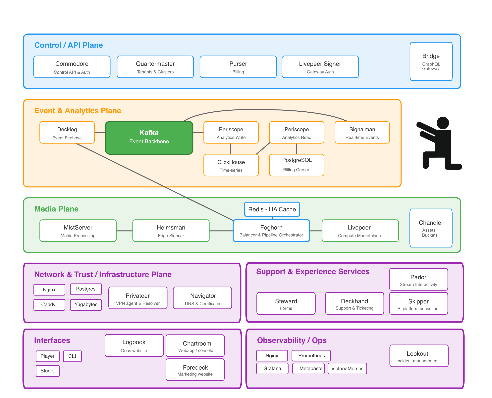

# FrameWorks

[](https://github.com/Livepeer-FrameWorks/monorepo/actions/workflows/ci.yml)
[](https://codecov.io/gh/Livepeer-FrameWorks/monorepo)
[](LICENSE.md)

> Warning: This stack is in active beta. Interfaces and schemas change frequently. If deploying in a production environment, be careful with data migrations when updating major versions. Plan ahead for stuff to break.

**Sovereign live video platform.** Run the video and control-plane stack on your infrastructure, ours, or both. S3-compatible storage and public DNS are external integrations today; native storage and DNS are on the roadmap.

An open streaming stack for live video: apps, real‑time APIs, and analytics. Services are narrowly scoped. Frontend uses GraphQL; service-to-service uses HTTP/gRPC APIs; analytics and realtime use Kafka events. Each service owns its data (no cross‑DB access).

## Packages & Bundles

| Package                                                                                                              | Version                                                                                                                                                       | Unpacked Size (npm)                                                                                                                                                                     | Install Size (deps)                                                                                                                                                          |
| -------------------------------------------------------------------------------------------------------------------- | ------------------------------------------------------------------------------------------------------------------------------------------------------------- | --------------------------------------------------------------------------------------------------------------------------------------------------------------------------------------- | ---------------------------------------------------------------------------------------------------------------------------------------------------------------------------- |
| [@livepeer-frameworks/player-react](https://www.npmjs.com/package/@livepeer-frameworks/player-react)                 | [](https://www.npmjs.com/package/@livepeer-frameworks/player-react)                 | [](https://www.npmjs.com/package/@livepeer-frameworks/player-react)                 | [](https://packagephobia.com/result?p=@livepeer-frameworks/player-react)                 |
| [@livepeer-frameworks/player-svelte](https://www.npmjs.com/package/@livepeer-frameworks/player-svelte)               | [](https://www.npmjs.com/package/@livepeer-frameworks/player-svelte)               | [](https://www.npmjs.com/package/@livepeer-frameworks/player-svelte)               | [](https://packagephobia.com/result?p=@livepeer-frameworks/player-svelte)               |
| [@livepeer-frameworks/player-wc](https://www.npmjs.com/package/@livepeer-frameworks/player-wc)                       | [](https://www.npmjs.com/package/@livepeer-frameworks/player-wc)                       | [](https://www.npmjs.com/package/@livepeer-frameworks/player-wc)                       | [](https://packagephobia.com/result?p=@livepeer-frameworks/player-wc)                       |
| [@livepeer-frameworks/player-core](https://www.npmjs.com/package/@livepeer-frameworks/player-core)                   | [](https://www.npmjs.com/package/@livepeer-frameworks/player-core)                   | [](https://www.npmjs.com/package/@livepeer-frameworks/player-core)                   | [](https://packagephobia.com/result?p=@livepeer-frameworks/player-core)                   |
| [@livepeer-frameworks/streamcrafter-react](https://www.npmjs.com/package/@livepeer-frameworks/streamcrafter-react)   | [](https://www.npmjs.com/package/@livepeer-frameworks/streamcrafter-react)   | [](https://www.npmjs.com/package/@livepeer-frameworks/streamcrafter-react)   | [](https://packagephobia.com/result?p=@livepeer-frameworks/streamcrafter-react)   |
| [@livepeer-frameworks/streamcrafter-svelte](https://www.npmjs.com/package/@livepeer-frameworks/streamcrafter-svelte) | [](https://www.npmjs.com/package/@livepeer-frameworks/streamcrafter-svelte) | [](https://www.npmjs.com/package/@livepeer-frameworks/streamcrafter-svelte) | [](https://packagephobia.com/result?p=@livepeer-frameworks/streamcrafter-svelte) |
| [@livepeer-frameworks/streamcrafter-wc](https://www.npmjs.com/package/@livepeer-frameworks/streamcrafter-wc)         | [](https://www.npmjs.com/package/@livepeer-frameworks/streamcrafter-wc)         | [](https://www.npmjs.com/package/@livepeer-frameworks/streamcrafter-wc)         | [](https://packagephobia.com/result?p=@livepeer-frameworks/streamcrafter-wc)         |
| [@livepeer-frameworks/streamcrafter-core](https://www.npmjs.com/package/@livepeer-frameworks/streamcrafter-core)     | [](https://www.npmjs.com/package/@livepeer-frameworks/streamcrafter-core)     | [](https://www.npmjs.com/package/@livepeer-frameworks/streamcrafter-core)     | [](https://packagephobia.com/result?p=@livepeer-frameworks/streamcrafter-core)     |

| Bundle        | Total Emitted Size                                                                                                                                                                                                                                        |
| ------------- | --------------------------------------------------------------------------------------------------------------------------------------------------------------------------------------------------------------------------------------------------------- |
| marketing     | [](https://app.codecov.io/github/Livepeer-FrameWorks/monorepo/bundle/website-marketing-esm)                                                   |
| docs          | [](https://app.codecov.io/github/Livepeer-FrameWorks/monorepo/bundle/website-docs-esm)                                                             |
| webapp client | [](https://app.codecov.io/github/Livepeer-FrameWorks/monorepo/bundle/website-application-__sveltekit.app-client-esm) |
| webapp server | [](https://app.codecov.io/github/Livepeer-FrameWorks/monorepo/bundle/website-application-__sveltekit.app-server-esm) |

## Architecture at a glance



- Control / API plane
  - Bridge (`api_gateway`): GraphQL gateway and MCP hub
  - Commodore (`api_control`): auth, streams, business logic
  - Quartermaster (`api_tenants`): tenants, clusters, nodes
  - Purser (`api_billing`): usage, invoices, payments
  - Livepeer Signer: ETH transaction signer for Livepeer Gateway
- Media plane
  - Foghorn (`api_balancing`): regional load balancer & media pipeline orchestrator (HA via Redis, cross-cluster federation via FoghornFederation gRPC)
  - Helmsman (`api_sidecar`): edge sidecar, MistServer management via Foghorn
  - MistServer: ingest/processing/edge delivery
  - Livepeer Gateway (golivepeer): transcoding/AI processing
  - Chandler (`api_assets`): cluster-scoped static media asset server for thumbnails, sprites, VOD metadata, and cached S3 assets
- Event & Analytics plane
  - Periscope Ingest (`api_analytics_ingest`): consumes Kafka, writes ClickHouse
  - Periscope Query (`api_analytics_query`): serves analytics & usage summaries
  - Decklog (`api_firehose`): gRPC ingress → Kafka
  - Signalman (`api_realtime`): real-time event fan-out and WebSocket hub
  - Kafka: event backbone
  - ClickHouse: time‑series
- Network & Trust plane
  - Navigator (`api_dns`): public DNS automation & certificate issuance
  - Privateer (`api_mesh`): WireGuard mesh agent & local DNS
  - Nginx / Caddy: ingress, reverse proxying, and TLS termination
- Infrastructure substrate
  - PostgreSQL/YugabyteDB: service-owned state and configuration database
- Support & Experience Services
  - Skipper (`api_consultant`): AI video consultant with RAG, tool-use, and SSE streaming
  - Deckhand (`api_ticketing`): support messaging and Chatwoot adapter
  - Steward (`api_forms`): contact forms and newsletter handling
  - Parlor (`api_rooms`): planned stream interactivity
  - Listmonk / Chatwoot: newsletter and support backends
- Interfaces
  - Chartroom / Web Console (`website_application`): main dashboard
  - Foredeck / Marketing Site (`website_marketing`): public site
  - Logbook / Documentation (`website_docs`): Astro Starlight docs
  - Player / Studio packages (`npm_player`, `npm_studio`): embeddable playback and ingest components
- Observability & Operations
  - VictoriaMetrics / Prometheus / Grafana / Metabase: metrics, dashboards, and BI
  - Lookout (`api_incidents`): deferred incident aggregation service

Principles

- Strict service boundaries (no cross‑DB reads)
- Time-series and event analytics live in ClickHouse; service-owned state and aggregates live in Postgres/YugabyteDB
- Type safety by reusing the gRPC types straight from the emitter. Passthrough and leave source data intact as much as possible, with optional enrichment fields

## Supported Platforms

| Component                    | linux/amd64 | linux/arm64 | darwin/arm64 |
| ---------------------------- | ----------- | ----------- | ------------ |
| Docker images (all services) | yes         | yes         | —            |
| Service binaries             | yes         | yes         | yes (signed) |
| CLI                          | yes         | yes         | yes (signed) |
| Edge node (native)           | yes         | yes         | yes          |

All darwin binaries are code-signed and notarized via Apple Developer ID. Docker images are linux-only (macOS runs them via Docker Desktop's Linux VM).

Install via Homebrew: `brew tap livepeer-frameworks/tap && brew install frameworks-cli`

## Quick Start

### Development Setup (docker-compose)

For local development and testing:

```bash
git clone https://github.com/Livepeer-FrameWorks/monorepo.git
cd monorepo
cp config/env/secrets.env.example config/env/secrets.env  # edit values as needed
make env  # writes .env from config/env
docker-compose up
```

The Compose stack loads `${ENV_FILE:-.env}` automatically. Override `ENV_FILE` (and pass `--env-file` to docker compose) when you want to use a different generated env file (for example `.env.staging`).

Endpoints (local)

- GraphQL Gateway: http://localhost:18090/graphql
- GraphQL WebSocket: ws://localhost:18090/graphql/ws (subscriptions)
- App via Nginx: http://localhost:18090
- Web Console: http://localhost:18030
- Marketing site: http://localhost:18031
- Listmonk (Admin): http://localhost:9001
- MistServer: http://localhost:4242 (RTMP: 1935, HTTP: 8080)
- Kafka (external): localhost:29092
- Postgres: localhost:5432
- ClickHouse: 8123 (HTTP), 9000 (native)

## Building & Testing

All build and test commands go through the Makefile. Key targets:

| Target          | Description                                                |
| --------------- | ---------------------------------------------------------- |
| `make build`    | Build all service binaries                                 |
| `make test`     | Run all tests (with race detector)                         |
| `make lint`     | Run Go + frontend lint checks (matches CI lint jobs)       |
| `make ci-local` | Run main CI checks locally (go/frontend lint, test, build) |
| `make verify`   | Full verification (tidy, fmt, vet, test, build)            |
| `make env`      | Generate `.env` from `config/env/`                         |

Single service: `make build-bin-<name>` (e.g. `make build-bin-purser`). See `Makefile` for all targets.

## Ports

| Plane                         | Service                  | Port     | Notes                                                                                                          |
| ----------------------------- | ------------------------ | -------- | -------------------------------------------------------------------------------------------------------------- |
| Control / API                 | Bridge                   | 18000    | GraphQL Gateway and MCP hub                                                                                    |
| Control / API                 | Commodore                | 18001    | Health/Metrics                                                                                                 |
| Control / API                 | Commodore (gRPC)         | 19001    | gRPC API                                                                                                       |
| Control / API                 | Quartermaster            | 18002    | Health/Metrics                                                                                                 |
| Control / API                 | Quartermaster (gRPC)     | 19002    | gRPC API                                                                                                       |
| Control / API                 | Purser                   | 18003    | Health/Metrics                                                                                                 |
| Control / API                 | Purser (gRPC)            | 19003    | gRPC API                                                                                                       |
| Control / API                 | Livepeer Signer          | 18016    | ETH transaction signer for Livepeer Gateway (not in dev compose)                                               |
| Event & Analytics             | Periscope Query          | 18004    | HTTP health/metrics only                                                                                       |
| Event & Analytics             | Periscope Query (gRPC)   | 19004    | gRPC API                                                                                                       |
| Event & Analytics             | Periscope Ingest         | 18005    | Kafka consumer                                                                                                 |
| Event & Analytics             | Decklog                  | 18006    | gRPC                                                                                                           |
| Event & Analytics             | Decklog (metrics)        | 18026    | Prometheus metrics                                                                                             |
| Event & Analytics             | Kafka (external)         | 29092    | Host access                                                                                                    |
| Event & Analytics             | Kafka (internal)         | 9092     | Cluster access                                                                                                 |
| Event & Analytics             | ClickHouse (HTTP)        | 8123     | Analytics database                                                                                             |
| Event & Analytics             | ClickHouse (Native)      | 9000     | Analytics database                                                                                             |
| Event & Analytics             | Signalman                | 18009    | WebSocket hub                                                                                                  |
| Event & Analytics             | Signalman (gRPC)         | 19005    | gRPC API                                                                                                       |
| Media                         | Helmsman                 | 18007    | Edge API                                                                                                       |
| Media                         | Foghorn                  | 18008    | Balancer                                                                                                       |
| Media                         | Foghorn (internal gRPC)  | 18019    | Internal-CA gRPC listener for Foghorn HA relay                                                                 |
| Media                         | Foghorn (external gRPC)  | 18029    | Public-ACME gRPC listener for Helmsman, edge bootstrap/enrollment, and FoghornFederation                       |
| Media                         | Foghorn Redis            | 6379     | Foghorn state sync (HA). Separate from Chatwoot Redis                                                          |
| Media                         | MistServer (control)     | 4242     | Control API                                                                                                    |
| Media                         | MistServer (RTMP/E-RTMP) | 1935     | Ingest                                                                                                         |
| Media                         | MistServer (HTTP)        | 8080     | HLS/WebRTC delivery                                                                                            |
| Media                         | MistServer (SRT)         | 8889/udp | SRT ingest                                                                                                     |
| Media                         | Livepeer Gateway         | 8935     | Livepeer compute gateway (transcoding orchestration; not in dev compose)                                       |
| Media                         | Chandler                 | 18020    | Cluster-scoped asset serving (thumbnails, sprites, VOD metadata)                                               |
| Network & Trust               | Navigator                | 18010    | Public DNS management & ACME (production deployments; intentionally excluded from single-node dev compose)     |
| Network & Trust               | Navigator (gRPC)         | 18011    | gRPC API (production deployments; intentionally excluded from single-node dev compose)                         |
| Network & Trust               | Privateer                | 18012    | WireGuard mesh agent & Local DNS (production deployments; intentionally excluded from single-node dev compose) |
| Network & Trust               | Nginx                    | 18090    | Reverse proxy                                                                                                  |
| Infrastructure                | PostgreSQL               | 5432     | Primary state database                                                                                         |
| Support & Experience Services | Listmonk                 | 9001     | Newsletter Admin                                                                                               |
| Support & Experience Services | Chatwoot                 | 18092    | Support dashboard (via Nginx: /support)                                                                        |
| Support & Experience Services | Forms API                | 18032    | Contact forms                                                                                                  |
| Support & Experience Services | Parlor (api_rooms)       | 18014    | Planned channel rooms for interactive features                                                                 |
| Support & Experience Services | Deckhand (api_ticketing) | 18015    | Support ticketing                                                                                              |
| Support & Experience Services | Deckhand (gRPC)          | 19006    | Support gRPC API                                                                                               |
| Support & Experience Services | Skipper                  | 18018    | AI video consultant HTTP                                                                                       |
| Support & Experience Services | Skipper (gRPC)           | 19007    | gRPC API                                                                                                       |
| Interfaces                    | Web Console              | 18030    | Application UI                                                                                                 |
| Interfaces                    | Marketing Site           | 18031    | Public site                                                                                                    |
| Interfaces                    | Documentation            | 18033    | Starlight docs                                                                                                 |
| Observability & Operations    | Prometheus               | 9091     | Metrics (CLI deployment only)                                                                                  |
| Observability & Operations    | Grafana                  | 3000     | Dashboards (CLI deployment only)                                                                               |
| Observability & Operations    | Metabase                 | 3001     | BI Analytics (CLI deployment only)                                                                             |
| Observability & Operations    | Lookout (api_incidents)  | 18013    | Deferred incident management service                                                                           |

## Documentation

**Public docs:** [logbook.frameworks.network](https://logbook.frameworks.network) (source: `website_docs/`)

| Audience   | Covers                                                       |
| ---------- | ------------------------------------------------------------ |
| Streamers  | Quick start, encoder setup, API reference, playback          |
| Operators  | Architecture, deployment, DNS, CLI, multi-cluster, WireGuard |
| Selfhosted | Self-hosted edge nodes with enrollment tokens                |
| Agents     | MCP integration, wallet auth, x402 payments                  |

**Internal docs** (in-repo, for contributors):

| Directory            | Purpose                                         |
| -------------------- | ----------------------------------------------- |
| `docs/architecture/` | System design decisions (analytics, routing, …) |
| `docs/standards/`    | Design system, metrics naming, testing policy   |
| `docs/rfcs/`         | Proposals under discussion                      |
| `docs/skills/`       | Agent integration & discovery files             |
| `CONTRIBUTING.md`    | Dev setup, code style, workflows, PR process    |

## Security

Found a vulnerability? See [`SECURITY.md`](SECURITY.md) for our disclosure policy,
scope, and safe harbor. Report privately via [GitHub Private Vulnerability Reporting](https://github.com/livepeer-frameworks/monorepo/security/advisories/new)
or **security@frameworks.network** — please don't open a public issue. The machine-readable
policy is served at `/.well-known/security.txt` on each site.
