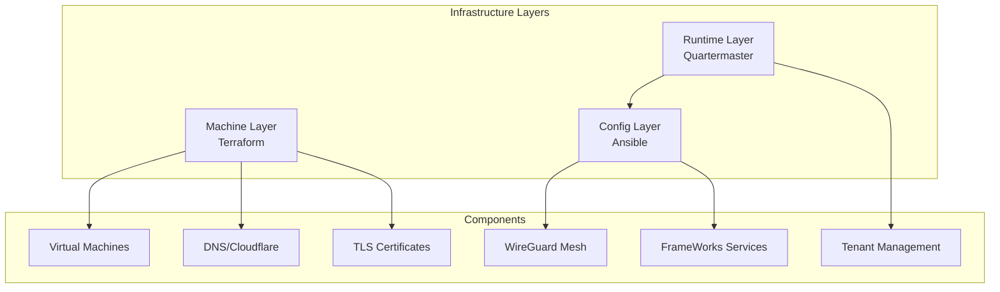

# 🏗️ FrameWorks Infrastructure

This document provides a high-level overview of how FrameWorks manages infrastructure at scale. For implementation details, see [infrastructure/README.md](../infrastructure/README.md).

## 📋 Overview

FrameWorks uses a pragmatic approach to infrastructure:

- Current (MVP)
  - Local: Docker Compose for development
  - Deployment: Manually provisioned hosts
  - Coordination: Quartermaster exposes tenant/cluster context via API
- Planned
  - Terraform for machine resources and external services
  - Ansible for configuration and service rollout
  - Long term: Kubernetes/GitOps

## 🏛️ Architecture

## 🔄 Component Roles

### Machine Layer (Terraform)
- Resource provisioning (planned)
- DNS and certificates (planned)
- Load balancing (planned)
- Network security (planned)

### Configuration Layer (Ansible)
- System configuration (planned)
- Service deployment (planned)
- Mesh networking (planned)
- Monitoring setup (planned)

### Runtime Layer (Quartermaster)
- Tenant management
- Service context/orchestration
- Dynamic inventory (planned)
- Health monitoring

## 🌐 Deployment Tiers

### Central Tier
- Purpose: Control plane and shared services
- Components: Core APIs, databases, message queues

### Regional Tier
- Purpose: Data locality and latency reduction
- Components: Analytics, caching, regional services

### Edge Tier
- Purpose: Media processing and delivery
- Components: Media servers, real-time services
