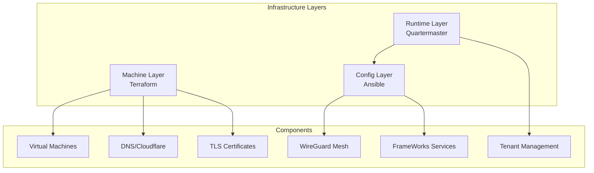

# 🏗️ FrameWorks Infrastructure

This document provides a high-level overview of how FrameWorks manages infrastructure at scale. For implementation details, see [infrastructure/README.md](../infrastructure/README.md).

## 📋 Overview

FrameWorks uses a pragmatic approach to infrastructure:

- Current (MVP)
  - Local: Docker Compose for development
  - Deployment: Manually provisioned hosts
  - Coordination: Quartermaster exposes tenant/cluster context via API
- Planned
  - Terraform for machine resources and external services
  - Ansible for configuration and service rollout
  - Long term: Kubernetes/GitOps

## 🏛️ Architecture



## 🔄 Component Roles

### Machine Layer (Terraform)
- Resource provisioning (planned)
- DNS and certificates (planned)
- Load balancing (planned)
- Network security (planned)

### Configuration Layer (Ansible)
- System configuration (planned)
- Service deployment (planned)
- Mesh networking (planned)
- Monitoring setup (planned)

### Runtime Layer (Quartermaster)
- Tenant management
- Service context/orchestration
- Dynamic inventory (planned)
- Health monitoring

## 🌐 Deployment Tiers

### Central Tier
- Purpose: Control plane and shared services
- Components: Core APIs, databases, message queues

### Regional Tier
- Purpose: Data locality and latency reduction
- Components: Analytics, caching, regional services

### Edge Tier
- Purpose: Media processing and delivery
- Components: Media servers, real-time services

## 🔧 Proxy & SSL Strategy

### Current Approach (Production)
- **Reverse Proxy**: Custom Nginx build with GeoIP2 module for geographic routing
- **SSL Certificates**: Let's Encrypt (Certbot) with automatic renewal
- **DNS**: Cloudflare (manual configuration)
- **Geographic Data**: MaxMind GeoIP2 databases for Foghorn routing decisions

### Future Consideration: Caddy Integration
**Potential Benefits**:
- Unified proxy solution (replace Nginx + Certbot)
- Automatic HTTPS with built-in ACME support
- Simpler configuration and maintenance
- No need for MaxMind - Cloudflare can pass geo headers directly

**Technical Requirements**:
- Evaluate Cloudflare geo header passthrough vs MaxMind database approach
- Test compatibility with Foghorn's geographic routing logic

**Decision**: Continue with current Nginx + MaxMind setup, evaluate Cloudflare geo headers + Caddy as future unified solution.

## 🔗 Mesh Networking Strategy

### The Bootstrap Challenge
FrameWorks services require secure VPN mesh connectivity for inter-service communication, creating a chicken-and-egg problem: the mesh must exist before services can communicate, but something must establish the mesh first.

### Privateer Solution
**Token-Based Mesh Joining**:
- Admin generates time-limited join tokens via Quartermaster API
- New nodes join mesh using single command: `privateer join --token=<jwt>`
- Bootstrap peer (central node) validates tokens and accepts connections
- Once on mesh, nodes register with Quartermaster and get full peer list

**Security Model**:
- **Time-limited tokens**: Default 24h expiry, configurable
- **Single-use**: Tokens invalidated after successful join
- **Signed authentication**: JWT tokens signed by Quartermaster
- **Minimal exposure**: Only bootstrap peer endpoint accessible publicly
- **Encrypted mesh**: All inter-service traffic via WireGuard

### Integration with Automation
**Manual Deployment**:
```bash
# Generate token
curl -X POST quartermaster.example.com/api/v1/mesh/tokens

# Join mesh
privateer join --token=eyJhbGc...
```

**Automated Deployment**:
```yaml
# Ansible
- name: Join mesh
  command: privateer join --token={{ mesh_token }}
```

```hcl
# Terraform
resource "frameworks_mesh_token" "node" {
  expires_in = "1h"
}

resource "compute_instance" "node" {
  user_data = "privateer join --token=${frameworks_mesh_token.node.token}"
}
```

This approach enables secure, automated mesh expansion while maintaining the isolated microservice architecture.
