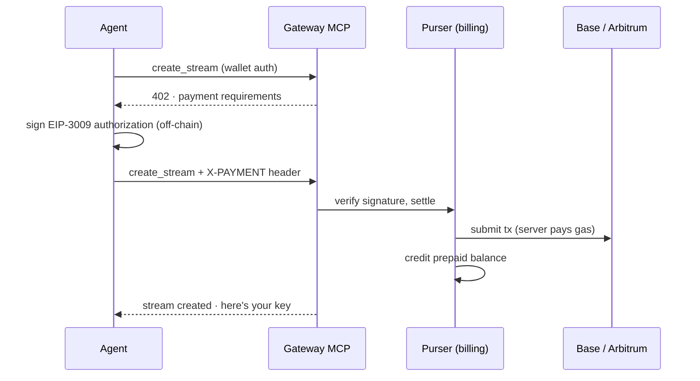

Here is the full onboarding flow for an AI agent that wants to broadcast on FrameWorks: create an EVM wallet, sign a login message, call `create_stream`, get told to pay, pay, call `create_stream` again. No signup form, no email verification loop, no card on file, no human in the middle. Most of the engineering behind it is in making "get told to pay, pay" trustworthy for both sides.

## Identity is a signature

Agents authenticate with an Ethereum wallet using a standard EIP-191 `personal_sign` over a login message containing a timestamp and a nonce. The first time a new wallet shows up, the platform auto-provisions around it: a tenant on the prepaid billing model, a user with no email, a balance starting at zero, and the wallet bound to both. The trust model is explicit — a bare wallet is a low-trust prepaid customer who loads balance before consuming; adding a verified email upgrades the account toward invoiced, postpaid territory. An agent can stay in the first category forever and be a perfectly good customer.

API requests themselves are free. Charges are for resources: bandwidth and viewer-hours, storage, processing. Usage is metered in five-minute summaries and deducted from the prepaid balance; if a balance goes more than $10 into the red, streams are terminated and new operations are blocked until it's topped up. Enforcement is mechanical, which suits a customer that can't read a collections email.

## The 402 is the API

When an agent calls a billable operation without the balance to cover it, the answer is HTTP 402 with a machine-readable payment offer attached: what's owed, which networks are accepted, where to pay, and a deadline. The agent signs a USDC transfer authorization off-chain — [x402](https://github.com/coinbase/x402) rides on EIP-3009, USDC's transfer-with-authorization primitive — and retries the same call with an `X-PAYMENT` header carrying the signature. The platform verifies the signature, submits the transaction on-chain itself (the server pays the gas, so the agent's wallet needs USDC and nothing else), credits the balance, and the retried operation goes through.

x402 settles on Base and Arbitrum. We skipped Ethereum mainnet — a few dollars of gas per transaction makes no sense for topping up a streaming balance. For agents (or humans) who prefer plain transfers, there's also a classic deposit flow: a derived deposit address, a price-locked quote, and block-explorer polling until ETH or USDC arrives.

Two guardrails keep this from being naive. Billable operations run a preflight before doing anything — authentication, billing details, positive balance — and a failed preflight returns a structured blocker that includes the x402 offer, so an agent learns _what to fix and how to pay_ from the error itself instead of parsing prose. And payments of €100 or more require billing details on the account first, which keeps the no-questions-asked path for small amounts while larger ones produce a proper paper trail.

Settlement is built to survive its own failure modes: verification happens before any provisioning side effect, credits are idempotent under webhook and retry replay, and a crash between "payment verified" and "access granted" resolves on retry rather than stranding a paid-but-inactive account.

## One MCP surface for the whole platform

The other half of agent-native is what the agent can actually do once it's a customer. The Gateway exposes the platform over [MCP](/agents/mcp): 38 tools — 37 owned by the Gateway, spanning streams, clips, DVR, VOD, playback, QoE diagnostics, billing, support, schema introspection, and infrastructure, plus [Skipper's](/agents/skipper) `ask_consultant` proxied in as the 38th — alongside read-only resources for streams, analytics, nodes, and billing state. A handful of tools work without any authentication at all (payment options, payment submission, playback resolution, marketplace browsing), because an agent needs to be able to discover how to become a customer before it is one.

The hub-and-spoke split keeps responsibilities clean. Skipper consults — its `ask_consultant` pipeline can search knowledge and run diagnostics but has mutation tools blocked, so a free-form consulting answer can never delete a stream as a side effect. State changes go through the dedicated Gateway tools, each with its own authorization and its own preflight. The Gateway injects the caller's tenant context into everything it forwards, so a spoke never sees a request without knowing exactly which tenant it's acting for.

We wrote about Skipper itself [when it launched](/blog/skipper-launch); the agent-facing docs start at [agents overview](/agents/overview), with [wallet auth](/agents/wallet-auth) and [payments](/agents/payments) covering this post's flow in reference form.

The bet underneath all of this: agents are becoming a real customer segment for infrastructure, and they're the most literal-minded customers imaginable. They don't read onboarding emails, they don't call support, and they take your API's word for everything. So the payment flow is a protocol and the errors carry their own fix instructions.
