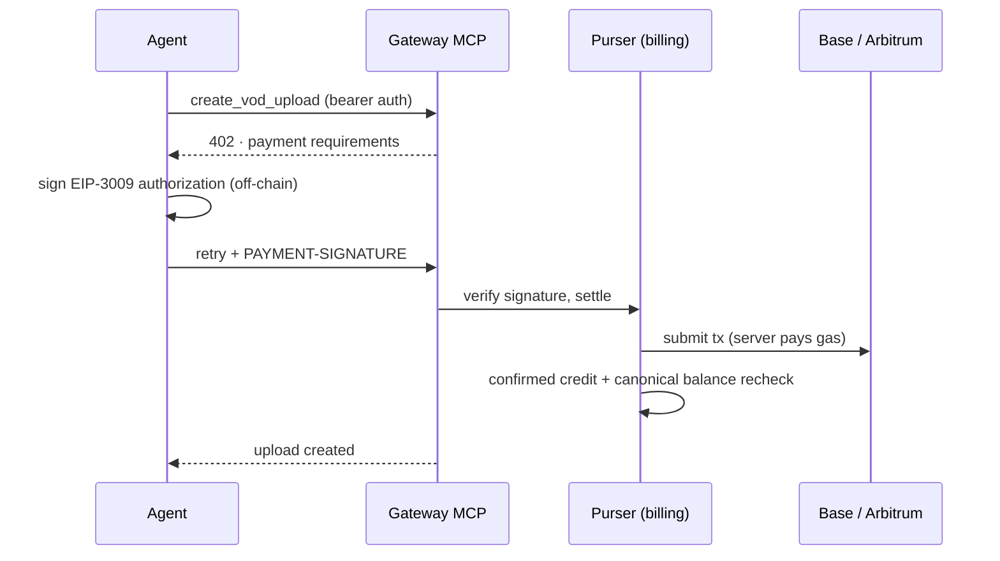

Here is the onboarding flow for an AI agent: create an EVM wallet, request and sign a one-time login challenge, configure a stream at zero balance, then fund the tenant before any rated ingest, playback, storage, or processing begins. No signup form, email verification loop, or card is required for prepaid use.

## Identity is a signature

Agents authenticate with EIP-191 `personal_sign` over a server-issued, five-minute, single-use challenge. The server stores its hash and atomically consumes it, so copied or concurrent replays cannot create another session. The first successful exchange auto-provisions a prepaid tenant, an email-less user, a zero balance, and the wallet binding. Adding a verified email and collection method makes postpaid available; it is not required for prepaid use.

API requests currently have a zero price, but their usage is still metered and
itemized alongside bandwidth, viewer time, storage, processing, and AI work.
Usage is reported in five-minute summaries and rated against the tenant and
work-cluster contract; if an available balance is exhausted, new billable
operations are blocked until it is topped up. Enforcement is mechanical, which
suits a customer that can't read a collections email.

## The 402 is the API

When an authenticated agent calls a rated operation without enough balance, the answer is HTTP 402 with a tenant-bound payment offer. The agent signs a USDC transfer authorization off-chain — [x402](https://github.com/coinbase/x402) rides on EIP-3009 — and retries with `PAYMENT-SIGNATURE`. FrameWorks submits it, waits for a confirmed successful receipt, atomically credits the balance, and then reruns ordinary admission policy. Payment never doubles as login or bypasses suspension.

```mermaid
sequenceDiagram
    participant A as Agent
    participant G as Gateway MCP
    participant P as Purser (billing)
    participant C as Base / Arbitrum
    A->>G: create_vod_upload (bearer auth)
    G-->>A: 402 · payment requirements
    A->>A: sign EIP-3009 authorization (off-chain)
    A->>G: retry + PAYMENT-SIGNATURE
    G->>P: verify signature, settle
    P->>C: submit tx (server pays gas)
    P->>P: confirmed credit + canonical balance recheck
    G-->>A: upload created
```

x402 settles on Base and Arbitrum. We skipped Ethereum mainnet — a few dollars of gas per transaction makes no sense for topping up a streaming balance. For agents (or humans) who prefer plain transfers, there's also a classic deposit flow: a derived deposit address, a price-locked quote, and block-explorer polling until ETH or USDC arrives.

Two guardrails keep this from being naive. Rated operations require authentication and positive available balance, while reads, configuration, cleanup, and payment recovery remain usable at zero balance. A failed rated check returns a structured blocker with the x402 offer, so an agent learns _what to fix and how to pay_ without parsing prose. Payments over €100, and payments carrying a VAT-number claim, require a complete billing profile and use the full-document path; exactly €100 can still use a simplified document.

Settlement is built to survive its own failure modes: verification happens before any provisioning side effect, credits are idempotent under webhook and retry replay, and a crash between "payment verified" and "access granted" resolves on retry rather than stranding a paid-but-inactive account.

## One MCP surface for the whole platform

The other half of agent-native is what the agent can actually do once it's a customer. The Gateway exposes the platform over [MCP](/agents/mcp): runtime-discovered tools spanning wallet onboarding, streams, clips, DVR, VOD, playback, QoE diagnostics, billing, support, schema introspection, and infrastructure, plus [Skipper's](/agents/skipper) `ask_consultant` — alongside read-only resources for streams, analytics, nodes, and billing state. A small public surface covers wallet challenge issuance, playback resolution, and marketplace browsing, because an agent needs to be able to discover how to become a customer before it is one. Tenant-bound payment options and submission require the wallet-authenticated tenant they credit.

The hub-and-spoke split keeps responsibilities clean. Skipper consults — its `ask_consultant` pipeline can search knowledge and run diagnostics but has mutation tools blocked, so a free-form consulting answer can never delete a stream as a side effect. State changes go through the dedicated Gateway tools, each with its own authorization and its own preflight. The Gateway injects the caller's tenant context into everything it forwards, so a spoke never sees a request without knowing exactly which tenant it's acting for.

We wrote about Skipper itself [when it launched](/blog/skipper-launch); the agent-facing docs start at [agents overview](/agents/overview), with [wallet auth](/agents/wallet-auth) and [payments](/agents/payments) covering this post's flow in reference form.

The bet underneath all of this: agents are becoming a real customer segment for infrastructure, and they're the most literal-minded customers imaginable. They don't read onboarding emails, they don't call support, and they take your API's word for everything. So the payment flow is a protocol and the errors carry their own fix instructions.
