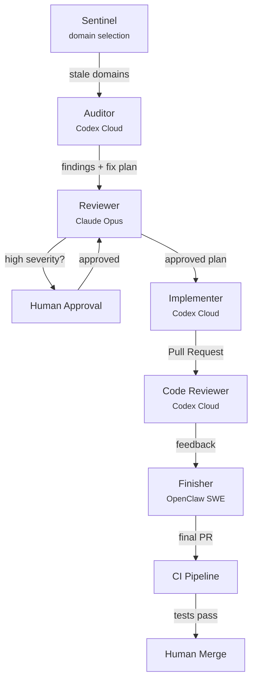

import { Aside } from "@astrojs/starlight/components";

Edge cases in distributed systems are easy to reason about in isolation. A viewer connecting from the antimeridian. A DVR recording that starts at the exact moment a stream ends. Two Kafka messages racing to deduct from the same prepaid balance. You can write a test for each one.

The problem is scale. FrameWorks has 12 subsystems — viewer routing, ingest, VOD, edge orchestration, analytics, billing, auth, MCP agent access, DNS, Skipper, WebSocket routing, and tenant management — each with its own failure modes. Edge cases multiply across service boundaries, and manual auditing doesn't catch them all. You review billing this week, and meanwhile a race condition in ingest goes unnoticed for months.

We needed something that runs continuously, prioritizes what hasn't been reviewed recently, and actually fixes what it finds. Not a one-time security audit. An ongoing process.

So we built a pipeline around seven AI agents. Each has a focused role. They coordinate through files and pull requests — no shared memory, no message bus. Git is the orchestration layer.

## The pipeline



Each cycle, the Sentinel selects up to three subsystems to audit based on how long it has been since they were last reviewed. The entire flow from audit to merged PR passes through multiple independent agents, each operating on the structured output of the previous one.

The key design principle: every agent writes its output to a file or a pull request. There is no orchestration service. The pipeline state is the state of the repository.

## The heartbeat pattern

The design is built on the heartbeat pattern, adapted from the [OpenClaw](https://openclaw.ai/) project's heartbeat engine. Instead of running a fixed task on a schedule, the agent wakes up, assesses the current situation, and decides whether to act.

We already use this pattern in production. Our Skipper monitoring agent runs on a 30-minute heartbeat, checking stream health for each tenant and making an LLM-driven decision:

```go
type decisionPayload struct {
    Action          string   `json:"action"`   // "investigate" | "flag" | "skip"
    Reason          string   `json:"reason"`
    MetricsReviewed []string `json:"metrics_reviewed"`
}
```

The core loop is a Go ticker:

```go
func (a *Agent) Start(ctx context.Context) {
    a.runCycle(ctx)
    ticker := time.NewTicker(a.interval)
    defer ticker.Stop()
    for {
        select {
        case <-ctx.Done():
            return
        case <-ticker.C:
            a.runCycle(ctx)
        }
    }
}
```

Each cycle iterates over eligible tenants and makes a per-tenant decision. Most of the time, the answer is "skip." The agent logs `HEARTBEAT_OK` and goes back to sleep.

```go
switch action {
case "investigate":
    report, tokens, err := a.Investigate(ctx, tenantID, "heartbeat", decision.Reason, snapshot)
    // ...
case "flag":
    // persist report for human review
    // ...
default:
    a.logger.WithField("tenant_id", tenantID).Info("HEARTBEAT_OK")
}
```

<Aside type="tip" title="Silent by default">
  Most heartbeats should be silent. The agent decides whether to act, not the schedule. A heartbeat
  that fires every week but only finds something worth auditing once a month is working correctly.
</Aside>

The audit pipeline applies the same pattern at a different scale: instead of checking stream health metrics every 30 minutes, it checks codebase staleness on a weekly cadence. Which subsystems have not been audited recently? Which have the highest risk weight? Only the stale, high-priority domains trigger an audit.

## Agent-by-agent breakdown

### Sentinel

The Sentinel handles domain selection. Each subsystem has a staleness score based on when it was last audited and a priority weight reflecting its risk profile:

```json
{
  "name": "analytics-billing",
  "paths": ["api_analytics_ingest/", "api_analytics_query/", "api_billing/"],
  "last_audited": "2026-01-30T00:00:00Z",
  "priority_weight": 1.5
}
```

The scoring formula is `days_since_last_audit * priority_weight`. Billing gets a 1.5x multiplier because data loss means revenue impact. Stable subsystems like forms and ticketing get a 0.6x. The Sentinel picks the top three and dispatches them.

The Sentinel is not an LLM agent. The decision is deterministic -- a staleness score does not benefit from reasoning. Save the LLM compute for the parts that need it.

### Auditor

The Auditor is a Codex Cloud task with full repository access. It receives a domain name, a description, and a list of code paths. Its job is to trace end-to-end flows within that domain, identify edge cases and failure modes, and write a structured report.

The output format is standardized:

```markdown
## Findings

### Finding 1: Prepaid balance deduction race

- **File(s)**: `api_billing/internal/usage/processor.go:142-168`
- **Category**: race-condition
- **Severity**: high
- **Evidence**: Two concurrent Kafka messages for the same tenant
  call DeductBalance without a transaction lock...
- **Impact**: Double-deduction possible under burst traffic.

## Recommended Fix Plan

Wrap the read-deduct-write in a PostgreSQL advisory lock
keyed on tenant_id...
```

The structured format matters. It forces the agent to cite specific files and line numbers, categorize the finding, explain the impact, and propose a concrete fix. An agent that cannot point to evidence is not allowed to claim something is broken.

### Reviewer

The Reviewer is a separate LLM session (Claude Opus in plan mode) that reads the audit report and validates the findings against the actual codebase. It checks whether the cited code matches what the Auditor described, whether the severity assessment is reasonable, and whether the proposed fix addresses the root cause.

For high or critical severity findings, the pipeline pauses for human approval. For medium and low findings, it proceeds automatically.

The Reviewer is the quality gate. It catches the cases where the Auditor misunderstands the system design -- a billing enforcement race that "looks like a bug" might be an intentional eventual-consistency trade-off. A second pair of (artificial) eyes prevents false positives from consuming engineering time.

### Implementer

The Implementer is another Codex Cloud task. It receives the approved fix plan and implements it: modifies the code, writes or updates tests, and creates a pull request. The PR description references the audit report for context.

### Code Reviewer

The Code Reviewer is a Codex Cloud task that performs automated code review on the PR. It checks for regressions, style violations (the codebase enforces `gofmt` for Go and Prettier for frontend), missing tests, and tenant isolation issues. Every database query in this codebase must filter by `tenant_id` -- the reviewer knows this invariant and checks for it.

The reviewer leaves inline comments on the PR, the same way a human reviewer would.

### Finisher

The Finisher reads the code review feedback, makes the requested changes, pushes fixup commits, and approves the PR. It serves as the last automated pass before CI.

The separation between Code Reviewer and Finisher is deliberate. Having different agents review and implement prevents the "I reviewed my own code and it looks fine" problem. The reviewer has no attachment to the implementation.

### CI and human merge

The PR goes through the standard CI pipeline: `make verify` (tidy, fmt, vet, test, build), `pnpm lint` and `pnpm format` for frontend code, and CodeQL security scanning. If CI passes, a human does the final review and merges.

The human is the last gate. Every PR, regardless of how many agents approved it, requires a human to merge it.

## Results

We ran this pipeline across all 12 subsystems in 26 batches of three tasks each. The numbers:

- **90 audit tasks** completed across **12 subsystems**
- **26 batches** of 3 tasks each
- Every task scoped to 1-3 hours of agent work

The findings:

| Category             | Count | Example                                                                 |
| -------------------- | ----- | ----------------------------------------------------------------------- |
| Race conditions      | 12    | Prepaid balance deduction under concurrent Kafka messages               |
| Tenant isolation     | 8     | Stream context cache keyed by `internal_name` only, missing `tenant_id` |
| Data loss risks      | 7     | Decklog batch flush interrupted by producer crash                       |
| Stale cache behavior | 6     | GeoIP cache stampede under bursty traffic                               |
| Protocol edge cases  | 5     | Player protocol blacklist leading to "no playable protocol" dead-end    |
| Storage consistency  | 5     | S3 upload succeeds but local delete fails, orphaned duplicate           |
| Auth bypass vectors  | 4     | GraphQL complexity bypass via deep nesting with small page sizes        |
| DNS propagation      | 3     | Stale DNS pointing at decommissioned nodes                              |

The subsystem breakdown:

| Subsystem                   | Tasks | Key Focus                                                          |
| --------------------------- | ----- | ------------------------------------------------------------------ |
| Viewer Playback and Routing | 10    | Geo edge cases, protocol scoring, session ordering                 |
| Analytics and Billing       | 10    | Kafka consumer errors, usage idempotency, ClickHouse migrations    |
| Agent Access / MCP          | 10    | x402 settlement safety, wallet provisioning, nonce handling        |
| Gateway and Auth            | 9     | Tenant scoping, rate limiting, WebSocket connection limits         |
| Ingest and Publishing       | 8     | WHIP path, DVR auto-start races, billing enforcement cache         |
| VOD / Clips / DVR           | 8     | Artifact lifecycle, defrost races, playbackId resolution           |
| Edge Nodes and Disk         | 7     | Disk-full during recording, heartbeat freshness, drain propagation |
| Service Events              | 6     | DLQ replay viability, Decklog batching, demo mode gating           |
| Network / DNS / Mesh        | 6     | ACME retry, mesh enrollment, token revocation                      |

<Aside type="note" title="Not every audit finds a bug">
  Many audits confirmed that the existing code handles the edge case correctly. A finding that says
  "the race condition is already prevented by an advisory lock" is just as valuable as finding an
  actual bug. It documents the invariant and proves the system was reviewed.
</Aside>

## What we learned

**Staleness scoring matters more than schedule frequency.** Running audits weekly is less important than making sure each cycle targets the areas that have been neglected longest. A billing subsystem that was last audited two weeks ago with a 1.5x priority weight beats a forms subsystem audited yesterday. The priority weights encode institutional knowledge about where bugs hurt most.

**Batch size of three is the sweet spot.** Large batches create a review bottleneck -- the Reviewer and the human at the merge stage get overwhelmed. Single-task batches underutilize the pipeline. Three tasks per cycle gives enough variety for the reviewer to stay sharp without creating a merge queue.

**The human-in-the-loop at the reviewer stage catches design misunderstandings.** LLMs trace code paths accurately, but they sometimes misunderstand _why_ the code was written a certain way. A billing enforcement race that "looks like a bug" might be an intentional eventual-consistency trade-off that was discussed in a design document the agent never saw.

**Structured output eliminates a class of false positives.** The audit file convention forces agents to cite specific files, line ranges, and the exact interleaving or input that triggers the issue. This prevents the pattern where an agent sees "concurrent access" and flags it as a race condition without checking whether a lock is already held.

**The biggest cost is LLM compute, not wall-clock time.** A full audit cycle uses significant token budget across the Auditor, Reviewer, Implementer, and Code Reviewer. The ROI is best for complex multi-service flows where a human would need to trace through four or five services to find the edge case. For simple single-file issues, a linter or static analysis tool is cheaper and more reliable.

## What is next

**Severity-based routing.** Critical findings should immediately page the on-call human rather than waiting for a review cycle. Low findings could skip the Code Reviewer entirely and go straight from Implementer to CI.

**Cross-subsystem audits.** The current pipeline audits one domain at a time. The most interesting bugs live at the boundaries: what happens when a billing enforcement check races against an ingest signal that crosses through the analytics pipeline? Multi-domain audits would trace these cross-cutting flows.

**Feedback loop into priority weights.** When an audit cycle finds real bugs in a domain, its priority weight should increase. Domains that consistently come back clean should decay toward lower weights. The staleness manifest becomes a living document that reflects actual risk rather than initial estimates.

**Incident-driven audits.** The runtime heartbeat agent already consumes incident events from a Kafka topic to trigger immediate investigations. The audit pipeline could do the same: when an anomaly detector flags something in production, schedule an audit of the affected domain rather than waiting for the next cycle.
