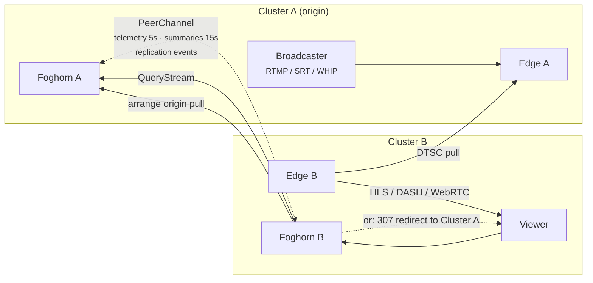

A FrameWorks stream is pushed into exactly one cluster. Viewers show up wherever they are. For a long time those two facts forced an awkward choice whenever a viewer's best edge lived in a cluster that had never seen the stream: send the viewer somewhere worse, or copy the stream somewhere it might not be needed.

As of the v0.1.0 cycle, Foghorn — the routing and balancing service that runs in every cluster — answers this itself. Foghorns now talk to each other. The result is that any edge can serve any tenant's stream, regardless of which cluster the broadcaster pushed into, and the clusters collectively behave like one CDN.

## The peer channel

Each pair of clusters maintains a single bidirectional gRPC stream between their Foghorn leaders. That one channel carries everything federation needs:

- **Edge telemetry** every 5 seconds — per-edge bandwidth, CPU, RAM, and location, so a peer can score your edges without asking.
- **Cluster edge summaries** every 15 seconds — smoothed averages for cheap cluster-to-cluster comparison.
- **Peer heartbeats** every 10 seconds — liveness, protocol version, capabilities.
- **Replication events** on change — "I started pulling this stream" and "I stopped."

Peer discovery is demand-driven. When a stream key is validated or a playback ID resolves, the response includes the list of peer clusters that share the tenant, and the leader opens channels to any it doesn't have yet. A reconciliation poll against Quartermaster every 5 minutes catches anything the fast path missed. Leadership itself is a Redis lease: if the leader dies, the lease expires within 15 seconds, another Foghorn instance picks it up, and peers reconnect. Non-leader instances keep answering routing queries from shared state the whole time.

## Scoring a remote edge

Viewer routing was already a scoring problem: each local edge gets `cpu + ram + bandwidth + geo` (weighted 500/500/1000/1000), plus a +50 bonus if the node already has the stream. Higher wins, sub-millisecond, entirely in memory.

Federation extends the same score to edges we don't operate from this cluster. Remote edges are scored from the cached peer telemetry, with two handicaps: every remote candidate pays a flat 200-point cross-cluster penalty, and none of them get the stream bonus. A remote edge has to be _meaningfully_ better before we'll route across a cluster boundary — closer to the viewer, or with real capacity headroom while the local cluster is squeezed. Remote candidates that still score at or below the penalty floor are discarded outright.

The comparison runs in two phases because per-stream answers cost an RPC. Phase one uses the cached summaries and decides whether a remote cluster is even worth asking. Only when a remote candidate wins that comparison does phase two happen: a `QueryStream` RPC to the peer, which scores its own edges with the same algorithm and returns concrete candidates with capacity data and pull URLs. That fan-out is single-flighted and memoized for 5 seconds per stream, and it ignores the triggering request's cancellation — if the first viewer gives up waiting, the answer still lands in the cache for the next one.

## Pull or redirect

With merged local and remote candidates, the decision has two shapes:

**Origin pull.** If the best answer is "serve it from a local edge that doesn't have the stream yet," Foghorn notifies the origin cluster, both sides record the replication in progress, and the local edge's MistServer opens a DTSC pull from the origin edge. DTSC is MistServer's native server-to-server transport; Foghorn only decides _which_ node pulls from _which_ source. First viewer eats the setup latency, and everyone after that is served locally.

**Redirect.** If the best answer is simply "the other cluster's edge," the viewer gets a 307 to that cluster's play endpoint and the media never crosses cluster boundaries at all.

The replication events exist to stop this from cascading. Once cluster B's pull completes, it broadcasts that the stream is now available there, and other clusters route to whichever copy suits them instead of each opening their own pull from the origin. Replication is also strictly single-hop: an edge pulls from the origin cluster, never from another cluster's replica, so there is no path for a pull chain to loop.

## When peers misbehave

Most federation state is designed to expire rather than to be cleaned up. If a peer stops advertising a stream without a clean withdrawal — a crash, a partition — a background sweep ages the entry out after 5 minutes. An in-flight pull that never completes gets the same treatment. A clean shutdown is just the same message with `is_live=false`. When a peer is unreachable entirely, artifact and query RPCs fail with an explicit "peer unreachable" rather than blocking, and the caller falls back to whatever local answer it has.

## Who pays for it

Cross-cluster serving raises an accounting question we wanted answered precisely: every event a cluster emits is stamped with the cluster that emitted it plus the stream's origin cluster, and each cluster reports its own per-tenant usage. A tenant's bill reflects where their viewers were actually served. The DTSC bandwidth between clusters is infrastructure cost, ours, and never becomes a tenant line item. And if a rated usage row somehow arrives without a cluster ID, billing fails closed and flags it instead of guessing.

Routing decisions land in analytics with the remote cluster marked, so you can see cross-cluster serves in the dashboard (they render amber, with a badge). If federation is doing its job, that badge should be rare: the 200-point penalty means local serving is the strong default, and federation is the escape hatch that makes the worst case "slightly farther edge" instead of "no stream."

For the operator's view of running multiple clusters, see [multi-cluster operations](/operators/multi-cluster); the scoring pipeline is described in the [architecture overview](/operators/architecture).
