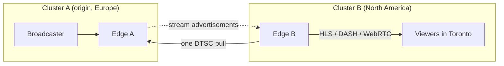

A FrameWorks stream is pushed into exactly one cluster. Viewers show up wherever they are. For a long time those two facts forced an awkward choice whenever a viewer's best edge lived in a cluster that had never seen the stream: send the viewer somewhere worse, or copy the stream somewhere it might not be needed.

As of the v0.1.0 cycle, clusters that serve the same tenant talk to each other directly. Each one knows which live streams its peers hold, and when a viewer needs a stream that lives elsewhere, the nearby cluster pulls it once and serves it locally. The stream is copied only when someone is watching it there.

## One viewer, two clusters

Take a broadcaster in Amsterdam who pushes over RTMP into a cluster in Europe. Their tenant also has access to a second cluster in North America. A viewer in Toronto opens the stream.

The North American cluster does not have the stream, but it already knows who does. Peer clusters continuously advertise the live streams they hold, so the viewer's cluster can answer "where is this stream" from its own memory rather than by asking a central service on every play.

Before it uses that answer, the viewer's cluster checks that the origin is still a peer the tenant is allowed to use. That check is made fresh, so a cluster whose access was revoked cannot keep supplying streams on the strength of an old record.

It then asks the European cluster for a good source edge. The origin scores its own edges and replies with candidates. One of the North American edges opens a pull from that source over DTSC, MistServer's native server-to-server transport. The control plane only decides which node pulls from which source; the media moves directly between MistServer instances.

The viewer in Toronto waits for that pull to start, which is the setup cost of the first cross-cluster view. The second viewer in Toronto, and the hundredth, are served from the same North American edge with no additional traffic across the ocean.

```mermaid
graph LR
    subgraph "Cluster A (origin, Europe)"
        PROD["Broadcaster"] --> EA["Edge A"]
    end
    subgraph "Cluster B (North America)"
        EB["Edge B"]
        V["Viewers in Toronto"]
    end
    EA -. "stream advertisements" .-> EB
    EB -- "one DTSC pull" --> EA
    EB -- "HLS / DASH / WebRTC" --> V
```

## A copy is made once, from the origin only

The obvious failure of a system like this is a cascade: every cluster opening its own pull, or clusters pulling from each other's copies until nobody knows where the original is.

Two rules prevent that. When a cluster starts pulling a stream, it tells its peers, so other clusters can see that a copy exists and where it came from. And replication is strictly single-hop: an edge pulls from the origin cluster, never from another cluster's replica. A pull chain has no path along which to loop.

Federation state is also built to expire rather than to be cleaned up. If a peer crashes or is cut off, its advertisements stop and its streams drop out of the directory, so nobody is routed toward a copy that no longer exists. When a peer is unreachable, requests to it fail quickly with an explicit error and the caller falls back to whatever local answer it has, instead of blocking a viewer on a dead connection.

## Who pays for the extra hop

Cross-cluster serving raises an accounting question that had to be answered precisely. Every event is stamped with the cluster that did the work and with the stream's origin cluster. Delivery is billed to the cluster that actually served the viewer, so a tenant's bill reflects where their audience watched. The DTSC traffic between clusters is our infrastructure cost and never appears as a tenant line item. If a rated usage record ever arrives without a cluster, billing refuses to guess and fails closed.

Routing decisions land in analytics with the serving and origin clusters recorded, so cross-cluster serves are visible in the dashboard rather than hidden inside an aggregate.

## What federation does not decide

Federation answers "can this cluster get the stream". It does not by itself decide which edge a viewer should use.

The limits are straightforward. The first viewer in a new cluster pays the setup latency of one pull. Federation only runs between clusters that share a tenant, so a stream cannot spread into a cluster its owner has no relationship with. And because replication is single-hop, every cluster that needs the stream pulls from the origin, which carries one outgoing copy per serving cluster.

How edges are chosen across clusters has changed since this post. Media placement now compares eligible edges in every permitted cluster by health, capacity and distance to the viewer, and lets accounts state rules such as "my own servers first". [Your Stream, Your Edge](/blog/your-stream-your-edge) explains that change.

For the operator's view of peering, artifact routing across clusters and billing attribution, see [multi-cluster operations](/operators/multi-cluster). For how routing choices are made and previewed, see the [media placement guide](/builders/media-placement).
