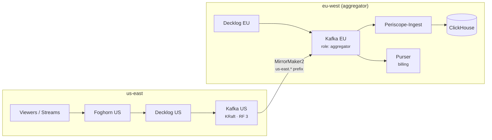

FrameWorks now runs two regions: eu-west and us-east. A viewer in Virginia gets a US edge, a US Foghorn routing decision, US Redis, and a US Kafka cluster absorbing the event firehose. What they don't get is a second source of truth — and the design work in this expansion was mostly about that second half.

## What runs where

Each region is a full media cell: Foghorn for routing, edge nodes, a Livepeer gateway for transcoding, Redis with Sentinel (a master, two replicas, and a three-sentinel quorum per region), the realtime layer, the event ingest path, and its own Kafka cluster. Kafka runs KRaft — three brokers and three controllers per region, replication factor 3, `min_insync_replicas: 2`, and no ZooKeeper anywhere. We retired the last ZooKeeper reference this spring; consensus lives in the controllers now.

The center of gravity stays in the EU: the distributed SQL cluster that backs the platform services, ClickHouse for analytics, and the control plane — provisioning, tenant management, billing, DNS. Media and events are regional; state and money are central.

The asymmetric piece is Kafka. The EU cluster is marked `role: aggregator` in the topology manifest; every other region is `role: regional`. MirrorMaker2 — running in the aggregator region — mirrors a small canonical set of topics one way, from each regional cluster onto the aggregator:

- `analytics_events` — stream lifecycle, viewer events, routing decisions
- `service_events` — service-level events from the control-plane services
- `analytics.raw_mist_triggers` — the raw media-trigger audit journal
- `billing.usage_reports` — per-tenant usage from the analytics query layer
- `decklog_events_dlq` — the ingest dead-letter queue, aggregated so failed events can be inspected and replayed from one place

MM2's replication policy prefixes mirrored topics with the source region, so US events land on the aggregator as `us-east.analytics_events` next to the EU-native `analytics_events`. Everything else stays home: stream-scoped realtime topics never cross the ocean, because the realtime layer (Signalman) only ever serves them regionally and the gateway routes subscriptions to the stream's origin region.

## Why an aggregator instead of a mesh

The consumers decided the shape. ClickHouse is central, the analytics ingest service is pinned to the aggregator, and billing needs every region's usage reports in one place before it can rate them. Mirroring a handful of topics to where those consumers already live is a much smaller commitment than making every consumer region-aware, and the canonical set is kept small so cross-region traffic stays proportional to events that matter globally.

Each analytics ingest instance gets the list of non-aggregator region prefixes injected by the provisioning CLI and registers one extra consumer handler per prefix — the same parsing code reads `analytics_events` and `us-east.analytics_events` without knowing or caring which region produced them. Producers needed even less: Decklog (the event firehose) reads its broker list from the environment, so a regional Decklog points at regional Kafka and the services in each cell dial their regional Decklog. No new routing code, just scoped configuration.

When a third region shows up, it gets its own KRaft cluster and MM2 flow, and the aggregator either stays on the EU cluster or moves to a dedicated one by flipping the `role` in the manifest.

## The consistency bill

Mirroring is at-least-once, regions can partition, and billing sits downstream of all of it. Most of the design effort went into the guarantees.

Every event carries an envelope with a UUIDv7 `event_id`, its source region, and its source cluster. ClickHouse tables dedup on `event_id` (with ingest-side dedup in front), which turns at-least-once mirroring into effectively-once analytics: a replayed or double-mirrored event collapses into the same row. Ordering is only guaranteed per partition, and nothing pretends otherwise — consumers reconstruct truth on read rather than trusting arrival order.

Events that carry state (billing, artifact lifecycle, provisioning) don't go fire-and-forget. Producers write them to a local outbox table in the same transaction as the state change; a drain worker ships them to Decklog and catches up after any outage, so a regional event-pipeline blip delays those events without losing them. Loss-tolerant telemetry — API usage counters, load-balancing samples — skips the outbox and accepts the loss window.

The billing read model takes one more step. Finalized facts (a viewer session ended, a processing segment completed) land in append-only tables — deliberately _not_ ClickHouse's self-deduplicating table engine, because two parser instances racing during a consumer-group rebalance plus a merge-timing window can eat a fact before anyone notices. Readers materialize the current truth with `min`/`argMax` at query time, and when two writers disagree about a fact, the divergence is recorded in an audit table and surfaced as a metric rather than silently overwritten.

## What it looks like from outside

Latency-sensitive paths — routing decisions, stream startup, realtime events — never wait on the ocean. Analytics dashboards aggregate both regions because the data already converged. A tenant's bill covers usage in every region because Purser only ever reads the aggregator. And [federation](/blog/federation-went-live) rides on top: the regions' Foghorns peer with each other, so cross-region viewers get the same origin-pull-or-redirect treatment as any cross-cluster viewer.

The topology, as always, is in the [public manifest](https://github.com/Livepeer-FrameWorks/gitops) — see [multi-cluster operations](/operators/multi-cluster) and the [cluster manifest reference](/operators/cluster-manifest) for the operator's view.
