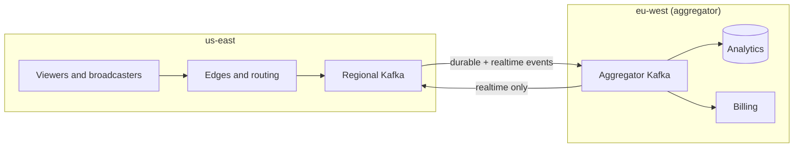

A viewer in Virginia opens a stream. In a single-region platform hosted in Europe, the routing decision, the session bookkeeping and the event traffic for that viewer all cross the Atlantic before the first frame arrives.

FrameWorks now runs two regions, eu-west and us-east. That viewer in Virginia gets a US edge, a US routing decision, and a US event pipeline absorbing the telemetry their session produces. The tenant who owns the stream still gets one dashboard and one bill covering both regions. Most of the design work went into keeping that second sentence true.

## Nothing on the viewer's path crosses the ocean

Each region is a complete media cell. It has its own edge nodes, its own routing and load balancing, its own transcoding capacity, its own cache, its own realtime layer and its own Kafka cluster. A broadcaster pushing into us-east and a viewer watching from us-east never wait on a request to Europe: stream startup, routing and playback admission are all answered inside the region.

What stays central is the state that has to be single: the control plane (accounts, provisioning, billing, DNS), the database behind it, and ClickHouse for analytics. None of those sit on the path between a viewer pressing play and video arriving.

## Why events converge in one region

The media is regional, but the questions a tenant asks are not. "How many people watched last week?" and "what do I owe?" need every region's data in one place.

We use Kafka's MirrorMaker 2 to copy each region's durable event streams (analytics, service events, billing usage reports and the dead-letter queue) into a single aggregator cluster in the EU, where ClickHouse and billing already live. A narrower link in the other direction carries only the realtime events that dashboards subscribe to, so a GraphQL subscription stays connected to its nearest region and still sees changes from both. Mirroring durable data toward the consumers that need it was a much smaller commitment than teaching every consumer about every region.

```mermaid
graph LR
    subgraph "us-east"
        USV["Viewers and broadcasters"] --> USE["Edges and routing"]
        USE --> USK["Regional Kafka"]
    end
    subgraph "eu-west (aggregator)"
        EUK["Aggregator Kafka"] --> CH[("Analytics")]
        EUK --> BILL["Billing"]
    end
    USK -- "durable + realtime events" --> EUK
    EUK -- "realtime only" --> USK
```

Producers need no knowledge of the topology. A service in us-east writes to its regional pipeline and is done; the mirror moves the event later. The mesh is declared explicitly in our [public cluster manifest](https://github.com/Livepeer-FrameWorks/gitops), and the CLI refuses a manifest with a missing or misplaced link. Two regions make a full mesh cheap. Before a third region, we will measure realtime volume and decide whether broadcasting every realtime event everywhere still makes sense.

## At-least-once mirrors, exactly-once bills

Mirroring is at-least-once. Regions can partition. A mirror can deliver the same event twice after a restart. Billing sits downstream of all of it, and a tenant should never pay twice for one viewer session.

Every event carries a unique ID and the region and cluster it came from. Analytics deduplicates on that ID, so a replayed or double-mirrored event collapses into the row that already exists. Events that record a state change, such as billing usage or an artifact being created, are written in the same database transaction as the change itself and shipped afterwards, so an outage in the regional event pipeline delays them without losing them. Loss-tolerant telemetry such as load-balancing samples skips that step and accepts a small loss window.

The finalized facts billing depends on, like a completed viewer session, needed one more change, and it came from a race we found rather than one we predicted. ClickHouse offers table engines that deduplicate rows in the background, which looks like exactly the right tool. It is not. When a Kafka consumer group rebalances, two parser instances can briefly process the same partition. Combine that with the timing of background merges, and a finalized fact can disappear without any error being raised.

So those facts are stored append-only, and the current truth is computed when it is read. When two writers disagree about the value of a billed fact, the disagreement is written to an audit table and raised as a metric, and supported cases become explicit corrections on the bill. Nothing is silently overwritten, and every change to what a tenant owes can be traced back to the events that caused it.

## What it costs and what it does not do

Cross-region dashboard updates arrive a little later than local ones, because they travel over the mirror. Analytics for a US stream reaches ClickHouse after the mirror delivers it, not the instant it happens. Keeping one central control plane means an EU-side control-plane outage is felt in both regions for account and billing operations, although viewers already watching keep watching.

In return, a tenant sees one bill that covers usage in every region, counted once, and viewers see latency set by their own region. Viewers whose stream lives in the other region are served through [federation](/blog/federation-went-live): a nearby edge pulls the stream across once, and later viewers watch it locally.

The operator's view, including how regions and mirror links are declared, is in [multi-cluster operations](/operators/multi-cluster) and the [cluster manifest reference](/operators/cluster-manifest).
