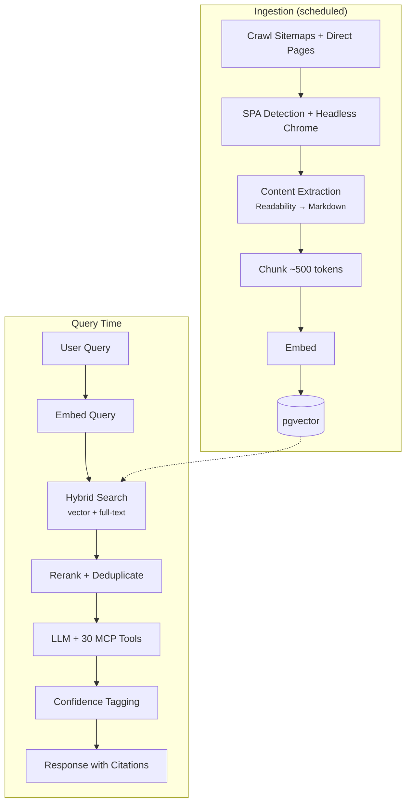

Every software platform needs a comprehensive API and docs for people to build on. Modern tools like [Docusaurus](https://docusaurus.io/) and [Astro Starlight](https://starlight.astro.build/) make it easier than ever to publish high-quality documentation — write your content in Markdown, and the build spits out something that looks good, with search, themes, and translation built in.

But the way people interact with docs is changing. With the rise of agentic assistants, developers increasingly point an AI at your docs and let it figure things out. What used to take two engineers two weeks — read the docs, build an integration, wire up a UI — now takes one agent a few hours to crawl, plan, and ship. The docs aren't just for humans anymore; they're a knowledge source for agents too.

That shift changes what a platform should offer. Static docs are table stakes. What developers actually need is a consultant that understands the domain, can look things up across dozens of sources, run live diagnostics on their infrastructure, and take actions on their behalf — all while being honest about what it knows versus what it's guessing.

Meet **Skipper** — the AI video consultant built into FrameWorks.

Skipper connects through the same [MCP gateway](/agents/mcp) that any external agent uses. The same GraphQL API, the same 30+ tools, the same authorization. Log in, and Skipper has full authenticated access to your account — the same streams, diagnostics, and billing that Claude Code or OpenClaw would see if you pointed them at the MCP endpoint. We didn't build a walled garden; we built a gateway and put our own agent on it first.

## What Skipper Does

That gateway access means Skipper doesn't just answer questions — it takes actions.

**Knowledge base search.** Skipper searches curated documentation across 10+ streaming domains: FrameWorks, MistServer, FFmpeg, OBS, SRT, HLS, nginx-rtmp, DASH, WebRTC, and more. Searches are semantic, not keyword-matched. Every answer includes citations back to the source material.

**Live stream diagnostics.** Skipper connects to your running streams and analyzes real data. Rebuffering patterns, packet loss, buffer health, routing decisions, anomaly detection — it can diagnose problems that would take you 30 minutes to find manually.

**Stream management.** Create streams, refresh keys, make clips, start DVR recording, upload VOD assets. Skipper executes these through the same GraphQL API you'd use directly, but conversationally.

**API introspection.** Building an integration? Skipper reads your GraphQL schema, generates ready-to-use queries, and can wrap them in working code snippets. It introspects the schema live — so the output always matches your current API version.

**Billing and payments.** Check your balance, initiate crypto top-ups, or resolve x402 payment flows — all from the chat.

## Confidence Tagging

Every Skipper response is tagged with a confidence level:

| Level          | Meaning                                                               |
| -------------- | --------------------------------------------------------------------- |
| **Verified**   | Confirmed from official FrameWorks documentation or tested procedures |
| **Sourced**    | Cited from external documentation (OBS, FFmpeg, etc.) with references |
| **Best guess** | Inferred from general knowledge — verify before acting on it          |
| **Unknown**    | Couldn't validate from available sources                              |

This isn't cosmetic. When Skipper generates a Python snippet from your schema, it knows that the GraphQL query is **verified** (generated from the real schema) but the Python wrapper is **best guess** (LLM-generated code). The tag tells you where to focus your review.

## Tool Calls

Skipper doesn't just generate text. It uses **30+ MCP tools** organized across stream management, QoE diagnostics, billing, knowledge search, API introspection, and more. When Skipper runs a tool, you see exactly what happened:

- **diagnose_rebuffering** — analyzed your stream's rebuffer ratio, found the root cause
- **generate_query** — built a createStream mutation from your live schema
- **create_clip** — clipped the last 30 seconds of your broadcast

Tool results render in specialized cards: diagnostic cards show health status with metrics and recommendations, code cards show GraphQL with copy buttons, stream cards display keys with show/hide toggles.

## Where to Use It

Skipper is available in three places — all backed by the same MCP gateway:

1. **Dashboard** — full access at `/skipper`. You're authenticated, so Skipper gets the same agentic access to your account that any MCP-connected agent would.
2. **Docs site** — floating widget (`Cmd+J`). Read-only mode: knowledge search, schema introspection, and diagnostics. No mutations.
3. **Your own agents** — connect Claude Code, OpenClaw, or any MCP client to the Gateway endpoint. `search_knowledge` and `search_web` are exposed alongside the same 30+ platform tools Skipper uses.

## Architecture

Skipper runs as a hub-and-spoke MCP setup. The Gateway MCP acts as the hub with 30+ tools. Skipper is a spoke that both **consumes** Gateway tools (diagnostics, stream management) and **provides** tools back (knowledge search, web search).

The knowledge base is built by a scheduled crawler that indexes documentation across 10+ streaming domains. The crawler handles both static sites and JavaScript-heavy SPAs — it auto-detects pages that need rendering and processes them in headless Chrome. Content extraction uses Mozilla's Readability algorithm to strip navigation and boilerplate, and three layers of change detection (source TTL, HTTP 304, content hashing) avoid re-embedding unchanged pages.

At query time, retrieval combines vector cosine similarity with PostgreSQL full-text search, followed by a reranking pass and per-source deduplication. Web search falls back to Tavily/Brave/SearXNG for topics not covered in the knowledge base.

Every conversation is persisted with token counts, confidence levels, citations, and tool call history — so you can pick up where you left off.

## Try It

- **[Skipper Docs](/agents/skipper)** — full reference
- **[Open Dashboard](https://app.frameworks.network/skipper)** — start chatting
- **Press `Cmd+J`** on any docs page to open the widget

---

Skipper is live today for all FrameWorks users. No additional setup, no extra cost for the chat itself — standard usage billing applies for any stream operations Skipper performs on your behalf.
