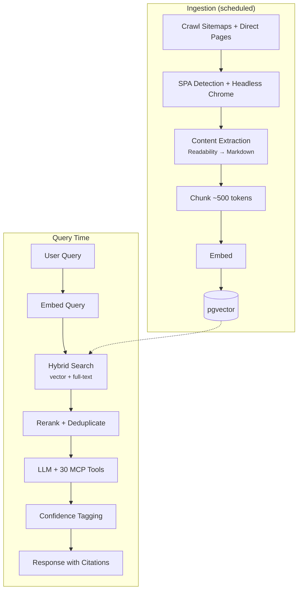

A question we see constantly, in some form: "my viewers keep buffering, what's wrong?" There is no docs page that answers that. Answering it means looking at the stream — rebuffer ratio, packet loss, which edges the viewers landed on, whether the encoder is keeping up. Half of a good answer lives in documentation; the other half lives in the running system.

Skipper puts both halves behind one interface. It's an AI video consultant built into FrameWorks: it searches curated streaming documentation, runs diagnostics against your live streams, generates API operations from the current schema, and, in authenticated dashboard chat, can manage streams and billing for you.

It connects through the same [MCP gateway](/agents/mcp) that external agents use. Same GraphQL API, same tool registry, same authorization checks. Skipper has no private backdoor into the platform, so anything it can do, your own agents can do too. In the dashboard it operates with your authenticated account context. On the docs site it runs read-only. Over MCP, `ask_consultant` runs the full consultant pipeline with mutation tools blocked; agents that intend to change platform state call the dedicated Gateway tools, which carry their own authorization.

## What it does

Ask "why is stream X buffering" and Skipper pulls real data: rebuffering patterns, packet loss, buffer health, routing decisions. The kind of diagnosis that takes 30 minutes of dashboard-hopping by hand comes back as one answer with the evidence attached.

Ask "give me a Python script that creates a stream" and it introspects the live GraphQL schema, generates the operation, and wraps it in working code. The schema introspection happens at query time, so the output matches your current API version rather than whatever the training data remembers.

Knowledge questions go to a curated corpus spanning 10+ streaming domains: FrameWorks, MistServer, FFmpeg, OBS, SRT, HLS, DASH, WebRTC, nginx-rtmp, Livepeer. Retrieval is semantic, and source-backed answers include citations.

And in authenticated dashboard chat it can act: create streams, refresh keys, clip the last 30 seconds of a broadcast, start DVR recording, upload VOD assets, check your balance, initiate supported crypto top-ups, or resolve x402 payment flows — through the same GraphQL API you'd call directly, just conversationally.

## It tells you when it's guessing

Every Skipper response is tagged with a confidence level:

| Level          | Meaning                                                               |
| -------------- | --------------------------------------------------------------------- |
| **Verified**   | Confirmed from official FrameWorks documentation or tested procedures |
| **Sourced**    | Cited from external documentation (OBS, FFmpeg, etc.) with references |
| **Best guess** | Inferred from general knowledge — verify before acting on it          |
| **Unknown**    | Couldn't validate from available sources                              |

The tag applies per part of an answer, and mixed answers are the common case. When Skipper generates that Python snippet, the GraphQL query inside it is **verified** — generated from the real schema — while the Python wrapper around it is a **best guess**, because it's LLM-generated glue code. The tag tells you where to spend your review time.

## Tool calls you can see

Skipper works through 30+ MCP tools covering stream management, QoE diagnostics, billing, knowledge search, and API introspection. When it runs one, you see what happened: `diagnose_rebuffering` analyzed your stream's rebuffer ratio and found the root cause, `generate_query` built a `createStream` mutation from your live schema, `create_clip` clipped the last 30 seconds of your broadcast.

Tool results render as cards in the chat — diagnostic cards with health status, metrics, and recommendations; code cards with copyable GraphQL; stream cards with show/hide toggles on the keys.

## How the knowledge base works

```mermaid
graph TD
    subgraph "Ingestion (scheduled)"
        CRAWL["Crawl Sitemaps + Direct Pages"] --> DETECT["SPA Detection + Headless Chrome"]
        DETECT --> EXTRACT["Content Extraction<br/><small>Readability → Markdown</small>"]
        EXTRACT --> CHUNK["Chunk ~500 tokens"]
        CHUNK --> EMBED["Embed"]
        EMBED --> PG[("pgvector")]
    end
    subgraph "Query Time"
        Q["User Query"] --> EMB["Embed Query"]
        EMB --> SEARCH["Hybrid Search<br/><small>vector + full-text</small>"]
        PG -.-> SEARCH
        SEARCH --> RERANK["Rerank + Deduplicate"]
        RERANK --> LLM["LLM + 30 MCP Tools"]
        LLM --> CONF["Confidence Tagging"]
        CONF --> RESP["Response with Citations"]
    end
```

That sounds like standard RAG because it mostly is. A scheduled crawler indexes the documentation sources; it handles static sites and JavaScript-heavy SPAs by detecting pages that need rendering and processing those in headless Chrome. Content extraction uses Mozilla's Readability to strip navigation and boilerplate. Pages are chunked to roughly 500 tokens, embedded, and stored in Postgres with pgvector, and three layers of change detection (source TTL, HTTP 304, content hashing) keep unchanged pages from being re-embedded.

At query time, retrieval combines vector cosine similarity with Postgres full-text search, then reranks and deduplicates per source before the model sees any context. Topics the knowledge base doesn't cover fall back to web search via Tavily, Brave, or SearXNG.

The FrameWorks-specific part is everything around the retrieval: the tool boundary, the confidence tagging, and the fact that Skipper is a spoke on the Gateway MCP hub — it consumes Gateway tools for diagnostics and stream management, and provides knowledge and web search tools back.

Every conversation is persisted with token counts, confidence levels, source metadata, and tool-call history, so you can pick up where you left off.

## Heartbeat monitoring

The other half of Skipper is watching streams nobody is asking about. For eligible tenants, a heartbeat agent runs every `HEARTBEAT_INTERVAL` (default 30 minutes), fetches stream health and client QoE metrics from Periscope, and compares them against Welford running baselines it builds over time. The triage is deterministic and runs before any LLM gets involved:

- **Threshold violations** — hard limits on rebuffer ratio, packet loss, and similar metrics trigger an investigation directly.
- **Cross-metric correlations** — deviation patterns are matched against 5 failure hypotheses (network degradation, encoder overload, viewer-side issues, ingest instability, CDN pressure). Confidence is matched signals over expected signals; 50% or more triggers investigation.
- **Baseline deviations** — metrics beyond 2σ from the running mean are flagged, with a 5-sample minimum so warmup noise doesn't page anyone.

When investigation is warranted, Skipper hands the orchestrator the diagnostic context — deviations, correlations, per-stream anomalies — and produces a structured report with root cause and recommendations. Per-stream drill-down compares each stream against the tenant-wide baseline and surfaces the most anomalous ones, up to 20. Infrastructure monitoring separately checks node-level CPU, memory, and disk across clusters, with persistence confirmation so a transient spike doesn't fire an alert. Notifications go out via configured email, WebSocket, or MCP channels.

Healthy tenants consume zero LLM calls per cycle.

## Social drafts

Skipper can also draft social posts from platform events, when `SKIPPER_SOCIAL_ENABLED=true` and a notify email is configured. The heartbeat agent and knowledge crawler push signals into a collector — viewer records, bandwidth milestones, federation metrics, newly embedded docs pages — and a detector scores them against stored baselines. The top signal becomes a draft tweet (280-character cap, checked against recent posts to avoid repeating themes), which is saved and emailed for human review. Default limit is 2 per day, checked every 2 hours. It never publishes on its own.

## Where to use it

Skipper is available in three places, all backed by the same MCP gateway:

1. **Dashboard** — authenticated chat at `/skipper`, with account-scoped diagnostics and management actions where enabled.
2. **Docs site** — floating widget on any page (`Cmd+J`). Read-only: knowledge search, schema introspection, diagnostics.
3. **Your own agents** — connect Claude Code or any MCP client to the Gateway endpoint. Use `ask_consultant` for full-pipeline answers with confidence tagging, and the dedicated platform tools for everything else.

Start with the [Skipper docs](/agents/skipper), the [operator setup guide](/operators/skipper), or just open the [dashboard](https://chartroom.frameworks.network/skipper) and ask it something.

Skipper is available where it's enabled for an eligible account or deployment; chat access follows the configured tier and rate limits, and standard usage billing applies to stream operations it performs on your behalf.
