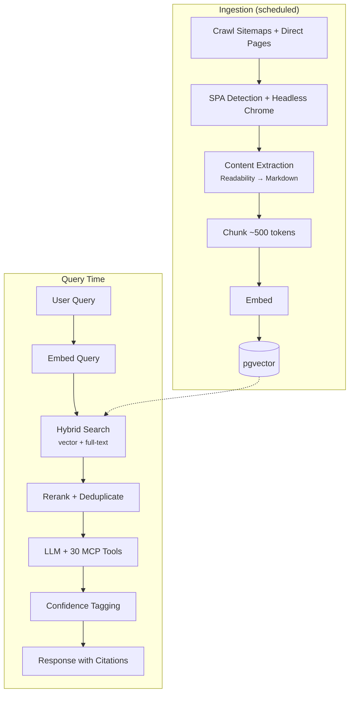

Every software platform needs a comprehensive API and docs for people to build on. Modern tools like [Docusaurus](https://docusaurus.io/) and [Astro Starlight](https://starlight.astro.build/) make it easier than ever to publish high-quality documentation — write your content in Markdown, and the build spits out something that looks good, with search, themes, and translation built in.

But the way people interact with docs is changing. With the rise of agentic assistants, developers increasingly point an AI at your docs and let it figure things out. What used to take two engineers two weeks — read the docs, build an integration, wire up a UI — now takes one agent a few hours to crawl, plan, and ship. The docs aren't just for humans anymore; they're a knowledge source for agents too.

That shift changes what a platform should offer. Static docs are table stakes. What developers actually need is a consultant that understands the domain, can look things up across dozens of sources, run live diagnostics on their infrastructure, and guide or execute authenticated platform workflows where that surface allows mutations — all while being honest about what it knows versus what it's guessing.

Meet **Skipper** — the AI video consultant built into FrameWorks.

Skipper connects through the same [MCP gateway](/agents/mcp) that external agents use. The same GraphQL API, the same tool registry, the same authorization checks. In the dashboard, Skipper can use your authenticated account context for streams, diagnostics, and billing. External agents can use the Gateway MCP endpoint directly, while `ask_consultant` runs the Skipper pipeline with mutation tools blocked inside the consultant call.

## What Skipper Does

That gateway access means Skipper doesn't just answer questions — in the authenticated dashboard path, it can use platform tools for actions. In docs mode and through MCP `ask_consultant`, mutation tools are intentionally blocked; external agents should call dedicated Gateway MCP tools directly when they need to change resources.

**Knowledge base search.** Skipper searches curated documentation across 10+ streaming domains: FrameWorks, MistServer, FFmpeg, OBS, SRT, HLS, nginx-rtmp, DASH, WebRTC, and more. Searches are semantic, not keyword-matched. Source-backed answers include citations back to the source material.

**Live stream diagnostics.** Skipper connects to your running streams and analyzes real data. Rebuffering patterns, packet loss, buffer health, routing decisions, anomaly detection — it can diagnose problems that would take you 30 minutes to find manually.

**Stream management.** In authenticated dashboard chat, Skipper can create streams, refresh keys, make clips, start DVR recording, and upload VOD assets through the same GraphQL API you'd use directly, but conversationally. Through MCP, use `ask_consultant` for guidance and the dedicated mutation tools for state changes.

**API introspection.** Building an integration? Skipper reads your GraphQL schema, generates ready-to-use queries, and can wrap them in working code snippets. It introspects the schema live — so the output always matches your current API version.

**Billing and payments.** Check your balance, initiate supported crypto top-ups, or resolve x402 payment flows from authenticated dashboard chat or the dedicated Gateway MCP billing/payment tools.

## Confidence Tagging

Every Skipper response is tagged with a confidence level:

| Level          | Meaning                                                               |
| -------------- | --------------------------------------------------------------------- |
| **Verified**   | Confirmed from official FrameWorks documentation or tested procedures |
| **Sourced**    | Cited from external documentation (OBS, FFmpeg, etc.) with references |
| **Best guess** | Inferred from general knowledge — verify before acting on it          |
| **Unknown**    | Couldn't validate from available sources                              |

This isn't cosmetic. When Skipper generates a Python snippet from your schema, it knows that the GraphQL query is **verified** (generated from the real schema) but the Python wrapper is **best guess** (LLM-generated code). The tag tells you where to focus your review.

## Tool Calls

Skipper doesn't just generate text. It uses **30+ MCP tools** organized across stream management, QoE diagnostics, billing, knowledge search, API introspection, and more. When Skipper runs a tool, you see exactly what happened:

- **diagnose_rebuffering** — analyzed your stream's rebuffer ratio, found the root cause
- **generate_query** — built a createStream mutation from your live schema
- **create_clip** — clipped the last 30 seconds of your broadcast

Tool results render in specialized cards: diagnostic cards show health status with metrics and recommendations, code cards show GraphQL with copy buttons, stream cards display keys with show/hide toggles.

## Heartbeat Monitoring

Skipper can run periodic health checks on active streams for eligible tenants. Every 30 minutes by default (configurable with `HEARTBEAT_INTERVAL`), it fetches stream health and client QoE metrics from Periscope, compares them against Welford running baselines it builds over time, and runs a deterministic triage:

- **Threshold violations** (hard limits on rebuffer ratio, packet loss, etc.) trigger an investigation
- **Cross-metric correlations** — 5 failure hypotheses (network degradation, encoder overload, viewer-side issues, ingest instability, CDN pressure) are matched against deviation patterns. Confidence ≥ 50% triggers investigation.
- **Baseline deviations** — metrics exceeding 2σ from the running mean are flagged for review

When investigation is warranted, Skipper runs the full orchestrator with the diagnostic context — deviations, correlations, per-stream anomalies — and produces a structured report with root cause and recommendations. Healthy tenants consume zero LLM calls per cycle.

Per-stream drill-down identifies the most anomalous individual streams (up to 20) by comparing each against the tenant-wide baseline.

Infrastructure monitoring checks node-level CPU, memory, and disk across all clusters, with persistence confirmation to prevent transient spikes from triggering alerts. Notifications go out via configured email, WebSocket, or MCP channels.

## Social Posting

Skipper can draft social media posts from platform events when `SKIPPER_SOCIAL_ENABLED=true` and `SKIPPER_SOCIAL_NOTIFY_EMAIL` is configured. The heartbeat agent and knowledge crawler push signals into an event collector — viewer records, bandwidth milestones, federation metrics, newly embedded documentation pages. A detector classifies and scores these signals against stored baselines.

The top-scoring signal is composed into a tweet by the utility LLM (max 280 characters, references recent posts to avoid theme repetition). Posts are saved as drafts and emailed to a configured address for human review before publishing. Configurable daily limit (default 2) and check interval (default 2h).

## Where to Use It

Skipper is available in three places — all backed by the same MCP gateway:

1. **Dashboard** — authenticated chat at `/skipper` with account-scoped diagnostics and management actions where enabled.
2. **Docs site** — authenticated floating widget (`Cmd+J`). Read-only mode: knowledge search, schema introspection, and diagnostics. No mutations.
3. **Your own agents** — connect Claude Code, OpenClaw, or any MCP client to the Gateway endpoint. Use `ask_consultant` for full-pipeline read/diagnostic answers with confidence tagging alongside the Gateway's dedicated platform tools.

## Architecture

Skipper runs as a hub-and-spoke MCP setup. The Gateway MCP acts as the hub with 30+ tools. Skipper is a spoke that both **consumes** Gateway tools (diagnostics, stream management) and **provides** tools back (knowledge search, web search).

```mermaid
graph TD
    subgraph "Ingestion (scheduled)"
        CRAWL["Crawl Sitemaps + Direct Pages"] --> DETECT["SPA Detection + Headless Chrome"]
        DETECT --> EXTRACT["Content Extraction<br/><small>Readability → Markdown</small>"]
        EXTRACT --> CHUNK["Chunk ~500 tokens"]
        CHUNK --> EMBED["Embed"]
        EMBED --> PG[("pgvector")]
    end
    subgraph "Query Time"
        Q["User Query"] --> EMB["Embed Query"]
        EMB --> SEARCH["Hybrid Search<br/><small>vector + full-text</small>"]
        PG -.-> SEARCH
        SEARCH --> RERANK["Rerank + Deduplicate"]
        RERANK --> LLM["LLM + 30 MCP Tools"]
        LLM --> CONF["Confidence Tagging"]
        CONF --> RESP["Response with Citations"]
    end
```

The knowledge base is built by a scheduled crawler that indexes documentation across 10+ streaming domains. The crawler handles both static sites and JavaScript-heavy SPAs — it auto-detects pages that need rendering and processes them in headless Chrome. Content extraction uses Mozilla's Readability algorithm to strip navigation and boilerplate, and three layers of change detection (source TTL, HTTP 304, content hashing) avoid re-embedding unchanged pages.

At query time, retrieval combines vector cosine similarity with PostgreSQL full-text search, followed by a reranking pass and per-source deduplication. Web search falls back to Tavily/Brave/SearXNG for topics not covered in the knowledge base.

Every conversation is persisted with token counts, confidence levels, source metadata when available, and tool call history — so you can pick up where you left off.

## Try It

- **[Skipper Docs](/agents/skipper)** — full reference
- **[Open Dashboard](https://chartroom.frameworks.network/skipper)** — start chatting where Skipper is enabled for your account
- **Press `Cmd+J`** on any docs page to open the widget

---

Skipper is available where it is enabled for an eligible account or deployment. Chat access is controlled by the configured tier and rate limits; standard usage billing applies for any stream operations Skipper performs on your behalf.
