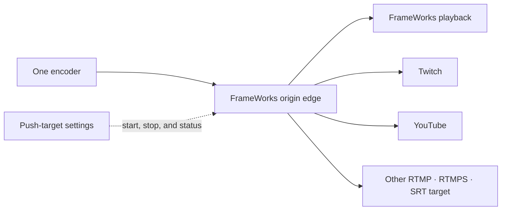

import { Aside, LinkCard, CardGrid } from "@astrojs/starlight/components";

Multistreaming lets you push a single live broadcast to multiple external platforms at once. When your stream goes live, FrameWorks automatically pushes to every enabled target — no third-party restreaming service required.

Each enabled live destination uses one slot from your existing viewer-capacity limit. There is no separate restream quota. Restream runtime and bytes are reported as delivered minutes and egress, while audience analytics continue to count human playback sessions only.

Playback policy, DVR, and analytics stay on the single ingest; only distribution fans out.

<Aside type="tip">
  Multistreaming uses native MistServer push, so FrameWorks does not add a re-encoding step. Each
  target receives the source bitstream from the origin node. Destination platforms can still add
  their own buffering and latency.
</Aside>


```mermaid
flowchart LR
    ENC[One encoder] --> ORIGIN[FrameWorks origin edge]
    ORIGIN --> VIEWERS[FrameWorks playback]
    ORIGIN --> TW[Twitch]
    ORIGIN --> YT[YouTube]
    ORIGIN --> OTHER[Other RTMP · RTMPS · SRT target]
    CONTROL[Push-target settings] -. start, stop, and status .-> ORIGIN
```

## Lifecycle

1. **Configure targets** — Add push targets to your stream via the dashboard or API
2. **Go live** — Start broadcasting as usual (OBS, StreamCrafter, SRT, etc.)
3. **Automatic push** — FrameWorks detects the stream going live and pushes to all enabled targets
4. **Automatic stop** — When your stream ends, all pushes stop automatically

Each push target has a live status indicator: **pending**, **pushing**, **retrying**,
**stopping**, **idle**, or **failed**.
The control plane stores a bounded machine reason separately from the sanitized
operator-facing error detail.

## Supported platforms

| Platform    | Dashboard preset ingest URL                                            | Key source                  |
| ----------- | ---------------------------------------------------------------------- | --------------------------- |
| Twitch      | `rtmp://live.twitch.tv/app/`                                           | Creator Dashboard           |
| YouTube     | `rtmp://a.rtmp.youtube.com/live2/`                                     | Live Control Room           |
| Facebook    | `rtmps://live-api-s.facebook.com:443/rtmp/`                            | Live Producer               |
| Kick        | `rtmps://fa723fc1b171.global-contribute.live-video.net/app/`           | Creator Dashboard           |
| X (Twitter) | `rtmps://prod-ec-us-west-2.compose.broadcast.live-video.net:443/rtmp/` | Media Studio or Producer    |
| Custom      | None; supply a complete `rtmp://`, `rtmps://`, or `srt://` URI         | The destination's dashboard |

In the dashboard, a platform preset fixes the ingest URL shown above and asks only for the stream
key; FrameWorks stores the preset URL followed by the key. If the destination gives you a different
server URL (another region or ingest server), choose **Custom** and enter the complete URI.

Through the API, you always supply the complete target URI. The `platform` value there is only a
label for the destination and does not change the URI.

<Aside type="caution">
  Your stream key for each platform is stored securely and masked in API responses. Never share your
  stream keys publicly.
</Aside>

## Dashboard

In the stream detail page, open the **Multistream** tab to manage push targets.

- **Add Target** — Select a platform, enter your stream key, and give it a name
- **Enable/Disable** — Toggle targets on or off without deleting them
- **Status** — See real-time push status for each target
- **Edit** — Update the name, stream key, or target URI at any time
- **Video track** — Keep Automatic for source video when compatible, or require source or processed video for an RTMP target
- **Delete** — Remove targets you no longer need

## GraphQL API

### Add a Push Target

```graphql
mutation {
  createPushTarget(
    streamId: "stream-global-id"
    input: {
      platform: "twitch"
      name: "My Twitch Channel"
      targetUri: "rtmp://live.twitch.tv/app/live_xxxxxxxxxxxx"
      videoChoice: "AUTO"
    }
  ) {
    id
    name
    platform
    targetUri
    isEnabled
    status
    reasonCode
    videoChoice
  }
}
```

### List Push Targets

Push targets are available as a field on the `Stream` type:

```graphql
query {
  stream(id: "stream-global-id") {
    id
    name
    pushTargets {
      id
      name
      platform
      targetUri
      isEnabled
      status
      reasonCode
      videoChoice
      lastError
      lastPushedAt
    }
  }
}
```

<Aside type="note">
  The `targetUri` field is masked in API responses: credentials, query params, and fragments are
  removed, and the complete path is replaced with `/redacted`. Full URIs are stored encrypted and
  only decrypted for internal push activation. FrameWorks checks resolved destination addresses
  immediately before activation, but MistServer performs the final connection lookup; use an egress
  firewall when you need a hard boundary against DNS rebinding.
</Aside>

Use `reasonCode` for automation and `lastError` for sanitized operator-facing detail. The
stable reason values are `unspecified`, `connected`, `completed`, `destination_rejected`,
`network_error`, `process_error`, `capacity_exhausted`, `configuration_error`,
`edge_upgrade_required`, `media_selection_failed`, and `stopped`.

### Video track choice

`videoChoice` is `AUTO` by default. Mist starts with the original video when its codec and known metadata fit the destination. If a documented hard limit rules it out, Mist chooses one compatible processed rendition. `SOURCE_VIDEO` requires an original video track; `PROCESSED_VIDEO` requires a rendition. The choice applies to video only: a compatible AAC conversion can still provide audio. A stream with only video or only audio can use `AUTO`; Mist gives a newly discovered single track one second for its companion to appear before publishing headers. If compatible tracks remain unavailable for 30 seconds after source tracks appear, the target reports `media_selection_failed` and retries while the broadcast remains live.

Kick targets use the documented H.264, 1080p60, 8 Mbps and AAC stereo 48 kHz ceilings. X targets use H.264 video up to 12 Mbps and AAC audio; the AAC bitrate is left unconstrained because common publisher defaults exceed X's recommendation. Twitch, YouTube and custom RTMP targets use codec negotiation without enforcing recommendation-only bitrate limits. FrameWorks cannot infer CBR or GOP compliance from Mist track metadata; configure the publisher or managed encoder to meet the destination's requirements.

For streams that do not need a video ladder, set `liveVideoAbr: "OFF"` on `createStream` or `updateStream`. This removes live video rendition processes from the next ingest while keeping audio conversion, thumbnails, and recording. `INHERIT` uses the tier's processing policy. A target set to `PROCESSED_VIDEO` needs the live ladder or another video process to supply a rendition.

### Update a Push Target

```graphql
mutation {
  updatePushTarget(id: "push-target-global-id", input: { isEnabled: false }) {
    id
    isEnabled
    status
  }
}
```

### Delete a Push Target

```graphql
mutation {
  deletePushTarget(id: "push-target-global-id") {
    success
    deletedId
  }
}
```

## Bandwidth Considerations

Each push target consumes upstream bandwidth on the origin node proportional to your stream's bitrate. For a 6 Mbps stream with 3 push targets, the origin node uses ~18 Mbps of upload bandwidth for multistreaming alone.

Keep this in mind when:

- Streaming at high bitrates (4K, high-FPS)
- Adding many simultaneous targets
- Using nodes with limited upload capacity

## Troubleshooting

**Target shows "failed" status**

- Verify your stream key is correct and hasn't expired
- Check that the platform isn't blocking your IP or account
- Some platforms require additional setup (e.g., Facebook requires creating a live broadcast first)

**Push doesn't start when stream goes live**

- Ensure the target is **enabled** (not just created)
- Check that your stream is actually live on the origin node
- Review the event log on the stream detail page for errors

**External playback is behind the FrameWorks stream**

- Destination platforms apply their own ingest processing and playback buffers.
- Compare the origin stream and the destination's ingest-health view before treating the delay as a FrameWorks incident.

<CardGrid>
  <LinkCard
    title="Encoder Setup"
    href="/builders/encoder-setup"
    description="Configure OBS, vMix, or other encoders"
  />
  <LinkCard
    title="Ingest Protocols"
    href="/builders/ingest-advanced"
    description="RTMP, SRT, WHIP ingest options"
  />
</CardGrid>
