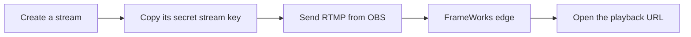

import { Aside } from "@astrojs/starlight/components";

Create a stream, send it video from OBS, and open the playback URL.

<Aside type="tip" title="Self-hosting?">
  This guide uses the managed FrameWorks service. Want full control? See [Infrastructure
  Operators](/operators/deployment) to deploy on your own servers. Core streaming features are the
  same; managed‑only services and UI flows may differ.
</Aside>

## 1. Create an Account

Head to [%APP_URL%](%APP_URL%) and sign up with email and password or an EVM wallet.

## 2. Create a Stream

This creates a push stream: OBS, FFmpeg, StreamCrafter, or a hardware encoder will upload media
into FrameWorks. If you want the platform to fetch from an existing camera or origin instead, see
[Pull-input Streams](/builders/pull-streams).

In the dashboard:

1. Click **Content → Streams** in the sidebar
2. Click **Create Stream**
3. Give it a name (this is just for you to identify it)
4. Click **Create**

You'll land on your stream's detail page.

## 3. Copy Your Stream Key

On your stream detail page, copy the **Stream Key** from the top row. If you want to manage multiple keys, open the **Ingest** tab and use **Stream Keys Management**.

Keep this secret—anyone with your stream key can broadcast to your channel. Stream keys are tied to your account and the specific stream you created.

## 4. Configure Your Encoder

Open OBS Studio (or your preferred streaming software). For the quickest setup, we'll use RTMP. Enhanced RTMP (E-RTMP) works on the same ingest endpoint when your encoder supports it. For advanced configurations like WHIP or specific optimizations (e.g., keyframe intervals, OBS profiles), refer to our [Encoder Setup Guide](/builders/encoder-setup).

**In OBS Studio:**

1. Go to **Settings** → **Stream**.
2. Set **Service:** `Custom`.
3. For **Server:** Enter `%RTMP_URL%` (you can also copy the RTMP/E-RTMP URL from the **Ingest** tab).
4. For **Stream Key:** Paste the stream key you copied from your FrameWorks dashboard.

Once configured, hit **Start Streaming** in OBS.

## 5. Watch Your Stream

After FrameWorks accepts the ingest, the dashboard changes the stream status to **Live**.

The **Playback Info** card shows your Playback ID. For protocol URLs and embed code, open the **Playback** tab.

## What's Next

- [Streams](/builders/streams) — Understand stream keys, playback IDs, and push versus pull ingest.
- [Encoder Setup](/builders/encoder-setup) — Configure OBS for a reliable stream.
- [Playback & Embedding](/builders/playback) — Put the stream on your site.
- [Troubleshooting](/builders/troubleshooting) — Diagnose ingest and playback failures.
