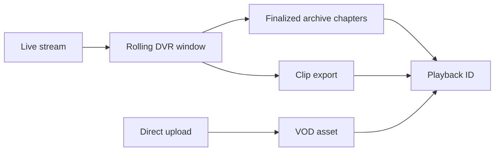

import { Aside } from "@astrojs/starlight/components";

Always-on venues, sports, conferences, classrooms, public meetings, monitoring feeds: anywhere the live moment and the long archive both matter. FrameWorks keeps a single DVR session running per channel for as long as the stream is live, and, when chapters are enabled on the stream, segments that session into chapter artifacts. You find chapters by listing a UTC time range and replay each one by its playback ID. This page covers DVR replay, clips from the buffer, and direct VOD uploads.



<Aside type="caution" title="Storage and retention costs">
  Recordings, clips, and VOD assets consume storage until they expire or are deleted. Longer
  retention periods can increase storage usage and cost depending on your billing tier and
  deployment. Set retention deliberately, delete assets you no longer need, and treat always-on DVR
  as a storage budget decision.
</Aside>

## DVR Recording

DVR records your live stream and preserves the broadcast for later playback. DVR content is playable **while the stream is still live**: viewers can seek back through the live DVR window, pause, and catch up. After that window, the recording is replayable only if chapters are enabled on the stream (they are off by default): it is then split into bounded chapter artifacts for replay.

The recording model separates capture, live seeking, and archive replay:

- **24/7 capture** — one stream session can keep recording continuously instead of rolling into arbitrary fixed-length assets.
- **Fast live playlists** — the live DVR window stays bounded so viewers get seekback without enormous manifests.
- **Archive replay** — chapters turn a long recording into hidden VOD-shaped artifacts with normal playback IDs.
- **Cost control** — retention policies decide how long completed DVR, clips, and VOD assets stay in storage.

That split matters:

| Concept            | What it controls                                                                                                                                                           |
| ------------------ | -------------------------------------------------------------------------------------------------------------------------------------------------------------------------- |
| Live DVR window    | How far back live viewers can seek while the stream is still recording. This is tier- and cluster-bounded so live playlists stay small.                                    |
| Continuous archive | The full DVR segment timeline for one stream session. It can span hours, days, or months if the ingest stays live.                                                         |
| DVR chapters       | Finalized VOD-shaped artifacts for historical replay. Each chapter is linked to its parent DVR and source stream, but stays out of the tenant-wide VOD library by default. |
| Retention          | How long a completed recording is kept after the stream session ends. Retention is not the live seekback window.                                                           |

### Enabling Recording

**When creating a stream:**

Set `record: true` in the create mutation:

```graphql
mutation {
  createStream(input: { name: "My Stream", record: true }) {
    __typename
    ... on Stream {
      id
      streamKey
      playbackId
      record
    }
    ... on ValidationError {
      message
      field
    }
  }
}
```

**On an existing stream:**

Toggle recording in the dashboard on the stream detail page, or update via the API:

```graphql
mutation {
  updateStream(input: { record: true }, id: "stream-global-id") {
    __typename
    ... on Stream {
      id
      record
    }
  }
}
```

### Starting and Stopping DVR

Recording begins automatically when a stream with `record: true` goes live. You can also start and stop recording manually during a broadcast:

```graphql
# Start recording
mutation StartRecording {
  startDVR(streamId: "stream-global-id") {
    __typename
    ... on DVRRequest {
      dvrHash
      playbackId
      createdAt
    }
    ... on ValidationError {
      message
    }
  }
}

# Stop recording
mutation StopRecording {
  stopDVR(dvrHash: "dvr-hash") {
    __typename
    ... on DeleteSuccess {
      success
    }
  }
}
```

### Playback

DVR recordings get their own `playbackId`, separate from the live stream's. This means the same stream supports three viewing modes:

- **Live** (`streamPlaybackId`) — real-time playback at the live edge.
- **Live DVR window** (`dvrPlaybackId`) — seekable playback while the stream is recording, bounded by the tier/cluster DVR window.
- **Archive chapters** — optional finalized VOD artifacts generated from the recording timeline for historical replay.

DVR playback URLs follow the same `/play/{playbackId}` pattern:

```
HLS:    %PLAY_URL%/play/{dvrPlaybackId}/hls/index.m3u8
DASH:   %PLAY_URL%/play/{dvrPlaybackId}/cmaf/index.mpd
MP4:    %PLAY_URL%/play/{dvrPlaybackId}.mp4
```

With the Player SDK, use `contentType="dvr"` for the live DVR window. The player enables seeking, skip, and speed controls within the active window:

```tsx
<Player contentType="dvr" contentId="a1b2c3d4e5f6g7h8" />
```

### Live Time-Shift

While a stream is live, the DVR recording grows continuously. Viewers using the DVR playback ID can:

- **Seek back** through the tier-bounded live DVR window
- **Pause and resume** without losing their position
- **Jump to live** to catch up to the real-time edge

The trade-off is latency — DVR playback goes through HLS or DASH segments, so it's higher latency
than a direct live WebRTC connection. But for live events,
conferences, and always-on streams this is a feature: viewers can rewind a goal, replay a slide, or start watching late and catch up within the live DVR window.

<Aside type="tip" title="Always-On Streams">
  DVR supports 24/7-style streams without forcing a new recording artifact every few hours. The live
  DVR window stays bounded for player performance, while the archive is replayed through chapter
  artifacts when historical chapters are enabled.
</Aside>

### Archive Chapters

For historical replay, FrameWorks splits the DVR archive into **chapter VOD artifacts**. Each chapter is its own canonical `.mkv` produced by the chapter finalization pipeline at boundary close and addressed by a Commodore-minted, shareable `playbackId` — pass it to `resolveViewerEndpoint` like any other VOD. The parent DVR's playback policy is snapshotted onto the chapter and still applies.

For the full chapter-policy story (modes, defaults, resolution semantics) see [DVR Chapters](/builders/dvr-chapters). Storage cost behavior is covered in [Storage & retention](/builders/storage-and-retention).

Chapters are off by default: a stream's `dvrChapterMode` is `NONE` until you set it. Common chapter shapes:

| Shape                 | Use                                                                                                           |
| --------------------- | ------------------------------------------------------------------------------------------------------------- |
| Window-sized chapters | Sequential chapters sized to the stream's DVR window (`WINDOW_SIZED`).                                        |
| Fixed UTC intervals   | Regular UTC buckets such as 6-hour or 24-hour spans. Minimum interval is 1 hour (enforced by Commodore + DB). |

All chapter time fields are UTC epoch milliseconds. The API does not store timezone names or offsets; clients that care about civil-day boundaries should convert them to a UTC range and list the chapters in that range with `dvrChapters(rangeStartMs:, rangeEndMs:)`.

#### Chapter API

Chapters become playable at boundary close once finalization produces the `.mkv`. Retrieve a chapter to get its `playbackId`; pass that to `resolveViewerEndpoint` like any other VOD and supply whatever authorization the parent DVR policy requires.

`dvrChapter` finds a chapter only when `startMs` and `endMs` are exactly its boundaries; it does not search for the chapter covering a range. Take the boundaries from `dvrChapters`, or compute them from the configured mode. With the 6-hour `FIXED_INTERVAL` configuration shown below, chapters start on UTC multiples of 6 hours and last 21,600,000 ms:

```graphql
query {
  dvrChapter(dvrId: "dvr-hash", startMs: 1715126400000, endMs: 1715148000000) {
    chapterId
    state
    playbackId
    isCurrent
    hasGaps
    segmentCount
    wallClockStartUnixMs
    wallClockEndUnixMs
    playableNow
    lastFailureReason
  }
}
```

`playbackId` is non-null once `state` reaches `FINALIZED`. Use `wallClockStartUnixMs` / `wallClockEndUnixMs` for player timeline mapping — they reflect the chapter's actual MKV span (set at finalization to the first/last owned segment's media times) so `video.currentTime` maps to wall-clock without drift.

Build a chapter index for player navigation with paginated listing:

```graphql
query {
  dvrChapters(
    dvrId: "dvr-hash"
    rangeStartMs: 1715040000000
    rangeEndMs: 1715212800000
    pageSize: 50
  ) {
    chapters {
      chapterId
      state
      playbackId
      startMs
      endMs
      isCurrent
      hasGaps
      segmentCount
      lastFailureReason
    }
    nextPageToken
  }
}
```

Chapter artifacts also surface through `storageArtifactsConnection` with kind `CHAPTER`. Pass a `streamId` for one stream's uploads and chapters. Omitting `streamId` does not hide chapters: `kinds: [VOD, CHAPTER]` then returns the chapters of every stream in your account along with your uploads. Request `kinds: [VOD]` for the upload library only.

```graphql
query StreamVodArtifacts {
  storageArtifactsConnection(
    input: { kinds: [VOD, CHAPTER], streamId: "stream-global-id", first: 20, offset: 0 }
  ) {
    nodes {
      id
      kind
      playbackId
      streamId
      title
      status
      createdAt
    }
    totalCount
    hasNextPage
  }
}
```

Historical chapter mode is configured on the Stream and snapshotted onto each recording at StartDVR. Changes apply to the next recording, not in-flight ones. `NONE` is the default. It keeps DVR recording and the active rolling DVR window enabled, but skips finalized chapter artifacts for historical replay:

```graphql
mutation {
  updateStream(
    id: "stream-id"
    input: { dvrChapterMode: FIXED_INTERVAL, dvrChapterIntervalSeconds: 21600 }
  ) {
    ... on Stream {
      id
      dvrChapterMode
      dvrChapterIntervalSeconds
    }
  }
}
```

### Retention

DVR retention starts after the recording finalizes; an active 24/7 recording is not deleted while live, regardless of age. The resolved horizon is snapshotted onto the artifact at StartDVR — the tier policy in force at that moment is what applies, even if the tenant's plan changes mid-stream.

The DVR system default is 30 days. A tenant can lift or shorten it per-class via `setMediaRetentionPolicy(targetType: DVR)`, per-stream via `setStreamRetentionOverrides`, or per-recording via `updateMediaRetention` once the artifact is finalized. The full cascade and the tier cap behavior are covered in [Storage & retention](/builders/storage-and-retention).

### Listing Recordings

```graphql
query {
  storageArtifactsConnection(
    input: { kinds: [DVR], streamId: "stream-global-id", first: 10, offset: 0 }
  ) {
    nodes {
      hash
      playbackId
      title
      createdAt
      expiresAt
      durationSeconds
      sizeBytes
      status
    }
    totalCount
    hasNextPage
  }
}
```

---

## Clips

A clip is a time range from the live stream, its DVR window, or a finalized chapter. There are
two kinds:

- **Stored clips**: create one in the dashboard (the **Clips** section of a stream's page) or with
  `createClip`. It is processed, saved to your account with its own `playbackId`, and counts
  toward storage and retention.
- **Ad-hoc cuts**: add `startunix`, `stopunix`, or `duration` to a progressive playback URL such
  as `/play/{dvrPlaybackId}.mp4`. The edge returns the range as a file and nothing is saved.

[Clips](/builders/clips) covers both: the four `createClip` time modes, which source a range is
read from, events, the URL parameters, and how far back each playback ID reaches.

The `tenantEvents` subscription with `types: ["recording.ready", "recording.failed"]` reports
finalized and failed DVR recordings. See [Events](/builders/events) for every event type.

---

## VOD Uploads

Upload pre-recorded video files for on-demand playback. VOD uploads use S3-compatible multipart uploads for reliable handling of large files.

<Aside type="note" title="Separate upload path">
  User-uploaded VOD goes through a different S3 multipart upload, validation, and processing path
  than clips and DVR, which are derived from a live stream's recording buffer. The lifecycle and
  surface are the same once the upload completes.
</Aside>

<Aside type="note" title="VOD storage lifecycle">
  VOD assets also count toward stored bytes while retained. Use storage retention defaults for your
  tenant-wide policy, then apply a per-asset override when a specific upload needs a shorter or
  longer horizon.
</Aside>

### Upload Flow

1. **Initiate** — Create an upload session to get presigned URLs
2. **Upload parts** — PUT each file chunk to its presigned URL
3. **Complete** — Finalize the upload with part ETags

The [SDKs](/builders/sdks#upload-a-file) run all three steps with one call, including part
retries and aborting the session on failure. The raw GraphQL flow:

```graphql
# Step 1: Create upload session
mutation {
  createVodUpload(
    input: { filename: "keynote.mp4", sizeBytes: 524288000, title: "Keynote Recording" }
  ) {
    __typename
    ... on VodUploadSession {
      id
      playbackId
      partSize
      expiresAt
      parts {
        partNumber
        presignedUrl
      }
    }
    ... on ValidationError {
      message
    }
  }
}
```

Upload each part with an HTTP PUT to the presigned URL, then complete:

```graphql
# Step 3: Complete upload
mutation {
  completeVodUpload(
    input: {
      uploadId: "upload-session-id"
      parts: [{ partNumber: 1, etag: "\"abc123\"" }, { partNumber: 2, etag: "\"def456\"" }]
    }
  ) {
    __typename
    ... on VodAsset {
      id
      playbackId
      status
    }
  }
}
```

<Aside type="tip" title="Presigned URL Expiry">
  Presigned URLs expire after approximately 2 hours. For very large uploads, start uploading
  promptly after creating the session.
</Aside>

### Import a video from a URL

When the file already sits on a web server, a CDN, or an S3 bucket behind a presigned link, let
FrameWorks read it from there instead of uploading it yourself:

```graphql
mutation {
  importVodAsset(input: { url: "https://media.example.com/talks/keynote.mp4", title: "Keynote" }) {
    __typename
    ... on VodAsset {
      id
      playbackId
      status
    }
    ... on ValidationError {
      message
    }
  }
}
```

The asset comes back at once with its `playbackId` and status `PROCESSING`. The processing node
reads the file straight from the URL, with no separate upload step, and processes it like an
upload: `upload.created` and `upload.completed` fire on acceptance, then `upload.ready` or
`upload.failed` (see [Events](/builders/events)).

- **Sources**: `https://` and `http://` URLs. For content on IPFS or Arweave, pass a public
  gateway's https link.
- **Range requests**: the server must support HTTP range requests, as S3, CDNs, and IPFS
  gateways do. The file is read in blocks, not in one download.
- **Filename**: the extension tells FrameWorks how to read the file: `mp4`, `mov`, `mkv`, `webm`,
  or `ts`. When the URL path does not end in one, pass `filename`. Formats that must be read from
  a local file (`avi`, `flv`, `m4v`) are not importable; upload them instead.
- **Reachability**: the URL must be publicly reachable. Private, loopback, and cloud-metadata
  addresses are refused on every connection, including after a redirect. Up to 5 http(s)
  redirects are followed.
- **Failures**: a source that cannot be read or processed fails the asset with `upload.failed`;
  the asset's `errorMessage` has the detail.

### VOD Processing

After upload completion, the asset goes through validation:

- **UPLOADING** → **PROCESSING** → **READY**
- If validation fails: **FAILED**

Poll `vodUploadStatus(uploadId)` for the state of an upload, or subscribe to `tenantEvents` with
`types: ["upload.completed", "upload.ready", "upload.failed"]` to learn when processing finishes.
Events carry no progress percentage; see [Events](/builders/events).

### VOD Playback

Same URL pattern as all other content:

```tsx
<Player contentType="vod" contentId="a1b2c3d4e5f6g7h8" />
```

### Managing VOD Assets

```graphql
# List all library VOD uploads (kinds: [VOD] excludes DVR chapters)
query LibraryUploads {
  storageArtifactsConnection(input: { kinds: [VOD], first: 20, offset: 0 }) {
    nodes {
      id
      playbackId
      title
      status
      sizeBytes
      durationSeconds
      createdAt
    }
    totalCount
    hasNextPage
  }
}

# List VOD-shaped artifacts derived from a stream, including DVR chapters
query StreamArtifacts {
  storageArtifactsConnection(
    input: { kinds: [VOD, CHAPTER], streamId: "stream-global-id", first: 20, offset: 0 }
  ) {
    nodes {
      id
      kind
      playbackId
      streamId
      title
      status
      createdAt
    }
    totalCount
    hasNextPage
  }
}

# Delete a VOD asset
mutation DeleteUpload {
  deleteVodAsset(id: "vod-global-id") {
    __typename
    ... on DeleteSuccess {
      success
    }
  }
}

# Abort an in-progress upload
mutation AbortUpload {
  abortVodUpload(uploadId: "upload-session-id") {
    __typename
    ... on DeleteSuccess {
      success
    }
  }
}
```
