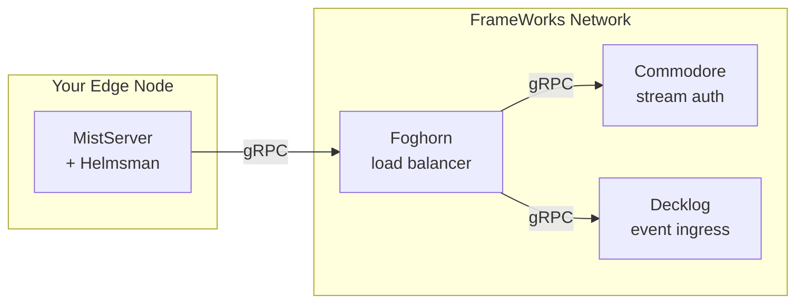

import { Aside } from "@astrojs/starlight/components";

<Aside type="caution" title="Experimental Feature">
  Hybrid deployment is a cutting-edge feature currently in **active development and testing**. The
  CLI workflows and APIs described here are highly experimental and subject to significant change
  without notice. **This feature is not yet ready for production use.**
</Aside>

<Aside type="note" title="Edge Node Connectivity">
  Hybrid edge nodes communicate with the FrameWorks network via public APIs (HTTP/gRPC). They do
  **not** participate in the internal WireGuard mesh (Privateer), which is reserved for backend
  infrastructure nodes.
</Aside>

Run your own edge nodes for ingest and delivery while the FrameWorks network handles the control plane, analytics, and orchestration.

## How It Works

1. **MistServer** is the media engine: ingest, processing/transcoding (including Livepeer‑powered ABR when configured), and HLS/DASH/WebRTC delivery
2. **Helmsman** (our sidecar) handles tight integration with Foghorn and forwards triggers/metrics via gRPC
3. **Foghorn** enriches events (GeoIP, tenant context), validates stream keys via Commodore (gRPC), and forwards to Decklog
4. **Decklog** receives enriched events from Foghorn and produces them to Kafka for analytics

## Prerequisites

Before you start:

- A server with Docker and Docker Compose
- Public IP (for viewers to reach you)
- DNS record pointing to your server
- Ports available as needed (expose only what you use):
  - **80/443** (HTTP/HTTPS)
  - **1935** (RTMP ingest)
  - **8080** (MistServer HTTP)
  - **5554** (RTSP)
  - **8889/udp** (SRT)
  - **18203/udp** (WebRTC)
  - **4200** (DTSC replication, Mist ↔ Mist)
  - **4242** (Mist controller; keep internal/local)
- A paid FrameWorks account with self-hosted clusters enabled, plus a CLI enrollment token to connect the node

Hardware minimums:

- **Starting point for light workloads** (scale with streams/transcodes):
  - 4 CPU cores (or less for very low volume)
  - 8 GB RAM
  - 100 GB storage (more if you're doing recordings)
  - 1 Gbps network

## What's Different from Full Self-Hosting

Hybrid gives you edge nodes. Full self-hosting gives you everything: the control plane, databases, Kafka, the dashboard, etc.

| Aspect     | Hybrid            | Full Self-Host  |
| ---------- | ----------------- | --------------- |
| You manage | Edge nodes only   | Everything      |
| Analytics  | FrameWorks-hosted | Your ClickHouse |
| Dashboard  | Hosted dashboard  | Your deployment |
| Complexity | Low-medium        | High            |

If you want total independence, see the [Infrastructure Operators](/operators/deployment) guide.
