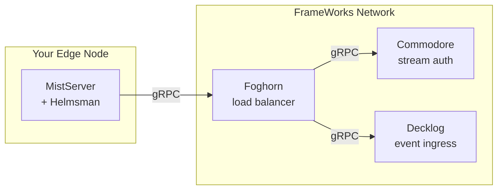

import { Aside } from "@astrojs/starlight/components";

<Aside type="note" title="Production readiness">
  Tenant-owned edge clusters, enrollment tokens, and node mode are available through the dashboard,
  API, and CLI. Full production rollouts still need normal operator validation around DNS,
  certificates, firewall policy, capacity, and monitoring.
</Aside>

<Aside type="note" title="Edge Node Connectivity">
  Hybrid edge nodes communicate with the FrameWorks network via public APIs (HTTP/gRPC). They do
  **not** participate in the internal WireGuard mesh (Privateer), which is reserved for backend
  infrastructure nodes.
</Aside>

Run your own edge nodes for ingest and delivery while the FrameWorks network handles the control plane, analytics, and orchestration.

## How It Works

```mermaid
graph LR
    subgraph YN[Your Edge Node]
        MS[MistServer<br/>+ Helmsman]
    end

    subgraph FN[FrameWorks Network]
        COM[Commodore<br/>stream auth]
        FOG[Foghorn<br/>load balancer]
        DL[Decklog<br/>event ingress]
    end

    MS -->|gRPC| FOG
    FOG -->|gRPC| COM
    FOG -->|gRPC| DL
```

1. **MistServer** is the media engine: ingest, processing/transcoding (including Livepeer‑powered ABR when configured), broad playback/container outputs (HLS, LL-HLS, DASH, WebRTC, MP4, WebM, WebSocket), and direct protocols when exposed
2. **Helmsman** (our sidecar) handles tight integration with Foghorn and forwards triggers/metrics via gRPC
3. **Foghorn** enriches events (GeoIP, tenant context), validates stream keys via Commodore (gRPC), and forwards to Decklog
4. **Decklog** receives enriched events from Foghorn and produces them to Kafka for analytics

## Prerequisites

Before you start:

- A Linux server for the default Docker deployment, or a Linux/macOS host for native edge deployment
- Docker and Docker Compose when using the Docker mode
- Public IP or reachable public DNS name for viewer traffic
- A DNS record for the assigned edge domain, unless the Bridge bootstrap flow assigns and syncs it for you
- Ports available as needed (expose only what you use):
  - **80/443** (HTTP/HTTPS)
  - **1935** (RTMP/E-RTMP ingest)
  - **8080** (MistServer HTTP)
  - **5554** (RTSP)
  - **8889/udp** (SRT)
  - **18203/udp** (WebRTC)
  - **4200** (DTSC replication, Mist ↔ Mist)
  - **4242** (Mist controller; keep internal/local)
- A FrameWorks account for one-command Bridge setup, or a valid `edge_node` enrollment token for token-based setup

Hardware minimums:

- **Starting point for light workloads** (scale with streams/transcodes):
  - 4 CPU cores (or less for very low volume)
  - 8 GB RAM
  - 100 GB storage (more if you're doing recordings)
  - 1 Gbps network

## What's Different from Full Self-Hosting

Hybrid gives you edge nodes. Full self-hosting gives you everything: the control plane, databases, Kafka, the dashboard, etc.

| Aspect     | Hybrid            | Full Self-Host  |
| ---------- | ----------------- | --------------- |
| You manage | Edge nodes only   | Everything      |
| Analytics  | FrameWorks-hosted | Your ClickHouse |
| Dashboard  | Hosted dashboard  | Your deployment |
| Complexity | Low               | High            |

If you want total independence, see the [Infrastructure Operators](/operators/deployment) guide.
