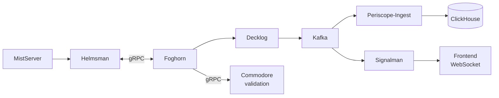
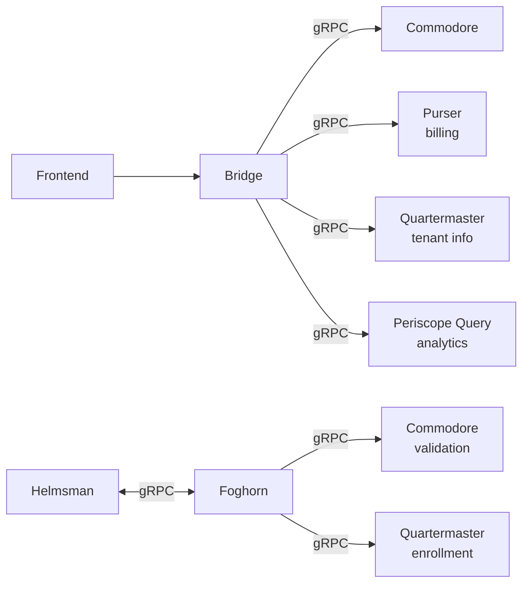
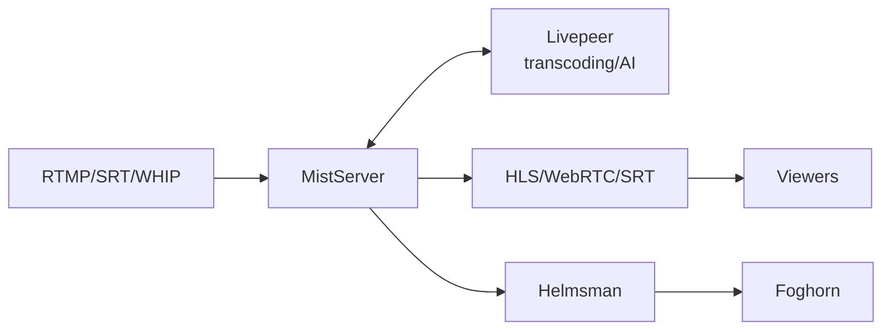
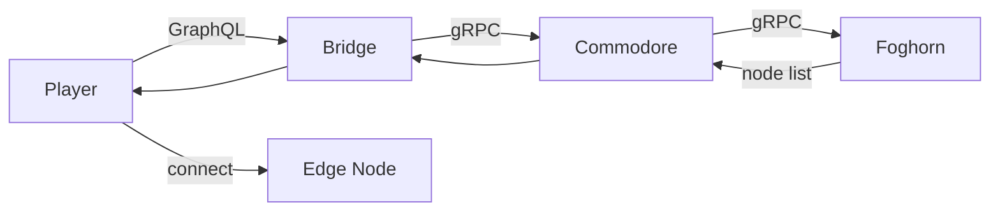
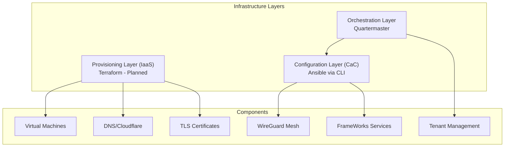

import { Steps, Card, Aside } from '@astrojs/starlight/components';

<Aside type="note" title="Reality check">
This page reflects the **current architecture**. Self-hosting and hybrid deployment options are available but still evolving; some pieces are production-ready and others are in active development.
</Aside>

## Overview

FrameWorks employs a pragmatic, tiered approach to infrastructure management, evolving from simple local setups to complex, distributed production environments.

- **Current (MVP):**
  - **Local Development:** Uses Docker Compose for a self-contained, rapidly reproducible environment.
  - **Deployment:** Relies on the FrameWorks CLI (`frameworks cluster provision`), which orchestrates provisioning via internal provisioners (Ansible is used for some infrastructure components). See [CLI Reference](/operators/cli-reference).
  - **Coordination:** The Quartermaster service acts as the source of truth, exposing tenant and cluster context via its API.

- **Planned Evolution:**
  - **Infrastructure as Code:** Introducing Terraform to manage machine resources (VMs, DNS records, Load Balancers) declaratively.
  - **Orchestration:** Migrating to Kubernetes and GitOps for robust, long-term container orchestration at scale.

## Multi-Plane Architecture

FrameWorks uses a multi-plane distributed architecture designed for scale, separating control logic from high-volume media and event data:

- **Control Plane**: Authentication, stream management, tenant/routing (immediate consistency).
- **Data Plane**: Analytics, metrics, and event processing (Kafka-driven).
- **Media Plane**: Media ingest/processing and routing.
- **Support & Interfaces**: Web apps, marketing sites, and documentation.

---

## Service Stack

The FrameWorks platform is composed of specialized services, each responsible for a distinct domain. These services communicate primarily via gRPC for internal traffic and expose a unified GraphQL API for external clients.

### Core Services

| Service | Port | Tier | Purpose |
|---------|------|------|---------|
| **Control Plane** | | | |
| Bridge | 18000 | Regional | GraphQL API Gateway (aggregates all services) |
| Commodore | 18001 | Central | Business logic & orchestration API |
| Quartermaster | 18002 | Central | Tenant management API |
| Purser | 18003 | Central | Billing API |
| Navigator | 18010, 18011 (gRPC) | Central | DNS automation & ACME certificates (Future: Self-hosted Anycast) * |
| **Data Plane** | | | |
| Periscope Query | 18004 | Central | Analytics & reporting API |
| Periscope Ingest | 18005 | Regional | Kafka event processing |
| Decklog | 18006 | Regional | gRPC event ingress → Kafka |
| Decklog (metrics) | 18026 | Regional | Prometheus metrics |
| Signalman | 18009 | Regional | Real-time updates & WebSocket hub |
| **Media Plane** | | | |
| Foghorn | 18008 | Regional | Load balancer |
| Foghorn (control) | 18019 | Regional | gRPC control API |
| Helmsman | 18007 | Edge | MistServer sidecar |
| **Support & Interfaces** | | | |
| Deckhand | 18015 | Central | Support messaging API (Chatwoot adapter) |
| Web Console | 18030 | Central | Main application interface |
| Marketing Site | 18031 | Central | Public website |
| Forms | 18032 | Central | Contact form handling |

### Infrastructure Components

| Component | Role | Plane | Port(s) | Deploy Location |
|-----------|------|-------|---------|-----------------|
| MistServer | Media processing (ingest/transcode) | Media | 4242, 8080, 1935, 5554, 4200, 8889/udp, 18203/udp | Edge |
| Livepeer Gateway (external) | Operator-hosted transcoding gateway | Media | Operator-defined | Operator-managed |
| PostgreSQL-compatible DB (Postgres/Yugabyte) | State & configuration database | Control | Operator-defined | Central |
| ClickHouse | Time-series analytics database | Data | 8123 (HTTP), 9000 (Native) | Central |
| Kafka | Event streaming backbone | Data | 9092 (Int), 29092 (Ext) | Central + Regional (single shared cluster) |
| Zookeeper | Kafka cluster management | Data | 2181 | Central + Regional |
| Privateer | WireGuard mesh agent | Infrastructure | 18012 (API), 5353/udp (DNS), 51820/udp (WireGuard) | Central/Regional * |
| Nginx | Reverse proxy & routing | Support | 18090 | Central |
| VictoriaMetrics (or Prometheus) | Metrics collection | Support | Operator-defined | Central |
| Grafana | Metrics visualization | Support | Operator-defined | Central |
| Listmonk | Newsletter/mailing list manager | Support | 9000 | Central |

*Navigator and Privateer are in testing. Production rollout is controlled and may not be enabled in every environment.*

**Livepeer integration note**: Today you run the Livepeer Gateway as an external service and configure MistServer to send segments to it. Longer term, we will integrate more directly with Livepeer orchestrators or embed the gateway more tightly.

### Interfaces

| Component | Role | Path | Port | Deploy Location |
|-----------|------|------|------|-----------------|
| Web Console | SvelteKit user dashboard | `website_application` | 18030 | Regional |
| Marketing Site | Sales / Marketing website | `website_marketing` | 18031 | Regional |
| Documentation | Astro Starlight docs site | `website_docs` | 18033 | Central |
| NPM Player | Embeddable HLS/WebRTC player | `npm_player` | N/A (npm package) | User websites |
| Android App | Future mobile client | `app_android` | N/A | Planned |

*Note: The Android App is currently a stub and represents a planned future interface for streaming to and consuming from the FrameWorks network.*

### CLI Tool

| Component | Role | Path | Install |
|-----------|------|------|---------|
| FrameWorks CLI | Cluster management and provisioning | `cli/` | `go install` or binary |

---

## Planned Services (Not Implemented)

| Service | Purpose | Status |
|---------|---------|--------|
| Lookout (`api_incidents`) | Incident management | Deferred (use Prometheus/Grafana) |
| Parlor (`api_rooms`) | Interactive room service | Planned |

---

## Deployment Tiers

- **Central**: Commodore, Quartermaster, Purser, Periscope Query, Deckhand, Forms, PostgreSQL-compatible DB (YugabyteDB recommended), ClickHouse, Listmonk, Chatwoot + Redis.
- **Regional**: Bridge, Foghorn, Decklog, Periscope Ingest, Signalman, Kafka, Web Console, Marketing Site.
- **Central/Regional**: Privateer (WireGuard mesh agent runs on all backend infrastructure nodes).
- **Edge**: MistServer, Helmsman, Livepeer Gateway.

---

## Data Flow Architecture

Understanding how data moves through the system is critical for operations and troubleshooting. The diagrams below illustrate the key pipelines for analytics, control, and media.

### Event-Driven Analytics Pipeline

**Note:** Helmsman maintains a persistent **bidirectional** gRPC stream with Foghorn:
- **Helmsman → Foghorn**: MistServer triggers, heartbeats, clip/DVR progress updates
- **Foghorn → Helmsman**: Clip pull requests, DVR start/stop commands, config seeds

Foghorn routes events to central services (Commodore for validation, Decklog for analytics, Quartermaster for tenant resolution).

### Control Plane Communications

### Media Pipeline

### Viewer Routing

Foghorn selects optimal edge nodes for viewers based on geography, load, and stream availability.

**Routing Paths:**

| Path | Flow | Use Case |
|------|------|----------|
| **GraphQL (primary)** | Player → Bridge → Commodore → Foghorn | FrameWorks Player, SDK integrations |
| **HTTP (direct)** | Client → Foghorn `/play/{viewkey}` | CLI tools, direct URL access, 307 redirects |

**Foghorn HTTP Endpoints:**

| Endpoint | Response | Use Case |
|----------|----------|----------|
| `GET /play/{viewkey}` | JSON with all endpoints | Direct integration |
| `GET /play/{viewkey}/hls/index.m3u8` | 307 redirect to edge | Direct HLS playback |
| `GET /play/{viewkey}/webrtc` | 307 redirect to edge | Direct WebRTC (WHEP) |
| `GET /{viewkey}` | Best node host or 307 | MistServer compatibility |

For URI patterns and player integration, see [Playback & Embedding](/streamers/playback).

---

## Infrastructure Layers

---

## Proxy & SSL Strategy

Traffic routing and TLS termination vary by deployment tier:

- **Development:** Nginx (via Docker Compose) handles local routing with self-signed or no TLS.
- **Production (Edge):** Caddy handles automatic HTTPS via Let's Encrypt (HTTP-01 validation).
  - Managed via CLI templates (`cli/internal/templates/edge/Caddyfile.tmpl`).
  - Supports HTTP/2, HTTP/3, and WebSocket upgrades natively.
- **Production (Central/Regional):** Navigator manages public DNS via Cloudflare API.
  - Single node → A record pointing directly to service
  - Multiple nodes → Cloudflare load balancer pool with geo-steering
  - Certificates issued via Let's Encrypt (DNS-01 validation through Cloudflare)

> **Note:** Cloudflare is used for DNS management and geographic load balancing (DNS-only mode, not proxied). Traffic flows directly to FrameWorks services. A self-hosted anycast DNS solution is planned to replace Cloudflare dependency once an ASN is acquired.

---

## Mesh Networking

Internal communication between nodes uses a WireGuard mesh managed by the **Privateer** agent (`api_mesh`). This handles:
- Secure inter-node communication
- Internal DNS resolution
- Backend infrastructure isolation

See [WireGuard Mesh Setup](/operators/wireguard) for configuration details.
