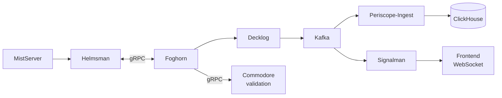
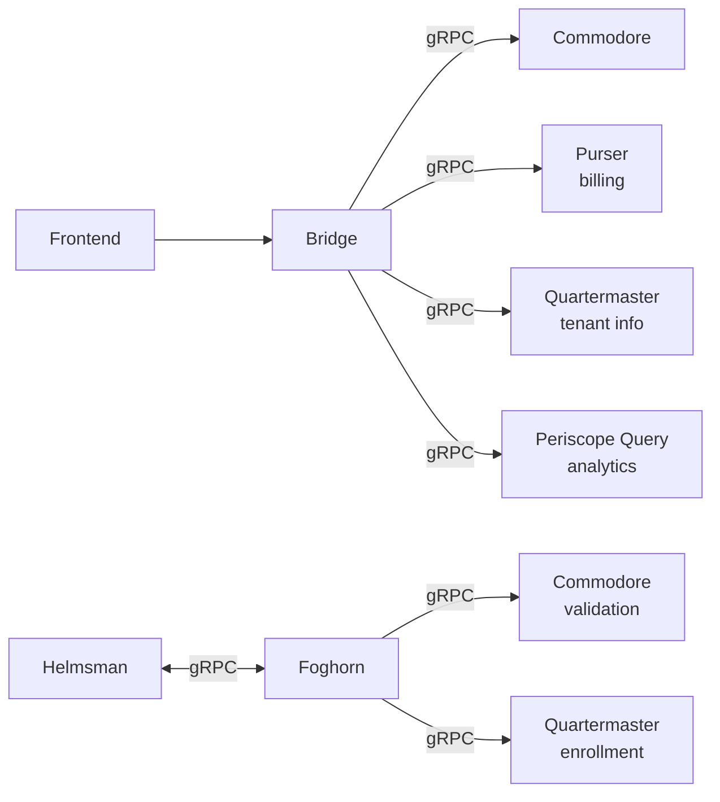
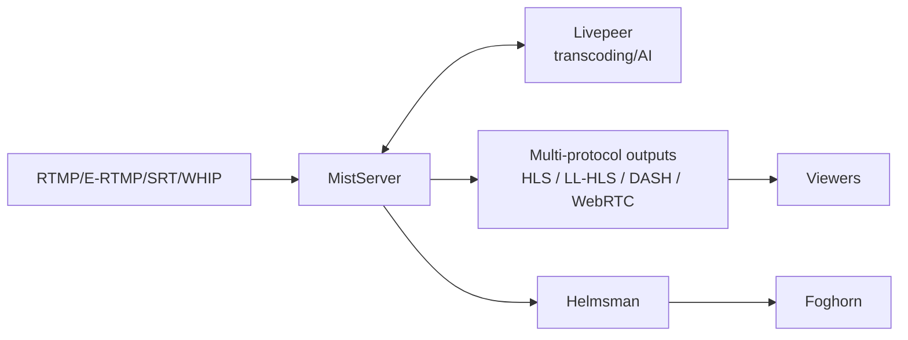
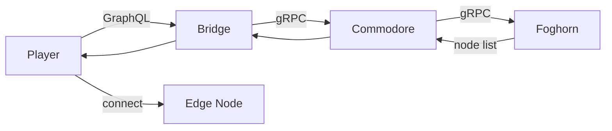
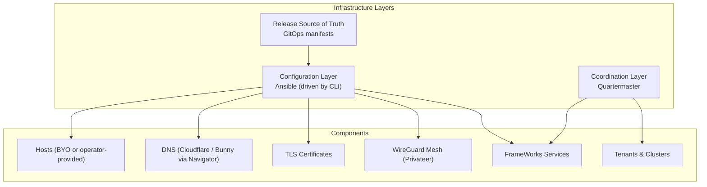

## Overview

FrameWorks runs the same service topology in every environment — local, staging, production, self-hosted — and varies only the deployment substrate:

- **Local development:** Docker Compose brings up the full stack on one host.
- **Production and self-hosted:** The FrameWorks CLI (`frameworks cluster provision`) drives Ansible roles against the hosts named in the cluster manifest. Release manifests live in a GitOps repository; the CLI reads them to pin versions and reconcile state. See [CLI Reference](/operators/cli-reference) and [Ansible Provisioning](/operators/ansible-provisioning).
- **Coordination:** Quartermaster is the runtime source of truth for tenants, clusters, and service discovery; every other service queries it rather than holding its own copy of routing state.

## Multi-Plane Architecture

FrameWorks uses a multi-plane distributed architecture designed for scale,
separating tenant-facing control logic from high-volume media, event data, and
network automation. Plane names describe runtime responsibility; deployment
tiers describe placement.

- **Control / API Plane**: GraphQL aggregation, auth, stream management, tenant routing, and billing APIs.
- **Media Plane**: Media ingest, processing, playback routing, edge orchestration, and media asset delivery.
- **Event & Analytics Plane**: Event ingress, Kafka fan-out, real-time fan-out, and analytical storage/querying.
- **Network & Trust Plane**: Public DNS, certificates, service identity, mesh networking, and ingress.
- **Support & Experience Services**: Support workflows, AI consultant workflows, forms, newsletters, and stream interaction services.
- **Interfaces**: Web apps, marketing sites, documentation, CLI, SDKs, and player/studio packages.
- **Observability & Operations**: Metrics, dashboards, alerting, BI, and incident workflows.

---

## Service Stack

The FrameWorks platform is composed of specialized services, each responsible for a distinct domain. These services communicate primarily via gRPC for internal traffic and expose a unified GraphQL API for external clients.

### Core Services

| Service                 | Port(s)                    | Tier             | Plane                         | Purpose                                                           |
| ----------------------- | -------------------------- | ---------------- | ----------------------------- | ----------------------------------------------------------------- |
| Bridge                  | 18000                      | Regional         | Control / API                 | GraphQL API Gateway and MCP hub                                   |
| Commodore               | 18001 (HTTP), 19001 (gRPC) | Central          | Control / API                 | Auth, streams, API tokens, media registry, and business workflows |
| Quartermaster           | 18002 (HTTP), 19002 (gRPC) | Central          | Control / API                 | Tenants, clusters, nodes, service discovery, and bootstrap state  |
| Purser                  | 18003 (HTTP), 19003 (gRPC) | Central          | Control / API                 | Billing, usage, invoices, payments, and x402 state                |
| Periscope Query         | 18004 (HTTP), 19004 (gRPC) | Central          | Event & Analytics             | Analytics and reporting API                                       |
| Periscope Ingest        | 18005                      | Regional         | Event & Analytics             | Kafka event processing and ClickHouse writes                      |
| Decklog                 | 18006 (gRPC)               | Regional         | Event & Analytics             | gRPC event ingress → Kafka                                        |
| Decklog (metrics)       | 18026                      | Regional         | Observability & Operations    | Decklog Prometheus metrics                                        |
| Signalman               | 18009 (WS), 19005 (gRPC)   | Regional         | Event & Analytics             | Real-time event fan-out and WebSocket hub                         |
| Foghorn                 | 18008                      | Regional         | Media                         | Load balancer and media pipeline orchestrator                     |
| Foghorn (internal gRPC) | 18019 (gRPC)               | Regional         | Media                         | Internal control API and HA relay over the internal CA            |
| Foghorn (external gRPC) | 18029 (gRPC)               | Regional         | Media                         | Edge bootstrap, Helmsman control, and FoghornFederation over ACME |
| Helmsman                | 18007 (HTTP)               | Edge             | Media                         | MistServer sidecar                                                |
| Chandler                | 18020 (HTTP)               | Regional         | Media                         | Cluster-scoped static media asset server                          |
| Navigator               | 18010 (HTTP), 18011 (gRPC) | Central          | Network & Trust               | Public DNS, ACME certificates, and internal CA material           |
| Privateer               | 18012 (HTTP)               | Central/Regional | Network & Trust               | WireGuard mesh agent and local `.internal` DNS                    |
| Deckhand                | 18015 (HTTP), 19006 (gRPC) | Central          | Support & Experience Services | Support messaging API (Chatwoot adapter)                          |
| Skipper                 | 18018 (HTTP), 19007 (gRPC) | Central          | Support & Experience Services | AI video consultant API                                           |
| Forms                   | 18032                      | Central          | Support & Experience Services | Contact form and newsletter handling                              |

### Infrastructure Components

| Component                                    | Role                                                     | Plane                         | Port(s)                                           | Deploy Location                            |
| -------------------------------------------- | -------------------------------------------------------- | ----------------------------- | ------------------------------------------------- | ------------------------------------------ |
| MistServer                                   | Media processing, ingest, and edge delivery              | Media                         | 4242, 8080, 1935, 5554, 4200, 8889/udp, 18203/udp | Edge                                       |
| Livepeer Gateway                             | Transcoding gateway and compute-marketplace integration  | Media                         | 8935                                              | Edge (co-located with MistServer)          |
| Livepeer Signer                              | ETH transaction signer for gateway                       | Control / API                 | 18016                                             | Central                                    |
| PostgreSQL-compatible DB (Postgres/Yugabyte) | Service-owned state and configuration database substrate | Infrastructure                | Operator-defined                                  | Central                                    |
| ClickHouse                                   | Time-series analytics database                           | Event & Analytics             | 8123 (HTTP), 9000 (Native)                        | Central                                    |
| Kafka                                        | Event streaming backbone                                 | Event & Analytics             | 9092 (Int), 29092 (Ext)                           | Central + Regional (single shared cluster) |
| Foghorn Redis                                | Foghorn HA state sync                                    | Media                         | 6379                                              | Regional                                   |
| Nginx                                        | Reverse proxy and local development routing              | Network & Trust               | 18090                                             | Central                                    |
| Caddy                                        | Edge TLS termination and reverse proxy                   | Network & Trust               | 80, 443, 18090                                    | Edge                                       |
| VictoriaMetrics + vmagent                    | Metrics collection and remote-write fan-in               | Observability & Operations    | Operator-defined                                  | Central + every backend and edge host      |
| Grafana                                      | Metrics visualization                                    | Observability & Operations    | Operator-defined                                  | Central                                    |
| Metabase                                     | BI analytics                                             | Observability & Operations    | Operator-defined                                  | Central                                    |
| Listmonk                                     | Newsletter and mailing list manager                      | Support & Experience Services | 9000 (service), 9001 (docker-compose host)        | Central                                    |

**Livepeer integration**: The Livepeer Gateway is provisioned via the CLI and discovered via Quartermaster service discovery. MistServer sends segments to the gateway automatically when Livepeer transcoding is configured for a stream. Ingest auth stays in the media plane: the gateway calls Foghorn's internal `/webhooks/livepeer/auth` webhook, and wallet/top-up automation reads `wallet_address` from Quartermaster service-instance metadata.

### Interfaces

| Component               | Role                                  | Path                  | Port              | Deploy Location |
| ----------------------- | ------------------------------------- | --------------------- | ----------------- | --------------- |
| Chartroom / Web Console | SvelteKit user dashboard              | `website_application` | 18030             | Regional        |
| Foredeck / Marketing    | Sales / Marketing website             | `website_marketing`   | 18031             | Regional        |
| Logbook / Documentation | Astro Starlight docs site             | `website_docs`        | 18033             | Central         |
| NPM Player              | Embeddable multi-protocol player      | `npm_player`          | N/A (npm package) | User websites   |
| NPM Studio              | Embeddable browser ingest studio      | `npm_studio`          | N/A (npm package) | User websites   |
| Android App             | Native mobile client (in development) | `app_android`         | N/A               | Roadmap         |

### CLI Tool

| Component      | Role                                | Path   | Install                |
| -------------- | ----------------------------------- | ------ | ---------------------- |
| FrameWorks CLI | Cluster management and provisioning | `cli/` | `go install` or binary |

---

## Deployment Tiers

- **Central**: Commodore, Quartermaster, Purser, Navigator, Periscope Query, Deckhand, Skipper, Forms, PostgreSQL-compatible DB (YugabyteDB recommended), ClickHouse, Listmonk, Chatwoot + Redis.
- **Regional**: Bridge, Foghorn, Decklog, Periscope Ingest, Signalman, Chandler, Kafka, Web Console, Marketing Site.
- **Central/Regional**: Privateer (WireGuard mesh agent runs on all backend infrastructure nodes).
- **Edge**: MistServer, Helmsman, Livepeer Gateway.

---

## Multi-Cluster Topology

FrameWorks supports multiple clusters. A **cluster** is a Foghorn instance (or HA pair) plus its edge nodes — strictly the media plane. All clusters share the same central Control / API Plane (Commodore, Quartermaster, Purser) and Event & Analytics Plane (Decklog, Periscope, Signalman). These services are not duplicated or federated per cluster.

Cross-cluster coordination is handled exclusively by the **FoghornFederation** gRPC protocol between Foghorn instances:

- **Peer discovery**: Quartermaster maintains a registry of all clusters. Foghorn queries `ListPeers` to find peers and opens `PeerChannel` bidirectional streams for real-time edge telemetry exchange.
- **Cross-cluster viewer routing**: When a viewer's cluster doesn't have a stream, Foghorn uses `QueryStream` to find it on a peer, then either redirects the viewer or arranges a DTSC origin-pull to serve locally.
- **Cross-cluster artifacts**: clips, VODs, and DVR chapters on remote clusters are all accessed via `PrepareArtifact`. Origin returns a presigned S3 URL when the artifact is synced, or a short-lived peer-relay URL + opaque capability grant pointing at the specific origin node when the canonical file is on disk but S3 sync is still pending (the origin Foghorn authorizes each pull online; no signing key on the edge) — viewers don't wait on sync. DVR chapter listing flows through the GraphQL chapter API (Commodore → origin Foghorn for the chapter row metadata); each finalized chapter is a regular VOD-shaped artifact with its own Commodore-minted public `playbackId`, so chapter playback follows the same federation rules as any other VOD.
- **Leader-only peering**: Each cluster elects one Foghorn instance (via Redis SET NX) to run PeerChannel connections, avoiding duplicate peer traffic.

Quartermaster is the sole routing authority. Commodore resolves tenant-to-cluster routing dynamically via `GetClusterRouting` — no hardcoded Foghorn addresses between services.

**Deployment models:**

| Model                | Description                                                                                                                                                                                                                                                |
| -------------------- | ---------------------------------------------------------------------------------------------------------------------------------------------------------------------------------------------------------------------------------------------------------- |
| **Shared**           | Free shared capacity is currently unmetered; premium shared tiers are seeded for later enforcement. All tenants share the same cluster, edges, and services.                                                                                               |
| **Dedicated**        | Enterprise tier. Isolated cluster with dedicated Foghorn, edges, and capacity — operated by FrameWorks or self-hosted on-premise via the [CLI](/operators/cli-reference), with [Manual Deployment](/operators/deployment-manual) as an advanced reference. |
| **Hybrid**           | Tenant runs self-hosted edges that fall back to the primary shared cluster. Edges federate via Foghorn; control/data plane remains shared.                                                                                                                 |
| **Open Marketplace** | Operators publish listed clusters with access controls, invites, subscription requests, and pricing metadata. Tenants browse listings and subscribe through the dashboard or API.                                                                          |

---

## Data Flow Architecture

Understanding how data moves through the system is critical for operations and troubleshooting. The diagrams below illustrate the key pipelines for analytics, control, and media.

### Event-Driven Analytics Pipeline

```mermaid
graph LR
    MS[MistServer] --> H[Helmsman]
    H <-->|gRPC| F[Foghorn]
    F --> D[Decklog]
    F -->|gRPC| C[Commodore<br/>validation]
    D --> K[Kafka]
    K --> PI[Periscope-Ingest]
    K --> S[Signalman]
    PI --> CH[(ClickHouse)]
    S --> FE[Frontend<br/>WebSocket]
```

**Note:** Helmsman maintains a persistent **bidirectional** gRPC stream with Foghorn:

- **Helmsman → Foghorn**: MistServer triggers, heartbeats, clip/DVR progress updates
- **Foghorn → Helmsman**: Clip pull requests, DVR start/stop commands, config seeds

Foghorn routes events to central services (Commodore for validation, Decklog for analytics, Quartermaster for tenant resolution).

### Control / API Communications

```mermaid
graph LR
    FE[Frontend] --> B[Bridge]
    B -->|gRPC| COM[Commodore]
    B -->|gRPC| PUR[Purser<br/>billing]
    B -->|gRPC| QM[Quartermaster<br/>tenant info]
    B -->|gRPC| PER[Periscope Query<br/>analytics]

    H[Helmsman] <-->|gRPC| F[Foghorn]
    F -->|gRPC| COM2[Commodore<br/>validation]
    F -->|gRPC| QM2[Quartermaster<br/>enrollment]
```

### Media Pipeline

```mermaid
graph LR
    IN[RTMP/E-RTMP/SRT/WHIP] --> MS[MistServer]
    MS <--> LP[Livepeer<br/>transcoding/AI]
    MS --> OUT[Multi-protocol outputs<br/>HLS / LL-HLS / DASH / WebRTC]
    OUT --> V[Viewers]
    MS --> H[Helmsman]
    H --> F[Foghorn]
```

### Viewer Routing

Foghorn selects optimal edge nodes for viewers based on geography, load, and stream availability.

**Routing Paths:**

```mermaid
graph LR
    P[Player] -->|GraphQL| B[Bridge]
    B -->|gRPC| C[Commodore]
    C -->|gRPC| F[Foghorn]
    F -->|node list| C
    C --> B --> P
    P -->|connect| E[Edge Node]
```

| Path                  | Flow                                  | Use Case                                    |
| --------------------- | ------------------------------------- | ------------------------------------------- |
| **GraphQL (primary)** | Player → Bridge → Commodore → Foghorn | FrameWorks Player, SDK integrations         |
| **HTTP (direct)**     | Client → Foghorn `/play/{viewkey}`    | CLI tools, direct URL access, 307 redirects |

**Foghorn HTTP Endpoints:**

| Endpoint                             | Response                | Use Case                 |
| ------------------------------------ | ----------------------- | ------------------------ |
| `GET /play/{viewkey}`                | JSON with all endpoints | Direct integration       |
| `GET /play/{viewkey}/hls/index.m3u8` | 307 redirect to edge    | Direct HLS playback      |
| `GET /play/{viewkey}/webrtc`         | 307 redirect to edge    | Direct WebRTC (WHEP)     |
| `GET /{viewkey}`                     | Best node host or 307   | MistServer compatibility |

For URI patterns and player integration, see [Playback & Embedding](/builders/playback).

---

## Infrastructure Layers

```mermaid
graph TB
    subgraph "Infrastructure Layers"
        SOURCE["Release Source of Truth<br/>GitOps manifests"]
        CONFIG["Configuration Layer<br/>Ansible (driven by CLI)"]
        ORCH["Coordination Layer<br/>Quartermaster"]
    end

    subgraph "Components"
        VMS["Hosts (BYO or operator-provided)"]
        DNS["DNS (Cloudflare / Bunny via Navigator)"]
        CERTS["TLS Certificates"]
        MESH["WireGuard Mesh (Privateer)"]
        SERVICES["FrameWorks Services"]
        TENANTS["Tenants &amp; Clusters"]
    end

    SOURCE --> CONFIG
    CONFIG --> VMS
    CONFIG --> DNS
    CONFIG --> CERTS
    CONFIG --> MESH
    CONFIG --> SERVICES

    ORCH --> TENANTS
    ORCH --> SERVICES
```

---

## Proxy & SSL Strategy

Traffic routing and TLS termination vary by deployment tier:

- **Development:** Nginx (via Docker Compose) handles local routing with self-signed or no TLS.
- **Production (Edge):** Caddy serves edge traffic. Bootstrap templates start with internal TLS
  and a 503 response; after enrollment, Foghorn pushes SiteConfig and TLS material to Helmsman,
  which rewrites and reloads Caddy for viewer traffic.
  - Managed via CLI templates (`cli/internal/templates/edge/Caddyfile.tmpl`).
  - Supports HTTP/2, HTTP/3, and WebSocket upgrades natively.
- **Production (Central/Regional):** Navigator manages public DNS through Cloudflare for root/API/web/admin names and Bunny DNS for delegated media cluster zones.
  - Root/API/web/admin names → Cloudflare A records or load balancers
  - Multiple root/global nodes → Cloudflare load balancer with one proximity-steered pool per Quartermaster cluster
  - Media cluster names → Bunny A-record sets under `{cluster_slug}.{base_domain}`
  - Media cluster records use Bunny geolocation Smart Routing when Quartermaster has node coordinates
  - Certificates issued via Let's Encrypt DNS-01 through the provider authoritative for the name

> **Note:** Cloudflare remains authoritative for root/API/web/admin/support names. Bunny DNS is authoritative for delegated media cluster zones. Traffic flows directly to FrameWorks services; provider-side proxies are not used for media traffic.

---

## Mesh Networking

Internal communication between nodes uses a WireGuard mesh managed by the **Privateer** agent (`api_mesh`). This handles:

- Secure inter-node communication
- Internal DNS resolution
- Backend infrastructure isolation

See [Mesh Networking](/operators/mesh-bootstrap) for bootstrap and runtime details.
