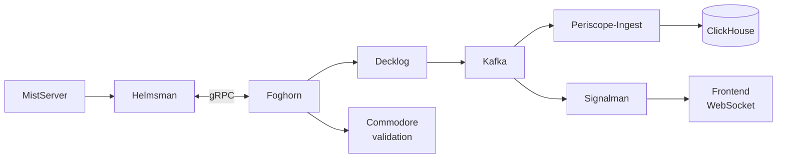
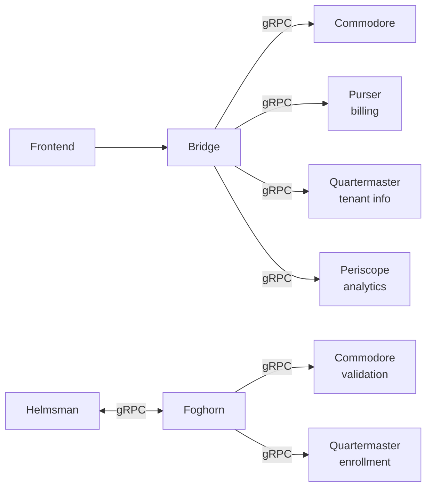

import { Steps, Card, Aside } from '@astrojs/starlight/components';

<Aside type="caution" title="Self-Hosting Coming Soon">
Self-hosting and hybrid deployment options are currently in development.
This page documents the platform architecture for transparency.
Deployment guides will be available when the feature launches.
</Aside>

## Overview

FrameWorks employs a pragmatic, tiered approach to infrastructure management, evolving from simple local setups to complex, distributed production environments.

- **Current (MVP):**
  - **Local Development:** Uses Docker Compose for a self-contained, rapidly reproducible environment.
  - **Deployment:** Relies on the FrameWorks CLI (`frameworks cluster provision`), which wraps Ansible for idempotent, automated provisioning of bare-metal servers. See [CLI Reference](/operators/cli-reference).
  - **Coordination:** The Quartermaster service acts as the source of truth, exposing tenant and cluster context via its API.

- **Planned Evolution:**
  - **Infrastructure as Code:** Introducing Terraform to manage machine resources (VMs, DNS records, Load Balancers) declaratively.
  - **Orchestration:** Migrating to Kubernetes and GitOps for robust, long-term container orchestration at scale.

## Multi-Plane Architecture

FrameWorks uses a multi-plane distributed architecture designed for scale, separating control logic from high-volume media and event data:

- **Control Plane**: Authentication, stream management, tenant/routing (immediate consistency).
- **Data Plane**: Analytics, metrics, and event processing (Kafka-driven).
- **Media Plane**: Media ingest/processing and routing.
- **Support & Interfaces**: Web apps, marketing sites, and documentation.

---

## Service Stack

The FrameWorks platform is composed of specialized services, each responsible for a distinct domain. These services communicate primarily via gRPC for internal traffic and expose a unified GraphQL API for external clients.

### Core Services

| Service | Port | Tier | Purpose |
|---------|------|------|---------|
| **Control Plane** | | | |
| Bridge | 18000 | Regional | GraphQL API Gateway (aggregates all services) |
| Commodore | 18001 | Central | Business logic & orchestration API |
| Quartermaster | 18002 | Central | Tenant management API |
| Purser | 18003 | Central | Billing API |
| Navigator | 18010, 18011 (gRPC) | Central | DNS automation & ACME certificates (Future: Self-hosted Anycast) * |
| **Data Plane** | | | |
| Periscope Query | 18004 | Central | Analytics & reporting API |
| Periscope Ingest | 18005 | Central | Kafka event processing |
| Decklog | 18006 | Central | gRPC event ingress → Kafka |
| Decklog (metrics) | 18026 | Central | Prometheus metrics |
| **Media Plane** | | | |
| Foghorn | 18008 | Regional | Load balancer |
| Foghorn (control) | 18019 | Regional | gRPC control API |
| Helmsman | 18007 | Edge | MistServer sidecar |
| **Support & Interfaces** | | | |
| Signalman | 18009 | Central | Real-time updates & WebSocket hub |
| Web Console | 18030 | Central | Main application interface |
| Marketing Site | 18031 | Central | Public website |
| Forms | 18032 | Central | Contact form handling |

### Infrastructure Components

| Component | Role | Plane | Port(s) | Deploy Location |
|-----------|------|-------|---------|-----------------|
| MistServer | Media processing (ingest/transcode) | Media | 4242, 8080, 1935, 5554, 4200, 8889/udp, 18203/udp | Edge |
| Livepeer | Transcoding/AI compute gateway | Media | 18016 (CLI), 18017 (RPC) | Edge |
| PostgreSQL | State & configuration database | Data | 5432 | Central |
| ClickHouse | Time-series analytics database | Data | 8123 (HTTP), 9000 (Native) | Central |
| Kafka | Event streaming backbone | Data | 9092 (Int), 29092 (Ext) | Regional |
| Zookeeper | Kafka cluster management | Data | 2181 | Regional |
| Privateer | WireGuard mesh agent | Infrastructure | 18012 (API), 5353/udp (DNS), 51820/udp (WireGuard) | Central/Regional * |
| Nginx | Reverse proxy & routing | Support | 18090 | Central |
| Prometheus | Metrics collection | Support | 9091 | Central |
| Grafana | Metrics visualization | Support | 3000 | Central |
| Listmonk | Newsletter/mailing list manager | Support | 9000 | Central |

\* *Navigator and Privateer have full implementations but are not included in the development docker-compose.yml. They are deployed separately in production environments.*

### Interfaces

| Component | Role | Path | Port | Deploy Location |
|-----------|------|------|------|-----------------|
| Web Console | SvelteKit user dashboard | `website_application` | 18030 | Regional |
| Marketing Site | Sales / Marketing website | `website_marketing` | 18031 | Regional |
| Documentation | Astro Starlight docs site | `website_docs` | 18033 | Central |
| NPM Player | Embeddable HLS/WebRTC player | `npm_player` | N/A (npm package) | User websites |
| Android App | Future mobile client | `app_android` | N/A | Planned |

*Note: The Android App is currently a stub and represents a planned future interface for streaming to and consuming from the FrameWorks network.*

### CLI Tool

| Component | Role | Path | Install |
|-----------|------|------|---------|
| FrameWorks CLI | Cluster management and provisioning | `cli/` | `go install` or binary |

---

## Planned Services (Not Implemented)

| Service | Purpose | Status |
|---------|---------|--------|
| Lookout (`api_incidents`) | Incident management | Use Prometheus/Grafana |
| Parlor (`api_rooms`) | Interactive room service | Planned |
| Deckhand (`api_ticketing`) | Support ticketing | Planned |

---

## Deployment Tiers

- **Central**: Commodore, Quartermaster, Periscope, Purser, Navigator, PostgreSQL, ClickHouse, Listmonk.
- **Regional**: Bridge, Decklog, Kafka, Signalman, Foghorn, Web Console, Marketing Site.
- **Central/Regional**: Privateer (WireGuard mesh agent runs on all backend infrastructure nodes).
- **Edge**: MistServer, Helmsman, Livepeer Gateway.

---

## Data Flow Architecture

Understanding how data moves through the system is critical for operations and troubleshooting. The diagrams below illustrate the key pipelines for analytics, control, and media.

### Event-Driven Analytics Pipeline

**Note:** Helmsman maintains a persistent **bidirectional** gRPC stream with Foghorn:
- **Helmsman → Foghorn**: MistServer triggers, heartbeats, clip/DVR progress updates
- **Foghorn → Helmsman**: Clip pull requests, DVR start/stop commands, config seeds

Foghorn routes events to central services (Commodore for validation, Decklog for analytics, Quartermaster for tenant resolution).

### Control Plane Communications

### Media Pipeline

---

## Infrastructure Layers

---

## Proxy & SSL Strategy

Traffic routing and TLS termination vary by deployment tier:

- **Development:** Nginx (via Docker Compose) handles local routing with self-signed or no TLS.
- **Production (Edge):** Caddy handles automatic HTTPS via Let's Encrypt (HTTP-01 validation).
  - Managed via CLI templates (`cli/internal/templates/edge/Caddyfile.tmpl`).
  - Supports HTTP/2, HTTP/3, and WebSocket upgrades natively.
- **Production (Central/Regional):** Navigator manages public DNS via Cloudflare API.
  - Single node → A record pointing directly to service
  - Multiple nodes → Cloudflare load balancer pool with geo-steering
  - Certificates issued via Let's Encrypt (DNS-01 validation through Cloudflare)

> **Note:** Cloudflare is used for DNS management and geographic load balancing (DNS-only mode, not proxied). Traffic flows directly to FrameWorks services. A self-hosted anycast DNS solution is planned to replace Cloudflare dependency once an ASN is acquired.

---

## Mesh Networking

Internal communication between nodes uses a WireGuard mesh managed by the **Privateer** agent (`api_mesh`). This handles:
- Secure inter-node communication
- Internal DNS resolution
- Backend infrastructure isolation

See [WireGuard Mesh Setup](/operators/wireguard) for configuration details.
