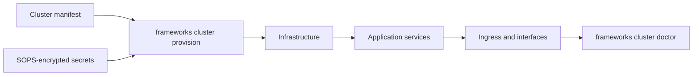

import { Card, CardGrid, LinkCard, Aside } from "@astrojs/starlight/components";

<Aside type="caution" title="Full-stack deployment">
  This guide describes how to deploy and operate the entire FrameWorks stack: control plane,
  Foghorn, media plane, and supporting services. Treat it like operating a SaaS platform: validate
  capacity, DNS, TLS, backups, secrets, monitoring, and upgrade runbooks before carrying production
  traffic.
</Aside>

This guide applies to anyone running the full platform, whether that is FrameWorks operating its
hosted platform or you self-hosting the whole stack as an independent platform. A self-hosted
platform has its own Foghorn, federation identity, and trust root; it cannot be federated with the
FrameWorks platform as one network. If you only want to run edge nodes (Caddy, MistServer, Helmsman)
attached to the FrameWorks platform, use the [hybrid edge guide](/hybrid/overview) instead.

## Media authority and control-plane outages

Provisioning generates separate signing and per-cell sealing material for the
media-authority pipeline. The production CLI renderer—not the development
compose file—places the signing private key and recipient map only on Commodore,
and the trust set plus one distinct decryption key on each Foghorn cell. The
derivation root is not rendered into any workload. Do not copy these variables
between cells or hand-edit Mist trigger configuration. The rendered key ID is
bound to the control-cell ID and X25519 public key; a cell/key mismatch now
fails during service startup rather than during the first sealed-source request.

The derived workload variables are intentionally service-specific:

- Commodore receives `MEDIA_AUTHORITY_SEAL_RECIPIENTS`.
- Each Foghorn receives `MEDIA_AUTHORITY_CELL_ID`, `MEDIA_AUTHORITY_SEAL_KEY_ID`, and
  `MEDIA_AUTHORITY_SEAL_PRIVATE_KEY_PEM_B64` for its own control cell.

These four values are renderer output, not shared-secret inputs. Operators configure the seal root
and cell topology; provisioning derives and places the per-cell material.

For a fresh production deployment, create the complete shared input once with
`frameworks cluster secrets generate-shared --out /secure/path/shared.env`, import that fragment
through the GitOps repository's supported SOPS editing command, and securely remove the plaintext
file. The complete input contains `DATABASE_RUNTIME_PASSWORD`, `SERVICE_TOKEN`,
`CLUSTER_ACCESS_MATERIALIZATION_SECRET`, `FOGHORN_BALANCER_CAPABILITY_SECRET`,
`FOGHORN_STATE_ENCRYPTION_KEY`, `MEDIA_AUTHORITY_SEAL_ROOT_SECRET`, `JWT_SECRET`,
`PASSWORD_RESET_SECRET`, `FIELD_ENCRYPTION_KEY`, `USAGE_HASH_SECRET`,
`TELEMETRY_TOKEN_SECRET`, `MEDIA_AUTHORITY_SIGNING_KEY_ID`,
`MEDIA_AUTHORITY_SIGNING_PRIVATE_KEY_PEM_B64`, `MEDIA_AUTHORITY_TRUST_SET`,
`CAPACITY_CONSENT_REVIEW_KEY_ID`, `CAPACITY_CONSENT_REVIEW_PRIVATE_KEY_PEM_B64`, and the
edge-telemetry ES256 signer (`EDGE_TELEMETRY_JWT_PRIVATE_KEY_PEM_B64`). The renderer derives
the per-cell variables; operators do not add derived recipients or private cell keys to the shared
input. Bosun's `BOSUN_FIELD_ENCRYPTION_KEY` is not part of the generated set: add a value of at
least 16 bytes yourself, for example from `openssl rand -base64 32`.

Non-development clusters also need a managed internal service CA. Generate it once with
`frameworks cluster secrets generate-internal-ca --out /secure/path/internal-ca.env`, import all
three values into the same SOPS store, and remove the plaintext fragment. Treat rotation as a trust
domain change: the command intentionally does not retain the root signing key after it signs the
Navigator intermediate.

During the v0.3.0 application-field migration, preserve an outgoing
`JWT_SECRET` in the JSON array `FIELD_ENCRYPTION_LEGACY_SECRETS` before rotating
it. This read-only compatibility channel accepts historical short JWT secrets;
do not place JWT secrets in `FIELD_ENCRYPTION_PREVIOUS_KEYS`, which is reserved
for versioned field keys and enforces the current field-key length floor.

After authority has converged, an existing media cell can continue playback,
ingest under its signed outage owner, source resolution, outputs, and already
dispatched work while Commodore, Quartermaster, or Purser is unavailable. This
is bounded by signed hard expiry and certificate validity; never-seen,
revoked/tombstoned, corrupt, or hard-expired authority remains unavailable.
Foghorn and Helmsman retain last-good runtime configuration across restart.

This is bounded autonomy, not cross-cell consensus. During an asymmetric
partition, the deterministic outage owner cannot observe a still-live claim in
an isolated peer cell, so dual ingest can exist until connectivity or leases
converge. The cross-cell placement claim is leased; tenant capacity is checked
from signed policy against durable per-cell ingest sessions. If the complete
Mist-liveness signal path is isolated, another cell may admit a publisher after
the placement claim expires. Events
whose tenant identity cannot be resolved are never allowed to mutate a guessed
tenant's state. See [Media-cluster authority and autonomy](https://github.com/Livepeer-FrameWorks/monorepo/blob/master/docs/architecture/media-authority.md#known-limitations)
for the exact boundaries.

During a v0.3 upgrade, an existing node fingerprint without an Ed25519 key is
not yet usable as outage admission. Keep Quartermaster available for each
existing media node's first post-upgrade reconnect: after a stable machine-ID or
MAC match, Quartermaster atomically binds the node's proved key. It never seeds
that binding from peer IP or replaces a different key. Once Foghorn has stored
the resulting bounded admission, later reconnects can use the cell-local copy
during a control-plane outage.

Keep Helmsman's durable state separate from reclaimable media. Container edges
mount `/data/state` independently from `/data/storage`; native installs render
the equivalent state directory through the Helmsman role. If that state is
lost, obtain a fresh enrollment token and run
`frameworks edge provision --ssh <user>@<host> --force-reenroll --enrollment-token <fresh-token>`
(or use
`--local`). The signed request authorizes Quartermaster to rotate the
pinned node key only when the existing tenant/node and stable machine or MAC
fingerprint still match. Helmsman binds the one-shot rotation to that token,
reuses the replacement key across retries, and records completion after
Foghorn accepts it; a persisted provisioning flag cannot rotate it again on
restart. Normal redeploys do not rotate it.

The shared production secret named `FOGHORN_STATE_ENCRYPTION_KEY` is a
deployment root, not a cross-cell runtime key. The CLI derives a different key
for every Foghorn control cell while keeping replicas in one cell compatible.
Development commands persist generated authority roots beside the local
manifest in `.frameworks/dev-generated-secrets.env`; production never relies
on process-local generated secrets.

The shipped rules alert on authority delivery backlog/version lag, apply or verification rejection,
hard-expired reads, and durable node-admission failures/saturation. During a planned outage canary,
query `foghorn_media_request_central_rpcs_total{path,service,method}` before and after the test: a
request covered by ready local authority must not increment it, except for ingest endpoint discovery's
single bounded Commodore live-claim check. A static alert on every central RPC would be wrong during
normal connected operation. New management mutations and new x402 settlement remain online-only.

Rejected-delivery alerts and `cluster doctor` distinguish unresolved live copies from historical
rejections. An expired correction still needs attention if a cell can hold an older valid copy;
once all such copies expire, the alert resolves without deleting the rejection history.
Normal delivery lag during a Foghorn restart does not trigger a full authority replay. A genuine
restore remains fenced until a matching summary or fresh per-authority fetch confirms what it holds;
an old delivery arriving late cannot clear that fence. Failed database enumeration during
`cluster restore postgres` fails the restore rather than reporting that fencing succeeded.

Authority work queues use range-sharded due-time indexes on YugabyteDB, and short-lease deliveries are
claimed through their own `short_lease` index. If Commodore repeatedly logs `Failed to observe media
authority delivery backlog` or `Failed to claim short-lease media authority delivery`, verify the
v0.3.10 and v0.3.11 expand and postdeploy migrations before increasing worker timeouts. Refresh work is
one obligation per authority, so it does not grow with event volume; the normal retention jobs preserve
all current and retryable authority while bounding expired terminal history. Operators should not
delete those tables manually.

`frameworks cluster doctor` reports **Media authority convergence**. When it is not healthy, run
`frameworks cluster diagnose media-authority`: it lists parked refresh targets with the reason they
cannot compile, stuck or refused deliveries, and each cell's recent apply rejections. A parked target
is not an operator task to clear: it is retried when its source state changes and once per hourly
reconcile, so fix the state its `park_reason` names (for example `seal_recipient_missing`: a serving
cell with no sealing key configured in Commodore).

A compiler or key-configuration failure does not revoke already valid signed access. If a commercial
quote describes newer entitlements than the signed tenant, the object waits for a refreshed tenant
instead of treating the mismatch as a policy denial. Explicit access revocations still propagate even
when unrelated billing or processing dependencies are unavailable.

Removed target cells receive corrections only until the fixed expiry horizon of their previous
copies. They are not renewed indefinitely, and expired retired target rows are pruned automatically
without removing version counters or recovery fences. v0.3.11 includes the retirement column and its
range-sharded cleanup index; let the release workflow run both expand and postdeploy validation.

## Quick Start

**Production Deployment (Recommended):**



```bash
# 1. Install CLI
curl -sSfL https://github.com/Livepeer-FrameWorks/monorepo/releases/latest/download/install.sh | sh

# 2. Review prerequisites
# See: /operators/prerequisites

# 3. Create cluster manifest + secrets file
# See: /operators/cluster-manifest
# Copy config/env/secrets.env.example → gitops/secrets/production.env

# 4. Detect hosts (verify SSH connectivity)
frameworks cluster detect --manifest cluster.yaml

# 5. Provision + init + static seeds (one command, usable platform)
frameworks cluster provision --manifest cluster.yaml \
  --bootstrap-admin-email you@co --bootstrap-admin-password-env DEPLOY_PW

# 6. Verify health — subsequent commands pick up the saved manifest path
#    from the active context, so no need to re-pass --manifest.
frameworks cluster doctor
```

<Aside type="tip" title="Context-fed defaults">
After a successful `cluster provision`, the CLI remembers the manifest path and the system
tenant ID in the active context. Follow-up commands like `cluster doctor`, `cluster status`,
and `admin users create` use those automatically and announce when they do:

```text
Using manifest from context: /etc/frameworks/cluster.yaml
Using tenant from context: 7c2d…
```

Explicit flags always win. Set `FRAMEWORKS_NO_HINTS=1` or `CI=1` to suppress next-step blocks
in pipelines.

</Aside>

**GitOps Deployment (from a GitHub repo):**

If your manifests are in a gitops repo managed by a GitHub App:

```bash
# Configure GitHub App credentials (once)
frameworks config set github.app-id 12345
frameworks config set github.installation-id 67890
frameworks config set github.private-key /path/to/key.pem
frameworks config set github.repo org/gitops

# Provision from the repo (fetches cluster.yaml, hosts, .env, etc.)
frameworks cluster provision --github-repo org/gitops --cluster production

# If secrets are SOPS-encrypted (recommended), specify an age key:
frameworks cluster provision --github-repo org/gitops --cluster production --age-key ~/.config/sops/age/keys.txt
```

This fetches the cluster manifest and referenced files (env files, host inventory) from the repo, then runs the standard provision pipeline. SOPS-encrypted files — both env files and host inventory YAML — are decrypted automatically if an age key is available (see [External Services](/operators/external-services#encrypting-secrets-with-sops--age)). Operators manage config changes via pull requests.

A local GitOps checkout is authoritative for release metadata. Missing or invalid
channel pointers and release manifests stop resolution; neither a cached release
nor the default upstream repository replaces them. Explicit offline resolution may
use a validated cached copy of that same repository.

<Aside type="note" title="Provisioning Phases">
The CLI provisions in dependency order:

1. **Infrastructure** — Postgres, Redis, Kafka, ClickHouse (parallel)
2. **Quartermaster** — Control plane bootstrap (tenant, clusters, nodes, tokens)
3. **Privateer** — Mesh agent on ALL hosts → mesh health verification
4. **Application services** — All other services (parallel)
5. **Ingress & interfaces** — Nginx/Caddy, Chartroom, Foredeck, Logbook (parallel)

Use `--only infrastructure|applications|interfaces` to run a single phase.

For application/all phases, `cluster provision` runs `cluster init`, static
reference seeds (`cluster seed`), service-owned bootstrap reconciliation, and
edge release target sync as part of the provision run. For PostgreSQL/YugabyteDB,
`cluster init` applies baseline schemas first and then embedded `expand`
migrations from the database/version/phase migration layout. Demo tenant/user/
stream data is intentionally not part of provisioning; use
`frameworks cluster seed --demo` only for local development/test stacks.

</Aside>

**Local Development:**

```bash
# Quick local stack with Docker Compose
cd monorepo
cp config/env/secrets.env.example config/env/secrets.env  # First time only
make env                  # Generate .env from layered config
docker-compose up -d
```

See root `README.md` for local endpoints and ports.

<Aside type="tip">
  For multi-cluster deployments (separate control and media planes, multiple regions), define a
  `clusters` section in your manifest. The CLI creates all clusters, registers nodes under the
  correct cluster, and injects `CLUSTER_ID` into each service. See the [Cluster Manifest
  Reference](/operators/cluster-manifest#clusters) for details.
</Aside>

## Deployment Paths

### 1. CLI Deployment (Recommended)

The FrameWorks CLI automates the complex orchestration of multi-tier infrastructure, handling everything from SSH keys to database migrations (via internal provisioners; Ansible is used for some infrastructure components).

**Features:**

- Multi-host SSH deployment
- Docker and native (systemd) support
- GitOps version management
- Automated health validation
- [Backup and restore](/operators/backup-restore/) of the authoritative databases
- Health and configuration diagnostics

<CardGrid>
  <LinkCard
    title="CLI Reference"
    href="/operators/cli-reference"
    description="Grouped operator CLI overview."
  />
  <LinkCard
    title="Cluster Manifest"
    href="/operators/cluster-manifest"
    description="Configure your deployment."
  />
  <LinkCard
    title="Prerequisites"
    href="/operators/prerequisites"
    description="System requirements and setup."
  />
  <LinkCard
    title="External Services"
    href="/operators/external-services"
    description="Third-party integrations."
  />
</CardGrid>

### 2. Manual Deployment Reference

For operators who need to understand or debug what the CLI configures:

- [Manual Deployment](/operators/deployment-manual) - Advanced deployment explainer and break-glass reference
- [Operations Reference](/operators/operations) - Post-deployment operations, debugging, tuning
- [Listmonk Setup](/operators/listmonk-setup) - Newsletter backend post-provision configuration
- [Chatwoot Setup](/operators/chatwoot-setup) - Support inbox and Deckhand integration setup
- [Mesh Networking](/operators/mesh-bootstrap)

## Architecture

For detailed architecture documentation including service tables, ports, deployment tiers, and data flow diagrams, see [Architecture Overview](/operators/architecture).

## Security

### Network Security

- Backend nodes (central/regional) communicate over a private mesh (WireGuard or equivalent). Edge nodes do not join the mesh.
- When running more than one backend node, a private mesh is required for databases, Kafka, and service-to-service calls.
- TLS termination varies by tier:
  - Development: Nginx reverse proxy (optional TLS)
  - Edge nodes: Caddy serving Navigator-issued cluster wildcard certificates (DNS-01), delivered by Foghorn over the Helmsman control stream (see [DNS and Cluster Routing](/operators/dns#wildcard-tls-certificates))
  - Central/Regional: Navigator-issued certificates (DNS-01) or operator-managed proxies
- Firewall rules restrict access to required ports

### Data Security

- TLS at ingress (Caddy/Navigator/proxies) should be enabled. Internal service-to-service gRPC runs over TLS with leaves issued by the Navigator internal CA and distributed by Privateer; see [TLS Architecture](https://github.com/Livepeer-FrameWorks/monorepo/blob/master/docs/architecture/tls.md).
- Kafka inter-broker encryption is not enabled yet; the mesh provides the current security boundary.
- Service-to-service authentication uses `SERVICE_TOKEN` (RFC draft exists for stronger service identity).
- Secrets are currently managed via flat env files pushed during provisioning. This is an interim solution — a HashiCorp Vault integration is planned (RFC draft exists) to replace plaintext env files with dynamic secret injection.

### Access Control

- Multi-tenant isolation at application layer
- User roles and exact API-token scopes are enforced at the Gateway and service boundaries. Coarse `read` and `write` values are not wildcards; issue least-privilege namespaced scopes and add `mcp:high-risk` only for unattended high-risk MCP actions.
- The Gateway has tenant-aware rate-limit middleware. Free-tier product limits are enforced at Foghorn admission with a three-tier cluster-load policy: under 50% load all free traffic admitted; 50–95% load rejects new ingest from over-allowance free streams; at the 95% redline all new free ingest is rejected. Viewer admission follows the same shape with a higher first threshold (80% / 95%). Free tenants are also capped at 3 concurrent live streams and 200 concurrent viewers. Active sessions are never killed mid-stream. Recordings, VOD uploads, and clip exports are rejected at the per-tenant 10 GB storage cap.
- SSH key-based authentication for deployments

For monitoring, operations, and CLI commands, see [CLI Reference](/operators/cli-reference) and [Operations](/operators/operations).
