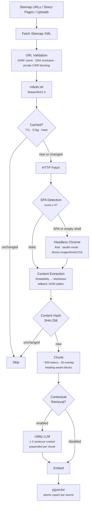
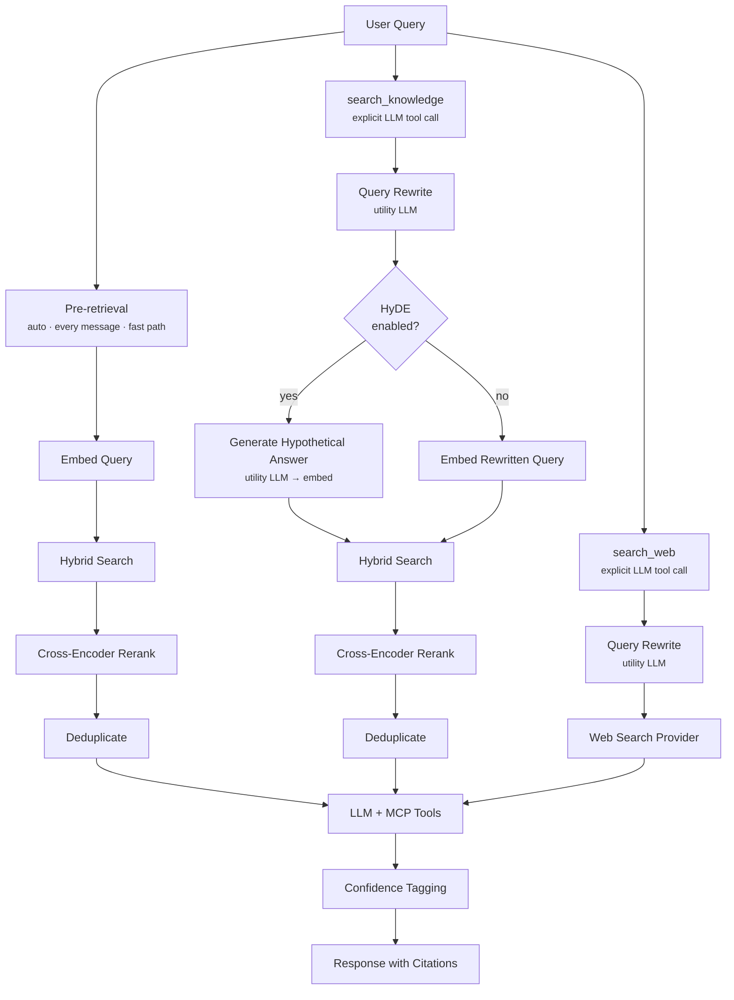

import { Aside, Steps, Tabs, TabItem } from "@astrojs/starlight/components";

Skipper requires three things: an **LLM** for chat, an **embedding model** for the knowledge base, and **PostgreSQL with pgvector**. Optionally, add a web search provider for live lookups beyond the knowledge base.

All configuration is through environment variables. The LLM and embedding providers are independent — you can mix local embeddings with an API-hosted LLM.

## Model Selection

<Aside type="note" title="What matters most">
  A well-tuned 14-32B model with good RAG handles 90%+ of queries. Cross-encoder reranking, query
  rewriting, and context window management improve answers more than upgrading the model. Invest in
  retrieval quality first — see [Retrieval Quality](#retrieval-quality).
</Aside>

### Embeddings

Embedding models convert text into vectors for similarity search. Quality here affects every answer — bad retrieval poisons everything downstream.

| Model                    | Run where    | Cost per 1M tokens | Notes                                                    |
| ------------------------ | ------------ | -----------------: | -------------------------------------------------------- |
| `nomic-embed-text`       | Ollama / CPU |               Free | Great quality, runs anywhere. Top pick for local.        |
| `bge-m3`                 | Ollama / CPU |               Free | Multi-lingual, multi-granularity. Heavier but excellent. |
| `text-embedding-3-small` | OpenAI API   |              $0.02 | Simple, 8K context, very cheap at scale.                 |
| `text-embedding-3-large` | OpenAI API   |              $0.13 | Higher quality. Good if retrieval feels weak.            |
| `voyage-3-large`         | Voyage API   |              $0.18 | Top-tier retrieval quality.                              |

**Recommendation:** Start with `nomic-embed-text` via Ollama (free, local). If retrieval quality is insufficient, try `text-embedding-3-large`.

<Aside type="caution" title="Embedding lock-in">
  Switching embedding models requires re-crawling all sources — vector dimensions may differ. Choose
  your embedding model before the first crawl.
</Aside>

### LLM — Local (Ollama)

Self-hosted via Ollama. No per-token cost — you pay for hardware.

**Tier 1 — Lightweight (7-8B)** — single 8-16GB GPU

| Model           | Context | VRAM (Q4) | Notes                                   |
| --------------- | ------: | --------: | --------------------------------------- |
| Qwen 3 8B       |    128K |      ~5GB | Strong instruction following + tool use |
| Llama 3.1 8B    |    128K |      ~5GB | Battle-tested, huge community           |
| Mistral 7B v0.3 |     32K |    ~4.5GB | Fast, good at structured prompts        |

Good for simple lookups. Struggles with multi-hop reasoning across multiple chunks.

**Tier 2 — Sweet Spot (14-32B)** — single 24-48GB GPU **(recommended)**

| Model                 | Context | VRAM (Q4) | Notes                                                |
| --------------------- | ------: | --------: | ---------------------------------------------------- |
| **Qwen 2.5 32B**      |    128K |     ~20GB | Best all-around. Strong RAG + instruction following. |
| Qwen 3 32B            |    128K |     ~20GB | Built-in thinking mode. Good for reasoning.          |
| Mistral Small 3.1 24B |    128K |     ~15GB | Excellent function calling. Fits on a 24GB card.     |
| Command R 35B         |    128K |     ~22GB | Purpose-built for RAG by Cohere. Native citations.   |

RTX 3090/4090 (24GB) runs Q4_K_M of 32B models at ~15-25 tok/s — fine for chat.

**Tier 3 — Heavy (70B+)** — 2x 24GB or 1x 80GB GPU

| Model         | Context | VRAM (Q4) | Notes                          |
| ------------- | ------: | --------: | ------------------------------ |
| Llama 3.3 70B |    128K |     ~40GB | Near 405B quality.             |
| Qwen 2.5 72B  |    128K |     ~42GB | Excellent multilingual + code. |

The jump from 32B to 70B is ~10-15% better on hard queries. Usually not worth 2-3x the hardware for a domain consultant with good RAG.

### LLM — API

No hardware needed. All accessible via OpenRouter with a single integration, or directly from each provider.

**Budget (&lt;$1/M tokens)**

| Model            | Provider  | Input / 1M | Output / 1M | Context |
| ---------------- | --------- | ---------: | ----------: | ------: |
| DeepSeek V3.2    | DeepSeek  |      $0.25 |       $0.38 |    128K |
| GPT-4o Mini      | OpenAI    |      $0.15 |       $0.60 |    128K |
| GPT-4.1 Mini     | OpenAI    |      $0.40 |       $1.60 |      1M |
| Claude Haiku 4.5 | Anthropic |      $1.00 |       $5.00 |    200K |

**Mid Tier (recommended)**

| Model                 | Provider  | Input / 1M | Output / 1M | Context |
| --------------------- | --------- | ---------: | ----------: | ------: |
| **Claude Sonnet 4.5** | Anthropic |      $3.00 |      $15.00 |    200K |
| GPT-4.1               | OpenAI    |      $2.00 |       $8.00 |      1M |
| GPT-4o                | OpenAI    |      $2.50 |      $10.00 |    128K |

**Premium**

| Model           | Provider  | Input / 1M | Output / 1M | Context |
| --------------- | --------- | ---------: | ----------: | ------: |
| Claude Opus 4.5 | Anthropic |      $5.00 |      $25.00 |    200K |
| GPT-5           | OpenAI    |      $1.25 |      $10.00 |       — |

### Cost Estimates

Assuming ~2K input tokens and ~500 output tokens per response:

| Model              | 100/day |         1,000/day |         10,000/day |
| ------------------ | ------: | ----------------: | -----------------: |
| Local 32B (Ollama) |      $0 |                $0 | $0 (hardware only) |
| DeepSeek V3.2      |   $0.03 |    $0.27 (~$8/mo) |    $2.70 (~$81/mo) |
| GPT-4o Mini        |   $0.05 |   $0.48 (~$15/mo) |   $4.80 (~$144/mo) |
| Claude Sonnet 4.5  |   $1.35 | $13.50 (~$405/mo) |     $135 (~$4K/mo) |

---

## Configuration

### Environment Variables

**LLM:**

| Variable         | Purpose                                   | Default          |
| ---------------- | ----------------------------------------- | ---------------- |
| `LLM_PROVIDER`   | `openai`, `anthropic`, or `ollama`        | —                |
| `LLM_MODEL`      | Model identifier                          | —                |
| `LLM_API_KEY`    | API credentials                           | —                |
| `LLM_API_URL`    | Custom endpoint (OpenRouter, self-hosted) | Provider default |
| `LLM_MAX_TOKENS` | Max output tokens per response            | `4096`           |

**Embeddings** (falls back to `LLM_*` when unset):

| Variable             | Purpose                   | Default        |
| -------------------- | ------------------------- | -------------- |
| `EMBEDDING_PROVIDER` | `openai` or `ollama`      | `LLM_PROVIDER` |
| `EMBEDDING_MODEL`    | Embedding model name      | `LLM_MODEL`    |
| `EMBEDDING_API_KEY`  | Embedding API credentials | `LLM_API_KEY`  |
| `EMBEDDING_API_URL`  | Embedding endpoint        | `LLM_API_URL`  |

**Utility LLM** (for background tasks like contextual retrieval; falls back to `LLM_*` when unset):

| Variable               | Purpose                                                                      | Default        |
| ---------------------- | ---------------------------------------------------------------------------- | -------------- |
| `UTILITY_LLM_PROVIDER` | Cheap LLM for background tasks (query rewriting, HyDE, contextual retrieval) | `LLM_PROVIDER` |
| `UTILITY_LLM_MODEL`    | Utility model identifier                                                     | `LLM_MODEL`    |
| `UTILITY_LLM_API_KEY`  | Utility LLM credentials                                                      | `LLM_API_KEY`  |
| `UTILITY_LLM_API_URL`  | Utility LLM endpoint                                                         | `LLM_API_URL`  |

**Web search** (optional):

| Variable          | Purpose                                 | Default          |
| ----------------- | --------------------------------------- | ---------------- |
| `SEARCH_PROVIDER` | `tavily`, `brave`, or `searxng`         | —                |
| `SEARCH_API_KEY`  | Search API key (not needed for SearXNG) | —                |
| `SEARCH_API_URL`  | Custom endpoint (required for SearXNG)  | Provider default |

**Retrieval quality:**

| Variable              | Purpose                                                                                  | Default              |
| --------------------- | ---------------------------------------------------------------------------------------- | -------------------- |
| `RERANKER_PROVIDER`   | Cross-encoder reranker: `cohere`, `jina`, `voyage`, or `generic`                         | — (keyword fallback) |
| `RERANKER_MODEL`      | Reranker model (e.g. `rerank-4-pro`, `rerank-2.5`, `jina-reranker-v2-base-multilingual`) | —                    |
| `RERANKER_API_KEY`    | Reranker API credentials                                                                 | `LLM_API_KEY`        |
| `RERANKER_API_URL`    | Reranker endpoint (required for `generic` provider)                                      | Provider default     |
| `SKIPPER_ENABLE_HYDE` | Enable Hypothetical Document Embeddings for `search_knowledge`                           | `false`              |

**Knowledge base:**

| Variable                       | Purpose                                             | Default |
| ------------------------------ | --------------------------------------------------- | ------- |
| `SITEMAPS`                     | Comma-separated sitemap URLs                        | —       |
| `SKIPPER_SITEMAPS_DIR`         | Directory of source files (re-read each cycle)      | —       |
| `CRAWL_INTERVAL`               | Refresh interval                                    | `24h`   |
| `CHUNK_TOKEN_LIMIT`            | Max BPE tokens per chunk                            | `500`   |
| `CHUNK_TOKEN_OVERLAP`          | Overlap tokens between adjacent chunks              | `50`    |
| `SKIPPER_ENABLE_RENDERING`     | Enable headless Chrome for JS-rendered pages        | `false` |
| `SKIPPER_CONTEXTUAL_RETRIEVAL` | Use utility LLM to prepend context before embedding | `false` |
| `SKIPPER_LINK_DISCOVERY`       | Discover and crawl same-domain links                | `false` |
| `SKIPPER_SEARCH_LIMIT`         | Default result limit for `search_knowledge`         | `8`     |

**Service:**

| Variable                            | Purpose                                               | Default         |
| ----------------------------------- | ----------------------------------------------------- | --------------- |
| `SKIPPER_WEB_UI`                    | Enable standalone web UI at `/`                       | `true`          |
| `SKIPPER_API_KEY`                   | API key for admin WebUI auth (omit for network-trust) | —               |
| `SKIPPER_REQUIRED_TIER_LEVEL`       | Minimum subscription tier                             | `3`             |
| `SKIPPER_CHAT_RATE_LIMIT_PER_HOUR`  | Rate limit per tenant                                 | `0` (unlimited) |
| `SKIPPER_CHAT_RATE_LIMIT_OVERRIDES` | Per-tenant overrides (`tenant_id:limit,...`)          | —               |
| `SKIPPER_ADMIN_TENANT_ID`           | Tenant ID for global/platform knowledge               | —               |
| `SKIPPER_MAX_HISTORY_MESSAGES`      | Max conversation messages loaded per request          | `20`            |
| `GATEWAY_PUBLIC_URL`                | API Gateway base URL for MCP tool access              | —               |

### Configuration Examples

<Tabs>
  <TabItem label="Local (Ollama)">
    Zero ongoing cost. Requires a GPU for the LLM; embeddings run on CPU.

    ```bash
    # LLM
    LLM_PROVIDER=ollama
    LLM_MODEL=qwen2.5:32b
    LLM_API_URL=http://localhost:11434/v1

    # Utility LLM — cheap model for background tasks (contextual retrieval)
    UTILITY_LLM_PROVIDER=ollama
    UTILITY_LLM_MODEL=qwen2.5:7b
    UTILITY_LLM_API_URL=http://localhost:11434/v1

    # Embeddings (same Ollama instance, different endpoint)
    EMBEDDING_PROVIDER=ollama
    EMBEDDING_MODEL=nomic-embed-text
    EMBEDDING_API_URL=http://localhost:11434

    # Web search (optional, self-hosted)
    SEARCH_PROVIDER=searxng
    SEARCH_API_URL=http://localhost:8080

    # Reranker (optional — self-hosted cross-encoder via generic provider)
    # RERANKER_PROVIDER=generic
    # RERANKER_MODEL=BAAI/bge-reranker-v2-m3
    # RERANKER_API_URL=http://localhost:8787

    # HyDE — improves search_knowledge quality at ~500-1500ms extra latency
    # SKIPPER_ENABLE_HYDE=true
    ```

    Pull models first:
    ```bash
    ollama pull qwen2.5:32b
    ollama pull qwen2.5:7b
    ollama pull nomic-embed-text
    ```

  </TabItem>

  <TabItem label="API (Anthropic + OpenAI)">
    No hardware needed.

    ```bash
    # LLM — Claude Sonnet
    LLM_PROVIDER=anthropic
    LLM_MODEL=claude-sonnet-4-5-20250929
    LLM_API_KEY=sk-ant-...

    # Utility LLM — Haiku for background tasks (contextual retrieval)
    UTILITY_LLM_PROVIDER=anthropic
    UTILITY_LLM_MODEL=claude-haiku-4-5-20251001
    UTILITY_LLM_API_KEY=sk-ant-...

    # Embeddings — OpenAI (Anthropic doesn't offer embeddings)
    EMBEDDING_PROVIDER=openai
    EMBEDDING_MODEL=text-embedding-3-small
    EMBEDDING_API_KEY=sk-...

    # Web search
    SEARCH_PROVIDER=tavily
    SEARCH_API_KEY=tvly-...

    # Reranker — Cohere rerank
    RERANKER_PROVIDER=cohere
    RERANKER_MODEL=rerank-4-pro
    RERANKER_API_KEY=...

    # HyDE — improves search_knowledge quality at ~500-1500ms extra latency
    # SKIPPER_ENABLE_HYDE=true
    ```

  </TabItem>

  <TabItem label="OpenRouter">
    One API key, access to all providers. Swap models by changing one string.

    ```bash
    # LLM — any model via OpenRouter (OpenAI-compatible)
    LLM_PROVIDER=openai
    LLM_MODEL=anthropic/claude-sonnet-4-5
    LLM_API_KEY=sk-or-...
    LLM_API_URL=https://openrouter.ai/api/v1

    # Utility LLM — cheap model via OpenRouter for background tasks
    UTILITY_LLM_PROVIDER=openai
    UTILITY_LLM_MODEL=anthropic/claude-haiku-4-5
    UTILITY_LLM_API_KEY=sk-or-...
    UTILITY_LLM_API_URL=https://openrouter.ai/api/v1

    # Embeddings — OpenAI directly
    EMBEDDING_PROVIDER=openai
    EMBEDDING_MODEL=text-embedding-3-small
    EMBEDDING_API_KEY=sk-...

    # Web search
    SEARCH_PROVIDER=brave
    SEARCH_API_KEY=BSA...
    ```

    OpenRouter doesn't proxy embeddings or reranking, so use provider APIs directly for those.

    ```bash
    # Reranker — pick one:

    # Voyage AI (200M free tokens, instruction-following)
    RERANKER_PROVIDER=voyage
    RERANKER_MODEL=rerank-2.5
    RERANKER_API_KEY=pa-...

    # ZeroEntropy (#1 quality, fastest, half-price)
    # RERANKER_PROVIDER=generic
    # RERANKER_MODEL=zerank-2
    # RERANKER_API_KEY=ze-...
    # RERANKER_API_URL=https://api.zeroentropy.dev/v1/models

    # Jina (cheapest, strong multilingual)
    # RERANKER_PROVIDER=jina
    # RERANKER_MODEL=jina-reranker-v2-base-multilingual
    # RERANKER_API_KEY=jina_...
    ```

  </TabItem>

  <TabItem label="Hybrid">
    Local embeddings (free), API LLM (no GPU needed).

    ```bash
    # LLM — API
    LLM_PROVIDER=anthropic
    LLM_MODEL=claude-sonnet-4-5-20250929
    LLM_API_KEY=sk-ant-...

    # Utility LLM — Haiku for background tasks (much cheaper than Sonnet)
    UTILITY_LLM_PROVIDER=anthropic
    UTILITY_LLM_MODEL=claude-haiku-4-5-20251001
    UTILITY_LLM_API_KEY=sk-ant-...

    # Embeddings — local Ollama
    EMBEDDING_PROVIDER=ollama
    EMBEDDING_MODEL=nomic-embed-text
    EMBEDDING_API_URL=http://localhost:11434

    # Web search
    SEARCH_PROVIDER=tavily
    SEARCH_API_KEY=tvly-...

    # Reranker — Cohere rerank
    RERANKER_PROVIDER=cohere
    RERANKER_MODEL=rerank-4-pro
    RERANKER_API_KEY=...

    # HyDE
    SKIPPER_ENABLE_HYDE=true
    ```

  </TabItem>
</Tabs>

---

## Knowledge Base

Skipper's knowledge base is populated by crawling documentation sources and embedding them into pgvector.

### How the Crawler Works

<Steps>
  1. **Fetch** pages from sitemaps or direct URLs 2. **Detect** whether the page needs headless
  rendering (SPA detection) 3. **Extract** readable text via Readability → Markdown (strips
  navigation, boilerplate) 4. **Chunk** into ~500-token segments with 50-token overlap 5. **Embed**
  each chunk via the configured embedding model 6. **Store** in pgvector with metadata (source URL,
  title, source type, ingestion timestamp)
</Steps>

The full ingestion pipeline handles everything from sitemap discovery through to vector storage:



### Change Detection

The crawler runs every `CRAWL_INTERVAL` (default 24h) and uses three layers of change detection to avoid unnecessary work:

- **Source TTL** — skip sources crawled within the interval
- **HTTP 304** — conditional fetch with ETag / If-Modified-Since
- **Content hash** — SHA-256 comparison skips re-embedding unchanged pages

When rendering is enabled, Skipper also sends a HEAD request before launching Chrome — if the `Content-Length` matches the cached value, it skips headless rendering entirely.

### SPA Rendering

Many documentation sites are JavaScript-heavy SPAs that return empty shells to a plain HTTP fetch. When `SKIPPER_ENABLE_RENDERING=true`, the crawler auto-detects these pages using a scoring heuristic:

- SPA mount points (`<div id="root">`, `<div id="app">`, `<div id="__next">`)
- `<noscript>` tags, framework markers (`data-reactroot`, `ng-app`, `data-v-`)
- High script-to-text ratio, low text density in `<body>`

If the score reaches 4 or the extracted text has fewer than 10 words, Skipper renders the page in headless Chromium (via Rod) with stealth mode enabled and non-essential resources (images, fonts, CSS) blocked. The browser waits 500ms for DOM stability before extracting the rendered HTML.

Content is extracted using Mozilla's Readability algorithm (converted to Markdown). If Readability returns too little text, a fallback DOM walker strips navigation, sidebars, and hidden elements.

### Contextual Retrieval

When `SKIPPER_CONTEXTUAL_RETRIEVAL=true`, Skipper uses a utility LLM to prepend 1-2 sentences of context to each chunk before embedding. This helps disambiguation — a chunk about "buffer settings" gets tagged with whether it's about OBS, FFmpeg, or MistServer. The context is used only for embedding; the original chunk text is stored for retrieval.

### Retrieval Quality

Three features improve retrieval accuracy at query time. All are optional and independent — enable what fits your latency and cost budget.

**Cross-encoder reranking** (`RERANKER_PROVIDER`) replaces the default keyword-overlap heuristic with a model that scores (query, chunk) pairs together. This understands semantic equivalence that keyword matching cannot — "rebuffering issues" matches "playback stalling", "my stream keeps dying" matches "connection timeout troubleshooting". Applied to both pre-retrieval (every message) and `search_knowledge` tool calls.

| Provider                                             | Model                                | Quality    | Latency    | Cost             | Notes                                                                                            |
| ---------------------------------------------------- | ------------------------------------ | ---------- | ---------- | ---------------- | ------------------------------------------------------------------------------------------------ |
| [Cohere](https://cohere.com/rerank)                  | `rerank-4-pro`                       | #2 ELO     | ~600ms     | ~$2/1K queries   | Incumbent, widest cloud availability (Bedrock, Azure). `rerank-4-fast` trades quality for speed. |
| [Voyage AI](https://docs.voyageai.com/docs/reranker) | `rerank-2.5`                         | #4 ELO     | ~600ms     | $0.05/1M tokens  | 200M free tokens. Instruction-following. 1K docs/request. Backed by MongoDB.                     |
| [Jina](https://jina.ai/reranker)                     | `jina-reranker-v2-base-multilingual` | #12 ELO    | ~750ms     | ~$0.02/1M tokens | Cheapest. Strong multilingual and code search. 131K context in v3.                               |
| [ZeroEntropy](https://www.zeroentropy.dev)           | `zerank-2`                           | **#1 ELO** | **~265ms** | $0.025/1M tokens | Best quality + speed + price. Use `generic` provider.                                            |
| [Contextual AI](https://contextual.ai)               | `rerank-v2-instruct`                 | #9 ELO     | ~3.3s      | $0.05/1M tokens  | Instruction-following, recency-aware. Use `generic` provider.                                    |
| Generic                                              | Any `/v1/rerank` endpoint            | Varies     | Varies     | Varies           | Self-hosted BGE/MXBai models, or any compatible API.                                             |

<Aside type="note" title="Quality rankings">
  ELO ratings from the [Agentset Reranker Leaderboard](https://agentset.ai/leaderboard/rerankers)
  (Feb 2026), measuring head-to-head RAG retrieval quality. Rankings shift as providers release new
  models.
</Aside>

**Query rewriting** (automatic when utility LLM is configured) transforms conversational questions into search-optimized queries before embedding. "My European viewers are buffering a lot" becomes "European CDN edge rebuffering latency troubleshooting". Applied to `search_knowledge` and `search_web` tool calls; skipped for pre-retrieval to keep latency low.

**HyDE** (`SKIPPER_ENABLE_HYDE=true`) generates a hypothetical answer to the user's question, then embeds that answer instead of the question for vector search. The resulting vector is closer in embedding space to real documentation. Adds ~500-1500ms latency per `search_knowledge` call. Not used for pre-retrieval or web search.

<Aside type="tip">
  Start with a cross-encoder reranker — it gives the biggest accuracy improvement with minimal
  latency impact. Add query rewriting next (free if you already have a utility LLM configured).
  Enable HyDE last, only if retrieval quality still isn't satisfactory.
</Aside>

### Built-in Sources

Skipper ships with curated source files in `config/skipper/sitemaps/`:

| File             | Content                                                   |
| ---------------- | --------------------------------------------------------- |
| `frameworks.txt` | Platform docs and marketing site (env-templated URLs)     |
| `ecosystem.txt`  | MistServer, Livepeer, Daydream, WebRTC, DASH, Streamplace |
| `obs.txt`        | OBS Studio knowledge base articles                        |
| `ffmpeg.txt`     | FFmpeg tools, codecs, formats, protocols, filters         |
| `srt.txt`        | SRT protocol docs from Haivision                          |
| `nginx-rtmp.txt` | nginx-rtmp-module wiki                                    |
| `hls-spec.txt`   | HLS specification (IETF RFCs)                             |

Set `SKIPPER_SITEMAPS_DIR` to the directory containing these files. In Docker Compose, this is mounted as a read-only volume at `/etc/skipper/sitemaps`.

### Adding Custom Sources

Create a `.txt` file in the sitemaps directory. Two formats are supported:

**Sitemap URLs** — standard XML sitemaps:

```
https://logbook.example.com/sitemap.xml
```

**Direct page URLs** — for sites without sitemaps, prefix with `page:`:

```
# Internal documentation
page:https://wiki.example.com/streaming-guide
page:https://wiki.example.com/encoder-settings
```

**Force-rendered URLs** — for SPAs that always need headless Chrome, prefix with `render:`:

```
# React/Next.js docs that return empty shells without JS
render:https://spa-docs.example.com/getting-started
render:https://spa-docs.example.com/api-reference
```

Lines starting with `#` are comments. Empty lines are ignored. Environment variables are expanded (e.g., `${DOCS_PUBLIC_URL}`).

### Uploading Documents

The admin API accepts direct document uploads:

```bash
curl -X POST /api/skipper/admin/pages \
  -H "Authorization: Bearer $ADMIN_TOKEN" \
  -d '{"url": "internal://runbook", "title": "Streaming Runbook", "content": "..."}'
```

Uploaded content is embedded and stored as tenant-specific knowledge. Supported file types for multipart upload: `.txt`, `.md`, `.html`, `.csv`, `.json`, `.xml` (max 10MB).

---

## Web Search Providers

Web search is optional — Skipper works without it, relying on the knowledge base alone. When configured, Skipper falls back to web search if the knowledge base doesn't have a good answer.

| Provider                                      | Setup                                        | Notes                                          |
| --------------------------------------------- | -------------------------------------------- | ---------------------------------------------- |
| [Tavily](https://tavily.com)                  | `SEARCH_PROVIDER=tavily` + API key           | Returns clean extracted content. Best for RAG. |
| [Brave Search](https://brave.com/search/api/) | `SEARCH_PROVIDER=brave` + API key            | Fast, privacy-focused. Returns snippets.       |
| [SearXNG](https://docs.searxng.org/)          | `SEARCH_PROVIDER=searxng` + `SEARCH_API_URL` | Self-hosted, no API key needed.                |

---

## Self-Hosting Dependencies

Skipper can run entirely on your own infrastructure with no external API calls. This section covers deploying the self-hostable components.

### Ollama (LLM + Embeddings)

[Ollama](https://ollama.com) runs open-weight models locally. It provides both chat completion and embedding endpoints that Skipper uses directly.

**Docker (recommended for production):**

```yaml
ollama:
  image: ollama/ollama:latest
  ports:
    - "11434:11434"
  volumes:
    - ollama_data:/root/.ollama # persist downloaded models
  deploy:
    resources:
      reservations:
        devices:
          - driver: nvidia # GPU passthrough (NVIDIA)
            count: all
            capabilities: [gpu]
  healthcheck:
    test: ["CMD", "curl", "-f", "http://localhost:11434/api/tags"]
    interval: 15s
    timeout: 5s
    retries: 3
    start_period: 30s
```

For AMD GPUs, use `image: ollama/ollama:rocm`. For CPU-only, omit the `deploy.resources` block — expect ~2-5 tok/s on a 32B model.

**Pull models after starting Ollama:**

```bash
# Chat model (pick one per tier — see Model Selection above)
docker exec ollama ollama pull qwen2.5:32b

# Embedding model
docker exec ollama ollama pull nomic-embed-text

# Utility model (optional, for contextual retrieval / query rewriting)
docker exec ollama ollama pull qwen2.5:7b
```

<Aside type="caution" title="Models must be pulled before Skipper starts">
  Ollama ships with no models. If Skipper can't reach the configured model, it starts with LLM
  disabled and chat won't work. Pull models first, or use the health check + `depends_on` pattern
  below.
</Aside>

**Skipper env vars for Ollama:**

```bash
LLM_PROVIDER=ollama
LLM_MODEL=qwen2.5:32b
LLM_API_URL=http://ollama:11434/v1       # use container name in Docker networks

EMBEDDING_PROVIDER=ollama
EMBEDDING_MODEL=nomic-embed-text
EMBEDDING_API_URL=http://ollama:11434     # embeddings use /api/embeddings, not /v1
```

### SearXNG (Web Search)

[SearXNG](https://docs.searxng.org/) is a self-hosted metasearch engine. No API key needed.

```bash
docker run -d --name searxng -p 8080:8080 searxng/searxng:latest
```

**Skipper env vars:**

```bash
SEARCH_PROVIDER=searxng
SEARCH_API_URL=http://searxng:8080
```

### Self-Hosted Reranker

For fully local retrieval quality, run a cross-encoder model via [Text Embeddings Inference (TEI)](https://github.com/huggingface/text-embeddings-inference) or a similar `/v1/rerank`-compatible server:

```bash
docker run -d --name reranker -p 8787:80 \
  ghcr.io/huggingface/text-embeddings-inference:latest \
  --model-id BAAI/bge-reranker-v2-m3
```

**Skipper env vars:**

```bash
RERANKER_PROVIDER=generic
RERANKER_MODEL=BAAI/bge-reranker-v2-m3
RERANKER_API_URL=http://reranker:8787
```

### Putting It Together

A fully self-hosted stack with proper health checks and startup ordering:

```yaml
services:
  ollama:
    image: ollama/ollama:latest
    volumes:
      - ollama_data:/root/.ollama
    deploy:
      resources:
        reservations:
          devices:
            - driver: nvidia
              count: all
              capabilities: [gpu]
    healthcheck:
      test: ["CMD", "curl", "-f", "http://localhost:11434/api/tags"]
      interval: 15s
      timeout: 5s
      retries: 5
      start_period: 30s

  searxng:
    image: searxng/searxng:latest
    healthcheck:
      test: ["CMD", "curl", "-f", "http://localhost:8080/healthz"]
      interval: 10s
      timeout: 5s
      retries: 3

  skipper:
    # ... your existing Skipper config ...
    environment:
      LLM_PROVIDER: ollama
      LLM_MODEL: qwen2.5:32b
      LLM_API_URL: http://ollama:11434/v1
      EMBEDDING_PROVIDER: ollama
      EMBEDDING_MODEL: nomic-embed-text
      EMBEDDING_API_URL: http://ollama:11434
      SEARCH_PROVIDER: searxng
      SEARCH_API_URL: http://searxng:8080
    depends_on:
      ollama:
        condition: service_healthy
      searxng:
        condition: service_healthy

volumes:
  ollama_data:
```

<Aside type="tip">
  After first deployment, pull models into the running Ollama container. The volume ensures they
  persist across restarts: `docker exec ollama ollama pull qwen2.5:32b && docker exec ollama ollama
  pull nomic-embed-text`
</Aside>

---

## Architecture



Skipper runs as the `api_consultant` service (ports 18018 HTTP, 19007 gRPC). It connects to the API Gateway via MCP to access platform tools (diagnostics, stream management, GraphQL). The Gateway proxies Skipper's `ask_consultant` tool to external MCP agents, which runs the full orchestrator pipeline internally.

### Retrieval and Reranking

Every user message triggers an automatic pre-retrieval pass that searches both tenant-specific and global knowledge. The LLM can also explicitly call `search_knowledge` for targeted lookups.

Search uses a hybrid approach: 70% cosine vector similarity + 30% PostgreSQL full-text ranking. Results are then reranked — when a cross-encoder is configured (`RERANKER_PROVIDER`), it scores (query, chunk) pairs together for semantic understanding; otherwise a keyword-overlap heuristic is used (0.7 × vector similarity + 0.3 × query term overlap). Results are deduplicated to a maximum of 2 chunks per source URL.

**Query rewriting** (requires utility LLM) transforms conversational questions into search-optimized queries before embedding. This bridges vocabulary gaps between how users phrase questions and how documentation is written. Applied to `search_knowledge` and `search_web` tool calls; skipped for pre-retrieval to keep latency low.

**HyDE** (`SKIPPER_ENABLE_HYDE=true`) generates a hypothetical answer via the utility LLM, then embeds that answer instead of the question for vector search. The resulting vector is closer in embedding space to real documentation. Adds ~500-1500ms latency per `search_knowledge` call.

### Dependencies

| Dependency            | Purpose                                            |
| --------------------- | -------------------------------------------------- |
| PostgreSQL + pgvector | Vector store, conversations, usage tracking        |
| LLM provider          | Chat completion (OpenAI, Anthropic, or Ollama)     |
| Embedding provider    | Document/query embedding (OpenAI or Ollama)        |
| API Gateway (MCP)     | Platform tools — diagnostics, stream CRUD, GraphQL |
| Periscope (gRPC)      | Stream health metrics (via Gateway)                |
| Commodore (gRPC)      | Tenant and stream context                          |

<Aside type="note" title="Provider pricing changes frequently">
  Model pricing changes frequently. Verify with provider documentation before committing to a
  provider.
</Aside>
