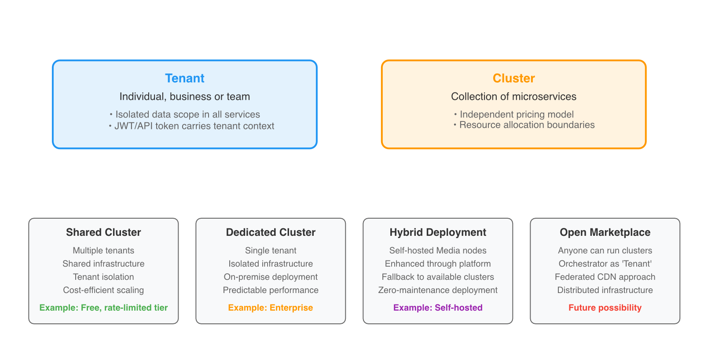
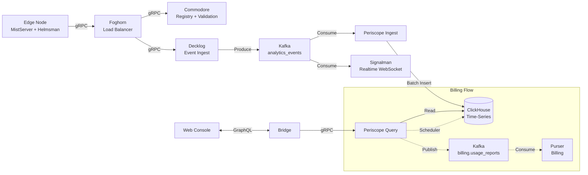

import { Aside } from "@astrojs/starlight/components";

<Aside type="caution" title="Self-Hosting Is Experimental">
  Self-hosting is available, but the operator stack is still evolving. Expect breaking changes in
  deployment flows and node lifecycle behavior. See the operator docs for current steps.
</Aside>

FrameWorks is built on a distributed microservices architecture, enforcing strict separation of concerns to maximize stability and throughput. This document details the core design patterns, data flows, and security models that power the platform.

## Architecture Patterns

### Multi-Plane Separation

FrameWorks isolates concerns into four distinct planes to ensure stability and scalability:

- **Control Plane (CP)**: Handles business logic, auth, and configuration. Optimized for **consistency** (ACID).
  - _Storage_: PostgreSQL-compatible (PostgreSQL in dev; YugabyteDB recommended for production).
  - _Services_: Commodore, Quartermaster, Purser.
- **Data Plane (DP)**: Handles high-volume events and analytics. Optimized for **throughput** and **ingestion**.
  - _Storage_: ClickHouse (Time-series), Kafka (Stream).
  - _Services_: Decklog, Periscope, Signalman.
- **Media Plane (MP)**: Handles video ingestion, processing, and delivery. Optimized for **latency** and **bandwidth**.
  - _Components_: MistServer, Helmsman, Foghorn.
- **Support Plane (SP)**: User interfaces and documentation.
  - _Apps & Tools_: Web Console, Docs Site, Marketing Site, CLI.

**DNS note**: Public DNS currently relies on Cloudflare. Navigator-managed DNS will migrate to a self-hosted global DNS layer.

### Event-Driven Analytics

All analytics data originates as immutable events from the Edge (Media Plane), flowing through Kafka into ClickHouse for real-time visibility and historical queries.

---

## API Standards & Patterns

To ensure a consistent developer experience, all FrameWorks APIs adhere to a strict set of design standards.

### Pagination Strategy

FrameWorks uses **keyset pagination** with opaque cursors for stable, efficient pagination.

**Cursor Format**: Base64-encoded `ts:{timestamp_ms}:id:{unique_id}`

- **Layer 1 (Gateway)**: Exposes **Relay Connections** (bidirectional cursor-based) to frontend clients.
  - _Arguments_: `first: Int`, `after: String`, `last: Int`, `before: String`
  - _Returns_: `edges`, `pageInfo`, `totalCount`
  - Cursors are **opaque** - passed through unchanged to backend services

- **Layer 2 (Backend Services)**: Decode cursors and apply keyset pagination.
  - Decode cursor to extract `{Timestamp, ID}`
  - Build WHERE clause: `(timestamp, id) < ($cursor_ts, $cursor_id)`
  - Fetch `limit + 1` rows to detect `hasNextPage`

- **Layer 3 (Database)**: Keyset queries (no OFFSET).
  - _PostgreSQL_: `WHERE (created_at, id) < ($1, $2) ORDER BY created_at DESC, id DESC LIMIT $3`
  - _ClickHouse_: Same pattern with `(timestamp, event_id)`

**Why Keyset > Offset**:

- Stable across inserts/deletes (offset causes page drift)
- Efficient on large tables (offset scans and discards rows)

### Rate Limiting & Connection Limits

| Limit                          | Default               | Config Variable                 |
| ------------------------------ | --------------------- | ------------------------------- |
| GraphQL complexity             | 2000                  | `GRAPHQL_COMPLEXITY_LIMIT`      |
| WebSocket connections/tenant   | 5                     | `WS_MAX_CONNECTIONS_PER_TENANT` |
| API requests/tenant            | 100 req/min, burst 20 | Quartermaster tenant limits     |
| Outbound HTTP connections/host | 100                   | (hardcoded shared HTTP client)  |
| PostgreSQL pool                | 25 open, 5 idle       | (code config)                   |
| Health check concurrency       | 8                     | `QM_HEALTH_MAX_CONCURRENCY`     |
| Max transcodes/node            | 0 (auto)              | `HELMSMAN_MAX_TRANSCODES`       |
| Blocking trigger grace         | 2000 ms               | `HELMSMAN_BLOCKING_GRACE_MS`    |
| Max concurrent streams         | Per billing tier      | Database                        |
| Max concurrent viewers         | Per billing tier      | Database                        |

### Node Operational Modes

Edge nodes report an operational mode to Foghorn. Foghorn is authoritative and may override the requested mode.

| Mode          | Behavior                                                                | Config                      |
| ------------- | ----------------------------------------------------------------------- | --------------------------- |
| `normal`      | Node accepts new streams and viewers (default)                          | `HELMSMAN_OPERATIONAL_MODE` |
| `draining`    | Node stops accepting new streams; existing sessions continue until done | `HELMSMAN_OPERATIONAL_MODE` |
| `maintenance` | Node is excluded from all routing; use for upgrades or hardware work    | `HELMSMAN_OPERATIONAL_MODE` |

### Query Complexity Model

GraphQL query complexity is calculated using a [Shopify-style](https://shopify.engineering/rate-limiting-graphql-apis-calculating-query-complexity) model where connection fields cost more based on requested page size.

| Constant                 | Value | Purpose                                                      |
| ------------------------ | ----- | ------------------------------------------------------------ |
| `ConnectionBaseCost`     | 2     | Fixed cost for any connection field                          |
| `DefaultPageSize`        | 50    | Assumed page size when `first`/`last` is omitted             |
| `MaxPageSize`            | 500   | Cap on page size used for complexity estimation              |
| `ConnectionMetaOverhead` | 8     | Per-connection overhead (pageInfo, totalCount, \_\_typename) |
| `HeavyFieldCost`         | 10    | Fixed cost for analytics root queries and rollup summaries   |

**Connection cost formula**: `ConnectionBaseCost + ConnectionMetaOverhead + (pageSize × perItemCost)`

**Rollup summary fields** (`StreamHealthSummary`, `ClientQoeSummary`, `RoutingEfficiency`) use `HeavyFieldCost` instead of pagination-based scaling, making them cheaper than equivalent connection queries. Prefer these for dashboard summaries.

---

## Event Types

The `analytics_events` Kafka topic serves as the central nervous system for platform data. Events are ingested into ClickHouse and power both real-time and historical analytics.

### Stream Events

| Event Type                | Source   | Description                                               | Storage Tables                                           |
| ------------------------- | -------- | --------------------------------------------------------- | -------------------------------------------------------- |
| `stream_buffer`           | Helmsman | Buffer state changes (FULL/DRY/RECOVER) and health scores | `stream_event_log`, `stream_health_samples`              |
| `stream_end`              | Helmsman | Stream session ended                                      | `stream_event_log`                                       |
| `stream_source`           | Helmsman | VOD source resolution                                     | Skipped (not stored)                                     |
| `stream_lifecycle_update` | Helmsman | Aggregated stream state snapshot                          | `stream_state_current` (state), `stream_event_log` (log) |
| `push_rewrite`            | Helmsman | RTMP push URL rewritten (key validation)                  | `stream_event_log`                                       |
| `push_end`                | Helmsman | Push session ended                                        | Skipped (not stored)                                     |
| `push_out_start`          | Helmsman | Push output started                                       | Skipped (not stored)                                     |
| `recording_complete`      | Helmsman | Recording segment finished                                | Skipped (not stored)                                     |
| `recording_segment`       | Helmsman | Recording segment metadata                                | Skipped (not stored)                                     |

### Viewer Events

| Event Type                | Source   | Description                                  | Storage Tables             |
| ------------------------- | -------- | -------------------------------------------- | -------------------------- |
| `viewer_connect`          | Helmsman | Viewer session started (IP, Geo, User-Agent) | `viewer_connection_events` |
| `viewer_disconnect`       | Helmsman | Viewer session ended                         | `viewer_connection_events` |
| `play_rewrite`            | Helmsman | Viewer playback URL resolved                 | Skipped (not stored)       |
| `client_lifecycle_update` | Helmsman | Player-side QoE metrics (bandwidth, errors)  | `client_qoe_samples`       |

### Track Events

| Event Type          | Source   | Description                                    | Storage Tables      |
| ------------------- | -------- | ---------------------------------------------- | ------------------- |
| `stream_track_list` | Helmsman | Snapshot of available A/V tracks and qualities | `track_list_events` |

### Infrastructure Events

| Event Type              | Source   | Description                                   | Storage Tables                                             |
| ----------------------- | -------- | --------------------------------------------- | ---------------------------------------------------------- |
| `node_lifecycle_update` | Helmsman | Node hardware usage (CPU, RAM, disk, network) | `node_state_current` (state), `node_metrics_samples` (log) |
| `load_balancing`        | Foghorn  | Load balancer routing decision                | `routing_decisions`                                        |
| `storage_snapshot`      | Foghorn  | Storage usage snapshot                        | `storage_snapshots`                                        |
| `storage_lifecycle`     | Foghorn  | Storage freeze/defrost lifecycle events       | `storage_events`                                           |
| `process_billing`       | Foghorn  | Transcoding/processing usage events           | `processing_events`                                        |
| `api_request_batch`     | Bridge   | Batched API request metrics                   | `api_requests`                                             |

### Artifact Events

| Event Type       | Source  | Description                    | Storage Tables                                            |
| ---------------- | ------- | ------------------------------ | --------------------------------------------------------- |
| `clip_lifecycle` | Foghorn | Clip generation status updates | `artifact_state_current` (state), `artifact_events` (log) |
| `dvr_lifecycle`  | Foghorn | DVR recording status updates   | `artifact_state_current` (state), `artifact_events` (log) |
| `vod_lifecycle`  | Foghorn | VOD upload/processing updates  | `artifact_state_current` (state), `artifact_events` (log) |

---

## Security Model

Security is layered at every level of the stack, from internal service-to-service communication to public-facing user authentication and bot protection.

### Service-to-Service Authentication

Internal microservices trust each other but require authentication to prevent unauthorized access from within the network perimeter.

- **Mechanism**: Shared `SERVICE_TOKEN`.
- **Header**: `Authorization: Bearer <SERVICE_TOKEN>`
- **Validation**: Middleware checks the token against the environment variable.

### User Authentication

- **Mechanism**: JWT (JSON Web Tokens).
- **Issuer**: Commodore.
- **Context**: Contains `user_id`, `tenant_id`, `role`.
- **Gateway**: Validates JWT signature, extracts claims, and injects them into the request context (`X-Tenant-ID`, `X-User-ID`) for downstream services.

### Developer Tokens (API Keys)

- **Mechanism**: Long-lived, opaque API tokens.
- **Purpose**: Programmatic access for external applications and scripts (as opposed to interactive user sessions).
- **Management**: Created and managed via the GraphQL API (Commodore). Tokens have customizable permissions and expiration dates. Today, developer tokens are full-access; RBAC will tighten this.
- **Validation**: The Gateway validates the token against Commodore's `ValidateAPIToken` RPC. Valid tokens are exchanged for an internal context (User ID, Tenant ID) similar to JWTs.

### Bot Protection

- **Registration**: Cloudflare Turnstile validation on the public registration form.
- **Rate Limiting**: IP-based rate limiting on auth endpoints.

### IP Redaction

- **Storage**: Viewer IPs are stored in analytics for internal use.
- **API**: GraphQL responses redact viewer IPs (host/connectionAddr return null).
