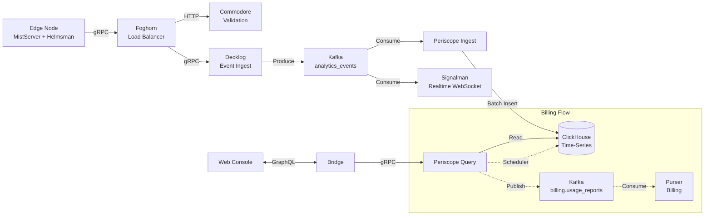

import { Aside } from '@astrojs/starlight/components';

<Aside type="caution" title="Self-Hosting Coming Soon">
Self-hosting and hybrid deployment options are currently in development.
This page documents the platform architecture for transparency.
Deployment guides will be available when the feature launches.
</Aside>

FrameWorks is built on a distributed microservices architecture, enforcing strict separation of concerns to maximize stability and throughput. This document details the core design patterns, data flows, and security models that power the platform.

## Architecture Patterns

### Multi-Plane Separation
FrameWorks isolates concerns into four distinct planes to ensure stability and scalability:

*   **Control Plane (CP)**: Handles business logic, auth, and configuration. Optimized for **consistency** (ACID).
    *   *Storage*: PostgreSQL (YugabyteDB).
    *   *Services*: Commodore, Quartermaster, Purser.
*   **Data Plane (DP)**: Handles high-volume events and analytics. Optimized for **throughput** and **ingestion**.
    *   *Storage*: ClickHouse (Time-series), Kafka (Stream).
    *   *Services*: Decklog, Periscope, Signalman.
*   **Media Plane (MP)**: Handles video ingestion, processing, and delivery. Optimized for **latency** and **bandwidth**.
    *   *Components*: MistServer, Helmsman, Foghorn.
*   **Support Plane (SP)**: User interfaces and documentation.
    *   *Apps*: Web Console, Marketing Site.

### Event-Driven Analytics
All analytics data originates as immutable events from the Edge (Media Plane), flowing through a Kafka pipeline to ensure real-time visibility and historical accuracy.

---

## API Standards & Patterns

To ensure a consistent developer experience, all FrameWorks APIs adhere to a strict set of design standards.

### Pagination Strategy

FrameWorks uses **keyset pagination** with opaque cursors for stable, efficient pagination.

**Cursor Format**: Base64-encoded `ts:{timestamp_ms}:id:{unique_id}`

*   **Layer 1 (Gateway)**: Exposes **Relay Connections** (bidirectional cursor-based) to frontend clients.
    *   *Arguments*: `first: Int`, `after: String`, `last: Int`, `before: String`
    *   *Returns*: `edges`, `pageInfo`, `totalCount`
    *   Cursors are **opaque** - passed through unchanged to backend services

*   **Layer 2 (Backend Services)**: Decode cursors and apply keyset pagination.
    *   Decode cursor to extract `{Timestamp, ID}`
    *   Build WHERE clause: `(timestamp, id) < ($cursor_ts, $cursor_id)`
    *   Fetch `limit + 1` rows to detect `hasNextPage`

*   **Layer 3 (Database)**: Keyset queries (no OFFSET).
    *   *PostgreSQL*: `WHERE (created_at, id) < ($1, $2) ORDER BY created_at DESC, id DESC LIMIT $3`
    *   *ClickHouse*: Same pattern with `(timestamp, event_id)`

**Why Keyset > Offset**:
*   Stable across inserts/deletes (offset causes page drift)
*   Efficient on large tables (offset scans and discards rows)

### Rate Limiting & Connection Limits

| Limit | Default | Config Variable |
|-------|---------|-----------------|
| GraphQL complexity | 200 | `GRAPHQL_COMPLEXITY_LIMIT` |
| WebSocket connections/tenant | 5 | `WS_MAX_CONNECTIONS_PER_TENANT` |
| HTTP connections/host | 100 | (hardcoded) |
| PostgreSQL pool | 25 open, 5 idle | (code config) |
| Health check concurrency | 8 | `QM_HEALTH_MAX_CONCURRENCY` |
| Max transcodes/node | 0 (auto) | `HELMSMAN_MAX_TRANSCODES` |
| Max concurrent streams | Per billing tier | Database |
| Max concurrent viewers | Per billing tier | Database |

---

## Event Types

The `analytics_events` Kafka topic serves as the central nervous system for platform data. Events are routed to specific ClickHouse tables using a dual-write pattern: one for the current state (replacing snapshots) and one for the immutable event log.

### Stream Events

| Event Type | Source | Description | Storage Tables |
|------------|--------|-------------|----------------|
| `stream_buffer` | Helmsman | Buffer state changes (FULL/DRY/RECOVER) and health scores | `stream_events`, `stream_health_metrics` |
| `stream_end` | Helmsman | Stream session ended | `stream_events` |
| `stream_source` | Helmsman | New stream source detected | `stream_events` |
| `stream_bandwidth` | Helmsman | Bandwidth measurement update | `stream_events` |
| `stream_lifecycle_update` | Helmsman | Aggregated stream state snapshot | `live_streams` (state), `stream_events` (log) |
| `push_rewrite` | Helmsman | RTMP push URL rewritten (key validation) | `stream_events` |
| `push_end` | Helmsman | Push session ended | `stream_events` |
| `push_out_start` | Helmsman | Push output started | `stream_events` |
| `recording_complete` | Helmsman | Recording segment finished | `stream_events` |

### Viewer Events

| Event Type | Source | Description | Storage Tables |
|------------|--------|-------------|----------------|
| `viewer_connect` | Helmsman | Viewer session started (IP, Geo, User-Agent) | `connection_events` |
| `viewer_disconnect` | Helmsman | Viewer session ended | `connection_events` |
| `play_rewrite` | Helmsman | Viewer playback URL resolved | `stream_events` |
| `client_lifecycle_update` | Helmsman | Player-side QoE metrics (bandwidth, errors) | `client_metrics` |

### Track Events

| Event Type | Source | Description | Storage Tables |
|------------|--------|-------------|----------------|
| `stream_track_list` | Helmsman | Snapshot of available A/V tracks and qualities | `track_list_events` |

### Infrastructure Events

| Event Type | Source | Description | Storage Tables |
|------------|--------|-------------|----------------|
| `node_lifecycle_update` | Helmsman | Node hardware usage (CPU, RAM, disk, network) | `live_nodes` (state), `node_metrics` (log) |
| `load_balancing` | Foghorn | Load balancer routing decision | `routing_events` |
| `storage_snapshot` | Foghorn | Storage usage snapshot | `storage_snapshots` |

### Artifact Events

| Event Type | Source | Description | Storage Tables |
|------------|--------|-------------|----------------|
| `clip_lifecycle` | Foghorn | Clip generation status updates | `live_artifacts` (state), `clip_events` (log) |
| `dvr_lifecycle` | Foghorn | DVR recording status updates | `live_artifacts` (state), `clip_events` (log) |

---

## Security Model

Security is layered at every level of the stack, from internal service-to-service communication to public-facing user authentication and bot protection.

### Service-to-Service Authentication
Internal microservices trust each other but require authentication to prevent unauthorized access from within the network perimeter.
*   **Mechanism**: Shared `SERVICE_TOKEN`.
*   **Header**: `Authorization: Bearer <SERVICE_TOKEN>`
*   **Validation**: Middleware checks the token against the environment variable.

### User Authentication
*   **Mechanism**: JWT (JSON Web Tokens).
*   **Issuer**: Commodore.
*   **Context**: Contains `user_id`, `tenant_id`, `role`.
*   **Gateway**: Validates JWT signature, extracts claims, and injects them into the request context (`X-Tenant-ID`, `X-User-ID`) for downstream services.

### Developer Tokens (API Keys)
*   **Mechanism**: Long-lived, opaque API tokens.
*   **Purpose**: Programmatic access for external applications and scripts (as opposed to interactive user sessions).
*   **Management**: Created and managed via the GraphQL API (Commodore). Tokens have customizable scopes/permissions and expiration dates.
*   **Validation**: The Gateway validates the token against Commodore's `ValidateAPIToken` RPC. Valid tokens are exchanged for an internal context (User ID, Tenant ID) similar to JWTs.

### Bot Protection
*   **Registration**: Cloudflare Turnstile validation on the public registration form.
*   **Rate Limiting**: IP-based rate limiting on auth endpoints.
